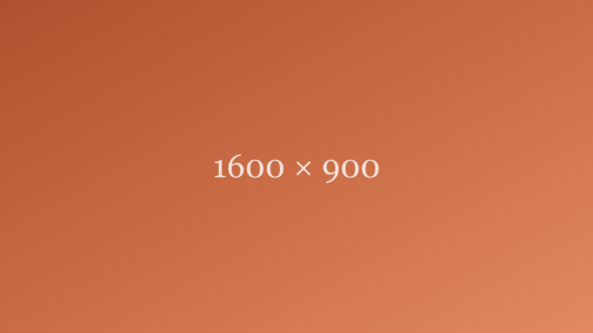

**[Placeholder content — for previewing the Journal layout only, not a real post.]**

This paragraph exists to test how a normal-length introduction wraps under the title and dek. Sample sample sample, filling space the way a real opening paragraph would, so the spacing between the header and the first line of body text can be judged honestly rather than guessed at.

A second paragraph, after the image, to see how a photo breaks up the reading column and how much room is left above and below it. This is not a real essay — it is scaffolding.
