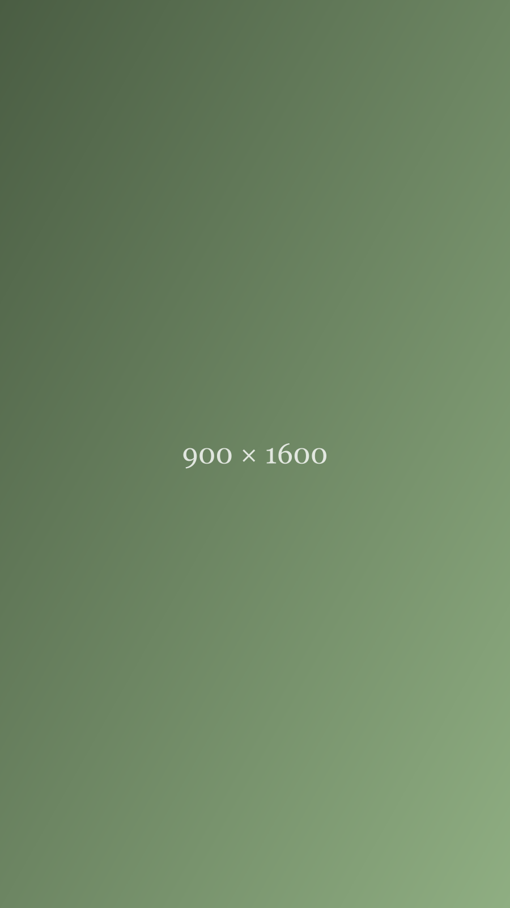

**[Placeholder content — for previewing the Journal layout only, not a real post.]**

This one pairs a tall, portrait-oriented image with a shorter amount of text, to see how the layout handles a piece that leans more visual than verbal.

Short closing line.
