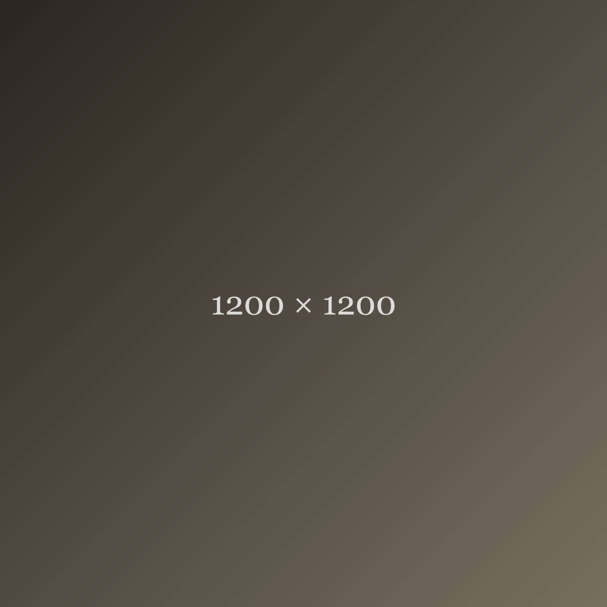

**[Placeholder content — for previewing the Journal layout only, not a real post.]**

A large square image sits below — useful for checking how a 1:1 image behaves in a column that isn't itself square.

This paragraph is here to fill out the body a bit more than the shorter test posts, to see how a mid-length piece reads in the essay typography — line height, paragraph spacing, and so on — without it being a real opinion about anything.

A second paragraph, same purpose.
