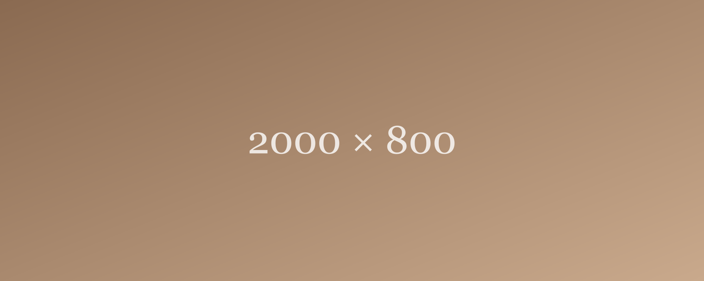

**[Placeholder content — for previewing the Journal layout only, not a real post.]**

An ultra-wide banner image below, to see how an image wider than it is tall (2:5 ratio) behaves when it's much more extreme than a typical 16:9 photo.

Closing paragraph, same placeholder purpose as the others.
