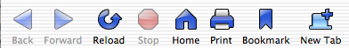

This is a preview of an icon set I’m working on for Chimera. I may expand it into a Mozilla skin at some point.

## Comments

**_Lewellyn** on 2003-02-20 18:01:41
> Hm. It looks a lot like the theme you include with your Phoenix build. :)

**Kevin** on 2003-02-21 09:51:56
> Very observant! Actually I started creating this icon set for Chimera then used them for the Phoenix theme. I'm close to finishing the set - I'll post them and a new screenshot when I'm done.

**Neil** on 2003-03-02 19:53:29
> Any possibility of porting the Pinstripe theme over to Phoenix? Or Chimera?

**Background Check** on 2005-01-12 04:29:01
> <a href="http://www.online-background-check.biz/" rel="nofollow ugc">Background Check</a> - <a href="http://www.online-background-check.biz/" rel="nofollow ugc">Background Checks</a>
> 
