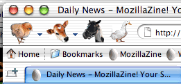

Announcing a Very Special Mozilla Theme! This theme is based on Pinstripe and follows the Aqua Human Interface Guidelines to the letter:

“In order to make toolbar icons easily distinguishable from one another, each icon should be a distinct animal. Use real-world objects (such as a moose) to facilitate quick recognition by users.”

## Comments

**Buran** on 2003-04-01 00:01:13
> Cute. ;) I'd prefer a birds-of-prey theme, though. ;)
> 
> April fool!

**Go** on 2003-04-02 21:31:41
> Cooooool
> 
> 
> 
> April Fool?? ;-)

**suan** on 2003-04-03 22:20:58
> a

**Katunori** on 2003-05-07 17:38:23
> Good

**:^)** on 2003-10-31 17:56:05
> i realize this was done as an april's joke, but i really like the design with farm animals. i'd use it as my theme any day. why not release it???

**NedBlog. Approves.** on 2003-04-08 10:17:03
> <strong>LJ Hax0r</strong>
> 
> For those among us who may be writing books on blogging hacks or who just use LiveJournal take a look at these two posts and nota bene. Plus my favourite April Fools joke of all. A Mozilla theme that follows the Aqua HIG. Class-A....
