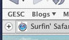

After seeing [Panther’s new tab controls](http://208.189.136.121/PantherPreview/html/PantherPreview13.html), I thought it was time to redesign [Pinstripe’s](http://kmgerich.com/pinstripe/pinstripe.html) browser tabs. I want to make the tabs less visually disturbing than the Aqua tabs while being usable and polished. Here’s what I have so far. Click on the thumbnail below to view the whole image. Please comment on the design and suggest changes. Bonus points if you create a mockup of how you think it should look!

P.S.: The screenshot is of the beta of Pinstripe 3 on Mozilla Firebird with the [SmoothStripes](http://homepage.mac.com/max_08/themes/smoothstripes.htm) theme. I don’t use OS themes myself but I plan to make the next version of Pinstripe more theme-friendly.

## Comments

**Hanns** on 2003-07-13 10:35:03
> I suggest:
> - remove drop shadow from personal toolbar
> - render edges of selected tab slighly rounded (like Safari)

**Jonathan Hicks** on 2003-07-16 04:48:31
> I agree - slightly rounded edges would just finish this off nicely.
> 
> One question on the tabs - will they stay that way in Panther? I'm not keen on the new tab system, but I'm assuming as these aren't the standard OS X tabs, that they'll stay the same. I hope so!
> 
> Please release this soon - I might switch to Firebird once you do!

**Kevin** on 2003-07-16 07:22:03
> How about this?
> 
> 
> 
> That screenshot I linked to in the original post includes Panther's new standard tab control. These new "tabs" will be seen on Camino in Panther. I'm not sure I like them either. I wonder why they opted for a new style over the well-established visual metaphor of tabbed folders.
> 
> Jonathan, if you're considering switching to Firebird from Safari or Camino, you might be annoyed at the <a href="http://bugzilla.mozilla.org/buglist.cgi?query_format=&short_desc_type=allwordssubstr&short_desc=&product=Firebird&long_desc_type=substring&long_desc=&bug_file_loc_type=allwordssubstr&bug_file_loc=&status_whiteboard_type=allwordssubstr&status_whiteboard=&keywords_type=allwords&keywords=&bug_status=NEW&bug_status=ASSIGNED&bug_status=REOPENED&op_sys=MacOS+X&emailassigned_to1=1&emailtype1=exact&email1=&emailassigned_to2=1&emailreporter2=1&emailqa_contact2=1&emailtype2=exact&email2=&bugidtype=include&bug_id=&votes=&changedin=&chfieldfrom=&chfieldto=Now&chfieldvalue=&cmdtype=doit&order=Reuse+same+sort+as+last+time&field0-0-0=noop&type0-0-0=noop&value0-0-0=" rel="nofollow ugc">outstanding bugs</a>. You have to be tolerant of a handful of major quirks to use Firebird as your everyday browser on OS X. The bugs will get fixed of course but I'm not sure when.
> 
> From <a href="http://weblogs.mozillazine.org/dave/archives/2003_06.html#003414" rel="nofollow ugc">Dave Hyatt</a>:
> 
> "In other words, feel free to criticize it on OS X, but understand that the design of Firebird is not going to put OS X first. It's going to put Windows first. If you want browsers designed for the Mac, use Safari and Camino. That's what they're there for."

**Jon HIcks** on 2003-07-16 12:24:33
> I think the slightly rounded corners makes all the difference. Let us know when its ready!
> 
> 'Switch' may have been the wrong word - 'try' would be better. Its quite a shallow reason, but I won't even <i>try</i> Firebird because its too ugly. I like to use a browser for a while and get to know it  - if the interface can be improved to this level, I can at least give Firebird a go. I use Camino nightlies mostly, so I'm used to putting up with some bugs (granted OS X Firebird has more!).

**** on 2003-07-16 21:23:02
> Could you combine reload and stop button like it is in Safari? The two button are exclusive and take unnecessarily too much real estate.

**Kevin** on 2003-07-16 22:47:36
> Probably not in Firebird where the reload and stop button are two different objects and can be placed wherever you want on the toolbar. It might be doable in Mozilla the suite, but I think combining the stop and reload buttons is a bad idea because it's so easy to hit reload when you meant to stop the page from loading. I also try not to mess with Mozilla's basic interface too much so a Mozilla user will have the experience they expect (just a nicer one).

**Jonathan Hicks** on 2003-07-19 09:47:10
> Kevin - comparing the two screenbshots again, I rather like the slight drop shadow under the toolbar on the first one. It adds a bit of depth and helps seperate the tabs from the toolbar. You can't please everyone!

**Kevin** on 2003-07-19 15:22:27
> I think I will experiment with a less severe drop shadow..
> 
> Also, a new version of Pinstripe will have to wait at least a week, because my Powerbook is going in the shop to fix a <a href="http://kmgerich.com/archive/images/badscreen1.jpg" rel="nofollow ugc">display  issue</a>.

**Jonathan Hicks** on 2003-07-21 15:20:02
> Ouch!

**Hanns** on 2003-08-17 16:57:27
> I installed Firebird and Pinstripe a few days ago. The browser tabs look great, exactly the way I hoped they would. Nice! ;)

**Jim S** on 2003-08-28 14:22:54
> So, is there any progress on making Pinstripe compatible with the latest version of Firebird. I really miss that look.

**L. Daudelin** on 2003-09-03 11:42:12
> What about the Mozilla 1.5b compatible Pinstripe? I'm also missing that look!

**Bill McGonigle** on 2003-09-14 12:39:11
> The 'inactive' color in the Panther screenshot is the same as the 'active' color in the Pinstrip 3 screenshot.  This is sure to confuse some/most users.
> 
> Why not use the highlight color the OS uses?
> 
> If not, maybe some border highlights could make the active tab look more like it's on top.  To me, it looks like the highlighted tab is sunken, which doesn't make sense from an Aqua lighting perspective - the top front light would reflect more from the topmost items.

**Kevin** on 2003-09-14 20:38:30
> I'm not sure I follow you Bill. Yes in the the initial screenshot the tabs look sunken. But I've evolved the design a bit since then. Here's an up-to-the-second screenshot. I'm aware that it doesn't look too 3D but I don't want the tab bar to jump out too much. What specific changes would you make to this?
> 
> <a href="http://kmgerich.com/archive/images/pinstripeworking.png" rel="nofollow ugc">http://kmgerich.com/archive/images/pinstripeworking.png</a>

**Phill Kenoyer** on 2003-09-20 03:45:21
> Now that Mozilla 1.5 is a RC, will you be supporting it?

**timbo** on 2003-09-30 15:46:04
> not a fan of the new tab design... there is not enough differentiation between the tabbed and non tabbed areas. Is there a way to control the font in the non-active tabs?
> 
> Also I'd suggest slightly rounded edges... just a pixel or two.
> 
> Looking forward to pinstripe for Moz 1.5

**misterjingles** on 2003-09-30 17:49:55
> "Looking forward to pinstripe for Moz 1.5"
> 
> I second that. I want to upgrade Moz but I cannot stand any other theme. Does Mozilla have any official documentation of theming?

**Bill McGonigle** on 2003-10-01 18:26:12
> Hi, Kevin,
> 
> Sorry to take so long to respond, I just came back after downloading a 1.5RC. :(
> 
> What I was trying to get at was the colors in the Panther tab controls vs. the colors in the Pinstripe tab controls.
> 
> In the Panther screenshot, the active tab is blue, the inactive tabs are light-gray.
> 
> In the Pinstripe screenshot, the active tab is light-gray.
> 
> So, we have a conflict of color meanings, which might confuse a novice user and might slow down a more experienced user.  What a color means in the context of a Panther tab is the opposite of what it means in a Pinstripe tab.
> 
> The Panther tabs eschew the file cabinet metaphor, and I'm not sure I like it yet, but that seems to be the direction Apple is taking.  It probably makes sense now that we have office workers who don't use file cabinets.
> 
> I really like the new screenshot you posted, and I  think it might in many ways be a better tab layout than Apple's done in Jaguar, but I think of Pinstripe as truely Aqua-consistent theme for Mozilla.  I place consistency one tiny notch above optimal functionality on the Mac, so I would advocate emulating Jaguar's tab look and feel.  Variable tab sizes might be tricky or impossible, though.
> 
> Notice how Safari skirts the whole issue by chickening out with Metal? ;)

**Florida Mortgage** on 2004-11-07 09:54:34
> <a href="http://www.bestlowmortgagerates.com" rel="nofollow ugc">Florida Mortgage</a>
> <a href="http://mortgage-calculator.bestlowmortgagerates.com" rel="nofollow ugc">Mortgage Calculator</a>
> <a href="http://www.bestlowmortgagerates.com/mortgagecalculator/" rel="nofollow ugc">Mortgage Calculator</a>
> <a href="http://www.bestlowmortgagerates.com/debtconsolidation/" rel="nofollow ugc">Debt Consolidation</a>
> <a href="http://www.bestlowmortgagerates.com/loanprograms/" rel="nofollow ugc">Loan Programs</a>
> <a href="http://www.bestlowmortgagerates.com/mortgagerates/" rel="nofollow ugc">Mortgage Rates</a>
> <a href="http://www.bestlowmortgagerates.com/commercialmortgage/" rel="nofollow ugc">Commercial Mortgage</a>
> <a href="http://www.bestlowmortgagerates.com/constructionloans/" rel="nofollow ugc">Construction Loans</a>
> <a href="http://www.bestlowmortgagerates.com/homeequityloans/" rel="nofollow ugc">Home Equity Loans</a>
> <a href="http://www.bestlowmortgagerates.com/homeequitylineofcredit/" rel="nofollow ugc">Home Equity Line of Credit</a>
> <a href="http://www.bestlowmortgagerates.com/floridamortgagecompany/" rel="nofollow ugc">Mortgage Company</a>
> 
> http://www.bestlowmortgagerates.com
> http://mortgage-calculator.bestlowmortgagerates.com
