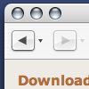
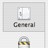
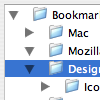
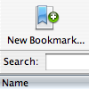
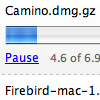
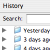
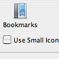

The newly released Mozilla Firefox 0.8 has a new look on Mac OS X. It is the first Firefox milestone to be released with the Pinstripe theme as the default. Here are a few screen shots.

Screen shots of Firefox on Windows can be found at [Neil’s World](http://www.neilturner.me.uk/2004/Feb/09/firefox_screenshots.html).

Click on an image to see a full screenshot.

<table border="0" cellpadding="10" width="100%"><tbody><tr><td><a href="http://kmgerich.com/pinstripe/screenshots/browser/mainwindow.png">  The main browser window</a></td><td><a href="http://kmgerich.com/pinstripe/screenshots/browser/preferences.png">  The Preferences dialog</a></td></tr><tr><td><a href="http://kmgerich.com/pinstripe/screenshots/browser/tabbrowsing.png">  Tab Browsing in action</a></td><td><a href="http://kmgerich.com/pinstripe/screenshots/browser/addbookmark.png">  The Add Bookmark dialog</a></td></tr><tr><td><a href="http://kmgerich.com/pinstripe/screenshots/browser/bookmarkmanager.png">  The Bookmark Manager</a></td><td><a href="http://kmgerich.com/pinstripe/screenshots/browser/downloadmanager.png">  The Download Manager</a></td></tr><tr><td><a href="http://kmgerich.com/pinstripe/screenshots/browser/historysidebar.png">  Tthe History sidebar</a></td><td><a href="http://kmgerich.com/pinstripe/screenshots/browser/customizetoolbar.png">  The Customize Toolbar dialog</a></td></tr></tbody></table>

## Comments

**Mario** on 2004-02-08 04:25:40
> These theme makes firebird more aqua looking than camino, it's so elegant, ive been using it since the firstnightlies it is a great work... i was wondering if your you are going to develop a mozilla one??
> 
> The only thing thats missing from totally turning me to FB its that there is no close button per tab ala Safari...

**Kevin** on 2004-02-08 08:41:53
> Thanks for the compliment Mario :) Yes I am going to be making a Mozilla Suite theme after I announce the Thunderbird theme which should be in the next week or two.

**Bernie** on 2004-02-08 13:17:45
> Kevin
> Thanks again for your Pinstripe themes... As a Mozilla suite fan, I'm waiting (for a long time now !!! :)) your version for 1.6 and next... firebird is nice, but a little bit too much rough on mac for the moment... And the suite app. is almost perfect !!!
> Thanks again !

**Peter** on 2004-02-08 15:24:42
> Can't wait for your thunderbird theme

**rgw** on 2004-02-08 17:26:25
> I'm no Mac user, but wouldn't the customize toolbar dialog be better displayed as one of those spiffy 'sheets' instead of a dialog window. That seems to be the UI rule concerning dialog boxes on teh mac.

**Kevin** on 2004-02-08 19:35:02
> You're right rgw. Here's the <a href="http://bugzilla.mozilla.org/show_bug.cgi?id=206649" rel="nofollow ugc">bug report</a> that covers it. This is one of the rough spots which will hopefully be smoothed out by Firebird 1.0

**rgw** on 2004-02-08 20:34:15
> Thanks for the info Kevin! BTW, your theme looks very classy; definitely makes firebird look 'purdy' on the mac.

**Brad** on 2004-02-09 00:39:49
> not for Windows :-(

**leonard** on 2004-02-09 04:58:59
> Just d/l'd FireFox 0.8 and wanted to compliment you guys on your work.  Pinstripe is amazing.  Way to go guys!

**Neil T.** on 2004-02-09 11:28:00
> Thanks for the link :) . The new theme really looks the part, I'm glad the Mozilla Foundation decided to adopt it.

**hermeneut** on 2004-02-09 11:55:36
> Please God let us have this exquisite theme for Windows!!!

**Noah Wild** on 2004-02-09 12:50:05
> Hey,
> 
> congratulations for your theme. I really love it and even switched back from safari to firefox just to be able to use it.
> Looking forward to the Thunderbird-theme, thoug ;-)

**Joel** on 2004-02-09 16:28:10
> The theme is gorgeous. Looking forward to the app. suite version. It's the only reason I've been hanging on to Mozilla 1.4.1.

**Martin** on 2004-02-09 18:46:21
> Superb work - really makes FireFox belong on X.

**Minh Nguye&#x1ec5;n** on 2004-02-09 20:07:02
> Brad, hermeneut, this theme probably won&rsquo;t ever be made to work on Windows, because Apple vigorously defends the Aqua style, and wants to keep it only for Macs. *sigh*
> 
> &nbsp;&ndash; Minh

**Minh Nguy&#x1ec5;n** on 2004-02-09 20:08:50
> Heh, I misspelled my last name...

**Rodion** on 2004-02-09 20:35:27
> can you release a version of pinstripe so it can work on windows because it looks lke a really good theme.

**Pinback** on 2004-02-09 20:44:51
> Am I the only one that doesn't like the new "it looks like Safari!" widgets? I preferred the old colourful Pinstripe 3 ones.
> 
> At least it's not that fugly "brushed metal" look (*shudder* ...)

**pantz** on 2004-02-09 22:03:38
> This one is for Mario - the guy who posted first - you can have close buttons for each tab in Fire[bird|fox]. You just have to install the 'Tabbrowser' extension - and it is in there amongst the many other cool options this gives ...
> 
> eg. you can shuffle the order of tabs, you can recall recently closed tabs, you can change color o f active tab, oh the list is so long my fingers just fell of

**Sadalsuud** on 2004-02-09 23:43:40
> The tabs look great but the buttons are ugly and the favorites bar looks like the appalling Safari ! I hope you'll deliver an alternative with colorful buttons. Nice work nevertheless. Congratulations.

**Jamp** on 2004-02-10 00:40:49
> I agree. Please bring back the old default theme. This new one is ugly. How one can design so horrible widgets is a mystery. Keep it for you if you want but the problem is that I can't find how to recover the old default theme who was perfect. Please help.

**Josh S** on 2004-02-10 10:39:28
> <i>This new one is ugly.</i>
> 
> You might try a different way to ask someone who is giving up their time to do something to benefit all of us. I don't understand ungrateful people like you.

**Jamp** on 2004-02-10 13:47:21
> You're right. But why to be grateful for something I don't like ? I suppose you can't understand that someone don't like this theme but it's not a criticism of your work. Technically the execution is perfect. I just don't like these ugly widgets. Personnaly, I can't understand you like it. Thanks for your efforts nevertheless.

**Phillybob** on 2004-02-10 16:08:51
> One word. Yum.

**Riccardo** on 2004-02-10 19:42:02
> Great work, this theme is awesome!!
> 
> The only thing I would object to is the scissor icon you chose for "cut" button, which is visually unrelated with "copy" and "paste" ones - please don't blame me for addressing such a trivial point... :-)
> 
> Slighty off-topic, my 2 cents on the issue of  "Close tab" button location addressed by Mario: although Apple's choice brings the benefit of letting you close backgrounded tabs quickly, I think that from an UI standpoint Mozilla's solution is preferable because enhances spatial consistency.

**YumYum** on 2004-02-10 19:43:35
> I've been using firebird 0.8, err -fox, since the january nightlies and like it better than Safari. It's rock solid and fast and renders almost everything you throw at it. And with Firefox-pinstripe a great browser got great looks! I love it. Lean and mean ;-) Thanks for getting all the icons done so well. I'm still amazed by the robustness of firefox and pinstripe. (I like firefox-pinstripe better than the old mozilla-pinstripe 2.0.) Thanks Kevin!!!
> 
> Statistics: Mac OS X 10.2.8, Powerbook G3 500 Fw

**Jozer99** on 2004-02-10 20:35:27
> Port this to Windows, you know someone is going to do it anyway, you might as well do it right.

**Laurence Gonsalves** on 2004-02-11 00:00:35
> Riccardo: what do you mean by "enhances spatial consistency"? I honestly can't figure out what that's supposed to mean. To me, having a single "close current tab" button makes about as much sense as having a single "close current window" button in the corner of my screen.
> 
> One of the main things preventing me from switching to Firefox is the clunkiness of the tabs compared to Galeon. Every time a new version comes out I give it another chance. I've also tried using "Tabbrowser extensions", but Galeon still has significantly better tabbed browsing support, IMHO. Galeon lets me have:
> 
> <ul><li> tabs at the bottom (makes mores sense to me for some reason). Tabbrowser extensions lets you turn this on, but the tabs still render like they're supposed to be on the top. :-Q
> 
> <li>close buttons on the tabs. Again, Tabbrowser extensions lets you turn this on, but the close buttons it uses are ENORMOUS. The close buttons on my Firefox tabs are about 1/3 the size of an entire tab in Galeon.
> 
> <li>closing the last tab closes the window. This seems like the most obvious thing, but I can't get this in Firefox even with Tabbrowser extensions!
> 
> <li>can drag tabs off of a window. If I want a tab to be in its own window in Galeon I can just drag it off.
> 
> <li>Galeon seems to be a lot smarter about where it opens tabs. It also remembers which tabs I've looked at, and which I haven't, and color codes them.
> 
> <li>sensible options without having to install a separate extension that pops up big ugly dialogs and makes my browser unstable (I get a lot more crashes and bizarre rendering artifacts when Tabbrowser extensions is installed)
> </li></li></li></li></li></li></ul>

**Thomas** on 2004-02-11 01:59:49
> Hey, I installed Firefox on a OS X 10.1 machine I had lying around. However, I noticed that the default theme is different from the one show in the screen shots at the top of this page. Unlike the screen shot pics, my Firefox doesn't have that new smoothe 10.3 Panther look to it. I still see the horizonal lines all over the interface. Is this normal? Is the Firefox/Pinstripe theme supposed to look different depending on the OS it's running on?
> 
> Thanks (appleweek@hotmail.com)

**Chris Hester** on 2004-02-11 07:55:55
> The first screenshot says "Firebird" at the top.
> 
> Windows users can 'sort of' apply the Pinstripe theme if they skin Windows itself. Use StyleXP - version 2.0 comes with various Mac-style themes!
> 
> See http://www.tgtsoft.com
> 
> I have my PC running the OSX Aqua theme - so much nicer!

**Riccardo** on 2004-02-11 12:15:36
> Laurence, I was referring to a "good rule" in interface design, which says that buttons and controls should always, as far as possible, keep the very same position on screen. This is intended to help users automate the mental process required to target the active area of the control ("muscle memory"), thus letting them gain confidence and efficency when operating the interface. In general, Mozilla close tab button keeps the very same relative position in the browser's windows. Speaking of my personal habits, I also find this very comfortable when I'm on Windows OSes: I'm used to keep all windows maximized to full screen, and in this special case, the close tab button maintain the same absolute position on screen. I istintictively konw that I have to move to the upper left side of the screen to hit the button - and, by the way, I also have not to worry about bringing another tab to the front if I "mistarget" the button's active area.
> 
> Anyway, I can admit that those could not be such strong points when it comes to different users' behaviors, and when compared to other advantages carried by having close buttons on each tab.
> 
> Also, I'm not sure, really, if "spatial consistency" is the right term for this thing - I'm italian and my english is a bit rough, beg your pardon :-)
> 
> Cheers
> 
> PS: sorry for long posting on a collateral issue.

**Andrew** on 2004-02-11 19:14:59
> awww...
> I wish this would be ported to windows...
> :( oh well...
> Keep up the good work! (and port this theme to windows!)

**Nate** on 2004-02-11 22:25:23
> PLEASE PLEASE LET'S HAVE A WINDOWS VERSION!

**Matt** on 2004-02-14 18:57:30
> Stop asking for Windows ports.  This isn't as simple as you may imagine.  Yes, most themes work fine on any OS version of Firefox, but Pinstripe isn't like most themes.
> 
> Pinstripe actually makes use of the GUI libraries on OSX to make it look that way.  There's no way to simply port these libraries to Windows, so Pinstripe can't simply be ported to Windows.  Yes, someone could make a theme that looks nearly identical to Pinstripe, but it's not really reasonable to ask this guy to maintain two themes that look the same just so people on Windows can use this.
> 
> If you really want this look you have a couple options:
> - Write your own theme that looks like this
> - Get one of the theme programs for Windows (not a complete solution, but similar)
> - Get a Mac.  If you like the look so much, why not actually get a Mac and forget about Windows.

**The Master** on 2004-02-15 13:38:48
> <a href="http://idisk.mac.com/ashley_burton/Public/Firefox/port/classic.jar" rel="nofollow ugc">http://idisk.mac.com/ashley_burton/Public/Firefox/port/classic.jar</a>
> ^^ A port that's been found. About as close are you are going to get. Be warned, it can cause some serious damage if not installed properly: Close FireFox, backup the old classic.jar file in 'Mozilla FireFox/chrome' and replace it with this. Some extensions may cause serious issues with this theme.

**Dave** on 2004-02-16 11:01:30
> Just got Firefox (what an improvement from 0.7!) & I do like the new version of Pinstripe very much.  Still, sometimes one wants buttons with pretty colors too!  Any chance you might port the last version of Pinstripe over for Firefox as an alternate for us to use?  Or perhaps color this one in with colors to match the buttons you used in the Bookmark manager?  I think you were going for the Apple plastic button look, which is cool, but as I said, sometimes one wants pretty colors!
> 
> Thanks for all the work you've put into your themes!

**Derek** on 2004-02-17 16:25:40
> Matt,
> 
> While I understand that a Win32 port of this theme is not trivial and unlikely to happen for legal reasons, you can't blame people for asking.
> 
> > Write your own theme that looks like this
> 
> Not everyone is a graphic artist.  Most Windows users don't have the tools or ability to create their own theme.
> 
> > Get one of the theme programs for Windows (not a complete solution, but similar)
> 
> Probably the best solution.
> 
> > Get a Mac. If you like the look so much, why not actually get a Mac and forget about Windows.
> 
> Because I'd have to drop over $2k on a fast Mac and spend another $1k re-buying software.  And even then I'd have to use VPC to run software that doesn't exist for the Mac.  I'll have to hit the lottery before I switch.

**Kevin** on 2004-02-17 21:10:06
> I don't endorse this port, but there's a <a href="http://forums.mozillazine.org/viewtopic.php?t=41625" rel="nofollow ugc">MozillaZine thread</a> about it.
> 
> Yes I made it in a fit of weakness a few months ago. I'm not sure if I have the free time to update it or maintain it. It is only a test at this point.

**Robert C Rackley** on 2004-02-19 23:03:59
> One thing that I've been wondering about is why the input boxes and drop down lists don't have the mac style.  The buttons look like windows.  Other than that, this theme is awesome.

**vintagenoise** on 2004-03-02 20:12:45
> the theme is absolutely gorgeous. beautifully safari-esque. you need to make it for windows because I love safari but I can only use that at school and the closest thing I cna get at home is using firefox on windows.

**chimerical** on 2004-03-06 18:53:16
> This theme is absolutely stunning.  I love it.
> 
> Regarding the Windows port...
> (The Windows port [classic.jar above] has some problems with the Privacy and Advanced sections under Options.  The [+] boxes are missing.  And the 'Save All Files to Folder' dropbox under the Downloads section under Options is a bit large on the height side.  And the navigation toolbar has a bit too much space above and below the buttons.  But don't get me wrong.  It's a GREAT port, and I appreciate all the work put into it.)

**george** on 2004-03-25 03:41:17
> i think windows users should use their own themes that they have access too, theres only like THREE themes that work ok on mac (including pinstripe), but yet so many users would rather use the themes that were MAC ONLY than their own...

**mike** on 2004-03-28 07:24:45
> Very nice. The only problem--and it's probably not a theme problem--are the big, ugly, jagged form entry areas and submit buttons. Why isn't Firemonkey (or whatever the name is today) using the same form items that Safari is?

**Tony** on 2004-04-01 20:18:23
> My only problem, and it keeps me using Safari most of the time, is that the drop-down list of bookmarks is so narrow in Firefox that I cannot tell which bookmark is what. Can this be widened to match the text, as in Safari?

**Kevin** on 2004-04-01 20:56:55
> Tony, which dropdown list of bookmarks do you mean? Can you email me a screenshot? Thanks

**Dallas** on 2004-04-05 21:22:47
> I agree about the form entry areas and submit buttons.  I would love it if those were aqua-stylee, too.

**Kristo** on 2004-05-05 05:08:02
> Excellent job. Clean and much better than the Apple airbrushed look. Gets better all the time.

**Ippei** on 2004-05-19 13:04:45
> Thank you for your super excellent theme for Firefox!
> I am using Pinstripe before I knew Phoenix, and I am still using Mozilla 1.4.1 because 1.5 looked so bad without pinstripe that I realised how important UI designs are.
> Please continue your excellent jobs, and I hope next version will be one for latest Mozilla.

**UKenG** on 2004-05-20 16:13:04
> I'd like to use Pinstripe, but it simply dosn't work with TabBrowser Extension - the tabs appear on the bar in peculiar positions and you cannot drag them around.
> 
> Since the facilities offered by TBE are the main reason for using FireFox rather than Safari I am unable to use Pinstripe.
> 
> Anyone else find it's incompatible with TBE? Any fixes for this clash?

**Alex C-G** on 2004-06-09 01:30:22
> Is there anywhere to download and install this theme for Firefox on other platforms?

**Matt** on 2004-06-13 18:53:41
> I know many people hate brushed metal, but many other of us do like it! So the question is...
> Is there a chance of releasing a Brushed Metal version of the pinstripe theme? Or does it work with metalifier by unsanity?

**Paolo** on 2004-06-16 01:20:16
> I downloaded Firefox .9 (Final) and to my dismay discovered your Pinstripe theme has been replaced with something else... Pls make your theme available for download. The default one bites.

**Ryan** on 2004-06-16 05:26:55
> Is there any way to install the original colorful default theme back into FireFox? The pre-0.9 pre-0.8 version? I really liked that theme.

**jc** on 2004-06-16 17:50:30
> i too would like to see pinstripe come back... or at least a grey [no colour] version of the default.
> thanks.

**Random832** on 2004-06-17 08:17:49
> Any chance of a "icons only" windows version? i.e. with all the same icons? just because you can't make a "complete aqua" version for legal reasons / amount of work involved in 'slicing images' or whatever, doesn't mean you can't package up these icons in a windows/linux firefox theme

**James** on 2004-06-17 09:44:17
> I liked it, however I switched to the "smoke" theme for its cross browser support.  Your excuse that apple legal will come down on you is kinda lame.  Just release it as opensource. :)  ALso if there are any "mac" specific areas, just release the instructions for re-creating those items in photoshop.  I really doubt there is any infringment unless you broke their copyright and actually lifted things from apple.

**coffeegirl** on 2004-07-14 16:07:56
> Why isn't this theme included with the newest version of Firefox? I downloaded 0.9 today and all it has is the default theme with big, giant, bright buttons. I hate it! I want my old Pinstripe theme back!
> 
> Anyone know where I can download this theme?

**coffeegirl** on 2004-07-14 16:16:50
> I went back to the 0.8 version, if anyone wants to follow my lead here's a link to download it:
> 
> http://ftp.mozilla.org/pub/mozilla.org/firefox/releases/0.8/

**d0t1q** on 2004-07-29 22:39:59
> good shot coffegirl!! :D

**coffeegirl** on 2004-08-24 22:41:47
> My apologies, I didn't intend to take a "shot" at anyone. I'm a graphic designer and I take it personally when I read anything remotely critical of my own work. I do not want my comments to be misconstrued in such a way.
> 
> To clarify, one of the reasons I use Firefox (and a Mac platform) is because the unobtrusive interface doesn't compete with the colors in the work I create for the Web. When I'm designing and testing a site, I am able to evaluate my color scheme on a neutral background with the Pinstripe theme.
> 
> While the icons of the new default theme aren't as screaming as a bright blue Microsoft toolbar, they're still rather large and stylized, which competes with some websites. I hope to stay the 0.8 until more themes are made available, or the creator of this beautiful, minimalistic theme makes the version with small gray buttons available as a download for a later version.
> 
> It has been established that the theme will not be available for Windows, but is it possible that it will be available for the launch of Firefox 1.0?

**Alex** on 2004-09-19 11:50:58
> Awesome skin.
> 
> Is there ANY way to get a Windows XP SP2 version of this for FireFox 0.9.3?

**peter** on 2004-09-30 17:45:34
> i to am going back to 0.08 because i cant get the pinstripe theme for 1.0

**Alvin** on 2004-10-11 05:25:21
> Nice theme. I hope it will become the default theme for Linux version of Thunderbird mail client as well.

**Laurent** on 2004-11-09 13:59:04
> For some reason, my Firefox 1.0 toolbar shows different icons for previous, next, reload, stop and home. All the other parts seem to be from Pinstripe except those icons in the toolbar.
> 
> Anybody knows what could be wrong?

**Ady** on 2004-11-12 10:04:48
> Ce zici bre, merge?

**** on 2004-12-07 00:27:19
> cool!!

**pixelgraphix** on 2004-02-09 06:27:10
> <strong>Der Vogel wird zum Fuchs</strong>
> 
> Die Mozilla Foundation hat die aktuelle Version ihres standalone Browsers 0.8 vorgestellt und ihm einen neuen Namen inkl. Icon verpasst. Das Icon wurde von Jon Hicks erstellt, dessen Weblog ein Favorit und echter Tipp ist. Firefox hat im Vergleich zum...

**eXtremities** on 2004-02-09 13:49:48
> <strong>Technical Jiggery Pokery: Pinstripe Firefox Gallery</strong>
> 
> Technical Jiggery Pokery: Pinstripe Firefox Gallery

**seanwillson.com** on 2004-02-09 21:39:36
> <strong>firefox v0.8</strong>
> 
> mozilla ... nope phoenix ... i mean firebird ... dang it, no wait firefox 0.8 was released today. despite their inability to pick and stick with a name they have a great browser. if your into branding i recommend you check out this good writeup. i use ...

**Karmakars.com** on 2004-02-09 23:36:57
> <strong>Mozilla Firefox</strong>
> 
> Mozilla Firebird (ver 0.7) changed its name to Mozilla FireFox with the release of its new version 0.8 today. Infact I am using FrieFox to write this entry :-) This latest release features a new download manager, bookmarks enhancements, better...

**Karmakars.com** on 2004-02-10 03:24:36
> <strong>Mozilla Firefox</strong>
> 
> Mozilla FireFox 0.8Mozilla Firebird (ver 0.7) changed its name to Mozilla FireFox with the release of its new version 0.8 today. Infact I am using FireFox to write this entry :-) This latest release features a new download manager, bookmarks...

**Blogzilla - a blog about Mozilla** on 2004-02-11 13:51:45
> <strong>Firefox Pinstripe</strong>
> 
> The default Pinstripe Theme for Mozilla Firebird on OSX is more breathtaking than a hot pocket. On the horizon is Pinstripe for Thunderbird and it looks very promising as well. Some really great work by Kevin Gerich. As mentioned on the Pinstripe Abou...

**Eightlines Comments** on 2004-02-13 16:27:02
> <strong>Branding Firefox</strong>
> 
> What happens when you have a forthcoming product release, a bad name, and a deadline? A new identity! The Mozilla Visual Identity Team had a legal issue with the Firebird name, plus a dilemmna with the icon used to designate...

**Ross Notes** on 2004-02-15 19:11:21
> <strong>Firefox!</strong>
> 
> If you've previously been disappointed in the look and feel of previous Mozilla/Phoenix/Firebird/Thunderbird releases on OS X, stop wasting your time with Ross Notes and start downloading Firefox. Feel free to come back to Ross Notes when your done wit...

**PAINED.NET** on 2004-06-06 15:04:56
> <strong>Mozilla Firefox: Replacing the default theme</strong>
> 
> The Mozilla Firefox staff decided to replace the default theme with a port of the MacOS X-theme Pinstripe. The previously used Qute theme by Arvid Axelsson is dumped down in favor of the change.
> 
>  Unfortunately, he enhanced his theme for the upcoming re

**PAINED.NET** on 2004-06-06 15:05:06
> <strong>Mozilla Firefox: Replacing the default theme</strong>
> 
> The Mozilla Firefox staff decided to replace the default theme with a port of the MacOS X-theme Pinstripe. The previously used Qute theme by Arvid Axelsson is dumped down in favor of the change.
> 
>  Unfortunately, he enhanced his theme for the upcoming re

**Nilesh's Weblog** on 2004-06-07 02:05:38
> <strong>The Fox and the open bag</strong>
> 
> The Firefox visual identity team has decided on changing the default theme of Firefox in preparation of the impending 1.0 release. As often in the open source community, this has caused some furor in the mozilla dev community with people taking sides w...

**djst's nest** on 2004-06-07 09:01:35
> <strong>Firefox gets a "new" look</strong>
> 
> So we now have a new default theme for Firefox on Windows, called Winstripe. The problem is that the new theme is heavily inspired by MacOS design and does not blend in on Windows XP. This blog entry is about...

**djst's nest** on 2004-06-07 15:25:36
> <strong>Firefox gets a "new" look</strong>
> 
> So we now have a new default theme for Firefox on Windows, called Winstripe. The problem is that the new theme is heavily inspired by MacOS design and does not blend in on Windows XP. This blog entry is about...

**g9g** on 2004-06-08 00:09:53
> <strong>The Fox's New Clothes</strong>
> 
> Yesterday, Kevin Gerich posted a screenshot of the new default theme that Firefox 0.9 will be sporting when it&#8217;s released. Called Winstripe, it&#8217;s essentially a Windows-ification of the Mac OS X theme, Pinstripe. Without a doubt, this a step...
> 
