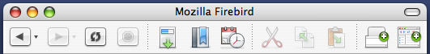

New Name. New Look. New Icon. The program formerly known as Phoenix and Mozilla Firebird has [just released version 0.8](http://www.mozillazine.org/talkback.html?article=4278). This version is faster and more stable than before and has more neat features than you can shake a stick at. Check the [release notes](http://www.mozilla.org/products/firefox/releases/). It also features the [Pinstripe theme](http://kmgerich.com/archive/000049.html) as the new default look on Mac OS X. [Download it here](http://www.mozilla.org/products/firefox/)!

Note: The Firefox UI may appear broken if you are using a previous version of the Pinstripe theme. Go into your theme preferences, select “Firefox (default)”, then close and reopen the browser to make sure you are using the latest incarnation of the Pinstripe theme.

## Comments

**dzd** on 2004-02-09 10:24:01
> Worst. Name. Ever. Sorry guys.

**Kevin** on 2004-02-09 11:10:23
> To be honest, I'm not wild about the name change either, but I don't think it's actually a bad choice. I've certainly seen <a href="http://mozillazine.org/poll_results.html?id=2960" rel="nofollow ugc">worse names suggested</a>. Give it some time to sink in.

**chris** on 2004-02-09 14:21:06
> Does this version play nice with the TBE?

**Kevin** on 2004-02-09 14:34:52
> Unfortunately it doesn't. See the <a href="http://kmgerich.com/archive/000046.html" rel="nofollow ugc">TBE post and comments</a>.

**khc** on 2004-02-09 14:56:37
> Since TBE doesn't work with it, is there a way to make URLs open from other applications open a new tab instead of a new window?

**andrew saturn** on 2004-02-09 17:41:06
> I like the name, it's growing on me. I especially like the new logo - very original and pleasing to the eye. Give it time.

**Paul** on 2004-02-09 19:51:38
> Couple of things I thought I'd post here among Mac users as the boards seem to be very PC orientated.
> 
> 1. I assume all I can do is wait for TBE to be updated for it to work properly again. I tried the fix I found elsewhere here but the tabs get all screwed up. All I really need to do is have other apps open pages in a new tab instead of a new window.
> 
> 2. How come Apple-M does not work to minimize?
> 
> 3. Whats with the white box that appears when using Expose?
> 
> Thanks.

**Paul** on 2004-02-09 19:53:41
> Couple of things I thought I'd post here among Mac users as the boards seem to be very PC orientated.
> 
> 1. I assume all I can do is wait for TBE to be updated for it to work properly again. I tried the fix I found elsewhere here but the tabs get all screwed up. All I really need to do is have other apps open pages in a new tab instead of a new window.
> 
> 2. How come Apple-M does not work to minimize?
> 
> 3. Whats with the white box that appears when using Expose?
> 
> Thanks.

**EPS** on 2004-02-09 22:48:52
> The scroll wheel jumps ahead WAY too many lines compared to how it works in all my other applications.  Any suggestions?

**Noah** on 2004-02-10 00:32:24
> That white box has been with us since the earliest of Mozilla... If I remember right, since the Mac is the only platform where all windows run under a single application instance, that control window keeps Firefox running when no browser windows are open, unlike Windows and 'nix, where each window is an application thread. It also keeps the menu bar going since on the other platforms menus are bound to the windows themselves. They got good at hiding that lil' guy (it used to appear in the Dock's window list) but obviously Expose has made it visible once again.

**Carlo** on 2004-02-10 08:27:24
> <em>Since TBE doesn't work with it, is there a way to make URLs open from other applications open a new tab instead of a new window?</em>
> 
> Try <a href="http://www.intraplanar.net/projects/tabprefs/" rel="nofollow ugc">TabPrefs 0.5</a>. Works fine w/ FF0.8 and comes with less fluff than TBE.

**Paul** on 2004-02-10 17:21:53
> Noah - Thanks for the explanation about the white box.
> 
> Carlo - I tried TabPrefs but new windows are still created by external apps, not new tabs. I have to use Safari with NetNewsWire for now I guess.

**Scott Vandehey** on 2004-02-11 17:27:16
> Am I the only one who is confused about why the pinstripes don't show up in the screenshots of the theme on this site?
> 
> I'm running firefox .8 on my 10.2.8 laptop, and the pinstripes display just fine in the title bar, toolbar, bookmark bar, and tab bar... but none of the screenshots on this site show them. What's going on?

**phil** on 2004-02-12 14:01:00
> I think Firefox is a fine name, especially given the  paucity of options.  It has a pretty good pedigree (originally famous for being a bestselling book about a wicked-cool plane of some kind) that was made into a Clint movie.
> 
> Anyway, names that are household words now started out sounding dumb or odd: Playstation and Dreamcast for instance, or how about Google as a name for your all-powerful search engine.
> 
> The browser itself isn't bad either...

**amake** on 2004-02-13 02:17:13
> To get Firefox to open external URLs in the current window, go to about:config and set "browser.always_reuse_window" to true.
> 
> Unfortunately, this doesn't open a new tab.  Maybe you can get your desired effect with a combination of this and TabPrefs.

**Scott Heath** on 2004-02-13 12:04:05
> A few surprizes in Firefox .8 on my Jaguar G4:
> 
> 1-The theme preview in the preferences window showed a very old classic theme when I picked 'default'. Fortunately, the new pinstripe theme actually appeared on the browser.
> 
> 2-The icon on all alerts is the old phoenix icon!
> 
> 3-There is no way to launch the venkman extension, and the autoforms extension completely disappeared.
> 
> Guess I'll still be using the Mozilla suite, even though I can't get pinstripe for it.

**Arman** on 2004-02-13 15:07:55
> I personally LOVE the name, not to mention the logo and the actual browser. ;)

**Simon** on 2004-02-14 17:05:54
> "Am I the only one who is confused about why the pinstripes don't show up in the screenshots of the theme on this site?"
> 
> Panther doesn't have these stripes does it?

**Jafe Mourner** on 2004-02-15 13:10:48
> This browser is amazing. Great work guys!

**Anthony** on 2004-02-23 14:53:40
> hi, i am looking for a brushed metal theme for Firefox, if anyone knows where i can find one please email me at macrlz9@mac.com THANK YOU SOOO MUCH!!!

**Michel** on 2004-03-03 09:30:34
> Hi Anthony,
> 
> AFAIK you could use Unsanity's <a href="http://www.unsanity.com/haxies/ape/" rel="nofollow ugc">Application  Enhancer</a> to toggle the brushed metal appearance on a per-application basis.
> 
> Not sure if that would work with Firefox, though since it uses Mac APIs to draw its UI when using the default Pinstripe theme, I reckon it should.
> 
> Currently Macless till September :(
> 
> - Michel

**monoclast** on 2004-03-03 11:21:05
> Would you PLEASE do everyone a favor and take the  statement off your page that states you will "release a Mozilla 1.5/1.6 pinstripe theme soon"?
> 
> I've been checking back with you web site for months and months, and you still haven't relewased anythign new.  So why have that statement there?
> 
> I am quite sure the rest of the world's definition of "soon" is a lot different than "six months"!
> 
> Thanks.
> 
> -mono

**Kevin** on 2004-03-03 13:42:55
> A while ago I did <a href="http://kmgerich.com/archive/000015.html" rel="nofollow ugc">an experiment to turn Phoenix metal</a>. It had horrible redraw issues where parts of the interface would just dissapear. I'm sure that if you use a brushed metal OS theme, Firefox will look ugly because while the theme attempts to use the OS theme, in some places I have to cheat because the OS theme doesn't provide things that I'd like to do.
> 
> For instance the API for applying OS theme styles will only give me a darker toolbar background, not the lighter one as seen in Cocoa apps. So I use a semi-transparent white PNG over the OS-drawn toolbar backgroundand they blend to give the desired look. This means that the Firefox toolbar looks like a Cocoa one when you use the default OS theme. But if you switch to a different one, particularly one with a dark toolbar background, you'll see that the Firefox toolbar is slightly lighter than the rest of the theme colors.

**Kevin** on 2004-03-03 13:45:34
> monoclast, sorry that it's taking so long. But the Mozilla Suite theme is still in the works, and is in fact closer to being done now that we're almost finished with the Thunderbird theme, so "soon" still applies :)

**Mano** on 2004-03-06 18:28:50
> willl it also apply the new 1.7a(and b nightlies?)?

**monoclast** on 2004-03-18 08:06:40
> How about open sourcing the theme theen so that someone else can do it?
> 
> It seems you have other priorities; but Mozilla is in widespread use and deserves to have the pinstripe theme on Mac OS X!
> 
> -mono

**Fingerprint** on 2004-04-19 10:29:46
> Your theme is the best of the Firefox themes in da fucking world. Breathtakin'.

**Fingerprint** on 2004-04-21 06:27:25
> I use PinStripe theme in Firefox (Win XP default theme) and it looks really good. So. What's the problem about this theme in Windows Mozilla?

**** on 2004-04-22 00:05:36
> Fingerprint, the author states on the homepage that he will not be porting the Pinstripe theme to Windows. there are legal issues that prevent him from doing so.
> 
> "Note: I have no plans to port Pinstripe to Linux or Windows. Here's why."
> 
> check out http://kmgerich.com/pinstripe/about.html for more details.
> 
> to the theme's creator: EXCELLENT job. Firefox looks every bit like an OS X app should look.

**Fingerprint** on 2004-04-22 09:37:09
> To (Someone): I undersood it. But I'm amazed, because the Pinstripe looks good (excellent) also under WinXP default theme. Without porting.

**not a fan of that** on 2004-06-06 14:22:01
> Replace moveable type with other software, or you'll continue to receive crud like the above.

**Karmakars.com** on 2004-02-10 03:24:06
> <strong>Mozilla Firefox</strong>
> 
> Mozilla FireFox 0.8Mozilla Firebird (ver 0.7) changed its name to Mozilla FireFox with the release of its new version 0.8 today. Infact I am using FireFox to write this entry :-) This latest release features a new download manager, bookmarks...

**YZA's Blog** on 2004-02-11 02:18:26
> <strong>Firefox 0.8(Mac)とピンストライプTheme</strong>
> 
> Mac 版 Mozilla Firebird にピンストライプ Themeをインストールして使用中の方、 Firefox 0.8 にアップグレードする際はご注意ください。そのままMac 版 Firefox 0.8 をインストールすると、スクローãƒ...

**Life as it Comes** on 2004-02-17 15:39:52
> <strong>Mac Mozilla Themes</strong>
> 
> Kevin Gerich has delightful screenshots of the new Pinstripe UI for both Firefox and Thunderbird (not yet completed) on his site....

**Nilesh's Weblog** on 2004-06-07 02:07:12
> <strong>The Fox and the open bag</strong>
> 
> The Firefox visual identity team has decided on changing the default theme of Firefox in preparation of the impending 1.0 release. As often in the open source community, this has caused some furor in the mozilla dev community with people taking sides w...
