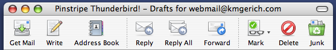

The Pinstripe Theme is coming soon to Thunderbird (Mac only of course)! Stephen Horlander has created some amazing icons. You’re gonna love it 🙂 Watch this blog for details.

## Comments

**Jon Hicks** on 2004-02-10 18:18:04
> Amazing. Those icons are absolutely beautiful - I can't wait to see the finished theme!

**bish** on 2004-02-10 19:37:01
> /me lusts

**markku** on 2004-02-11 02:38:27
> Can't we have this for the win32 builds? :)

**rgw** on 2004-02-11 16:57:05
> My understanding is that Pinstripe uses nsTheme to get to some kind of special API within OSX to give a more genuine aqua look.

**Greg K Nicholson** on 2004-02-11 17:29:51
> Does anyone have a spare Mac lying around?

**Robert** on 2004-02-11 20:01:26
> I am so happy about this theme.  I'm using Thunderbird on my XP machine but it just doesn't look OSX enough to use on my iBook.  This theme is great because I'm getting tired of the how oversimplified Mail is.

**dangerboy** on 2004-02-12 13:50:38
> Looks great, good job guys.  Can't wait for it.

**Wilbur** on 2004-02-12 23:52:23
> Wow, this theme makes the default TB theme look sick. The cartoony look is one thing that has kept me from using TB full time. But this pinstripe theme looks very clean and professional. I love it! *drools on keyboard*
> 
> Love your Firefox theme too.

**Castor** on 2004-02-15 18:53:18
> Drool indeed!
> 
> Leaves me with the big question: when?

**Cody** on 2004-02-16 01:36:17
> Very very nice, that's how thunderbird should look without a doubt, and keep up the good work :)

**Minime** on 2004-02-23 06:27:20
> Still waiting... *cough* *cough* can... wait... no... more... gimme.

**Wilbur** on 2004-02-24 23:07:18
> How much longer until this is in the nightly builds?

**Kevin** on 2004-02-24 23:53:15
> We're close .. a week, maybe two.

**Van Willigen** on 2004-02-25 18:10:17
> Hello,
> 
> Can you help the Fire (aol, msn, yahoo etc.) team with new icons
> the way you did with Thunderbird???
> 
> They need an update !

**Stephen Horlander** on 2004-02-25 21:28:27
> I actually started an icon makeover for Fire a while ago, but then I learned that they were making significant changes for the 1.0 release. Which will include a "theme" component. When 1.0 goes final I will probably finish it up and package it in a Fire theme file.

**Reinier** on 2004-03-07 14:27:27
> I am eagerly downloading Thunderbird nightlies... but so far no luck of seeing a Horlander piece of art yet...

**Alexander Ihrig** on 2004-03-09 10:12:21
> Hi Kevin & Stephen!
> 
> Thunderbird itself has no toolbar-button "Get & Send" (like OE). So I've been creating an extension:
> 
> MagicSLR
> 
> This Extension uses 4 modified qute-theme related icons. My (and the users) wish is, to have pinstripe related icons, when Thunderbird 0.6 will be released.
> 
> Would it be possible to get a preview of your thunderbird icons by mail-attachment? So I would be able to create the 4 MagicSLR icons. Or would it be possible to get 4 finished icons?
> 
> You should have a look at MagicSLR:
> 
> http://thunderbird.diepause.de/downloads/magicslr/index-en.php
> 
> MagicSLR is (I can only speak for our german users) the most used Thunderbird extension besides the offline extension!
> 
> Regards
> Alexander Ihrig
> Mozilla Thunderbird DE

**Joel Nelson** on 2004-03-09 15:05:23
> Can Pinstripe icons be created for the Outbox Extension?
> http://outbox.mozdev.org/

**Alexander Ihrig** on 2004-03-09 18:06:44
> Outbox and MagicSLR could use the same Pinstripe Icons. Outbox has only the two buttons "Send later" and "Send all" (or is "Send now"?).
> 
> BTW: The Pinstripe Icons for MagicSLR are only intended for the Mac OS X version!

**Reinier** on 2004-03-10 20:35:42
> Longing for pinstriped Thunderbird... some screenshots then, to keep us quiet? Pleeeeze?

**dzd** on 2004-03-14 23:45:47
> Can we get some icons that look that good for Pinstripe/Fx?

**macskeeball** on 2004-03-15 14:41:07
> Stunningly beautiful work as usual. When the Thunderbird version comes out I might end up switching from Mail like I switched from Safari to Firefox. Like it is now, Thunderbird is just far too ugly for my tastes.
> 
> PS- If you still want to use Thunderbird even before the Pinstripe theme is made available, I suggest using the Smoke theme as it's the most Mac-like Thunderbird theme availabe right now.

**Reinier** on 2004-03-16 14:02:39
> I couldn't agree more macskee', except I cannot bare to use Tb with the Smoke theme, knowing that this is coming along. And cannot say that Stephen's smilies help very much. ;-)

**rayced** on 2004-03-16 18:41:38
> please hurry up!!! ;) i need it!!!

**Alexander Ihrig** on 2004-03-17 07:02:30
> Why, oh why, there is no response on my question? We / I've to accept it, if Kevin is not interested in supporting extension developers. But why there is NO answer???

**Kevin** on 2004-03-17 07:26:20
> Alexander, I'm sorry that I haven't gotten back to you sooner, but we have limited free time and I have to focus right now on completing the theme and landing it in Thunderbird.
> 
> An idea I have for the future to support extension authors is to provide a sort of "Pinstripe icon kit" which would contain detailed descriptions of how to achieve the Pinstripe style along with some Photoshop examples.
> 
> Please email me after Pinstripe has landed in Thunderbird and then I will consider your request for icons. Thanks.

**x** on 2004-03-20 17:51:28
> any chances for win version?

**JH** on 2004-03-21 01:40:21
> Windows version PLEASE!!!

**Reinier** on 2004-03-24 15:49:05
> We're still waiting for the Mac OS X version. And even then…  it uses Mac specific ingredients, which cannot be used freely.

**Kevin** on 2004-03-24 18:31:39
> Here's a small update: Pinstripe Thunderbird is "done" but waiting on a code review before it can be checked in to the Mozilla source tree.
> 
> Also, Pinstripe is open source. The CSS code and images will be available when we release. You can use the code and images in any way you like provided it is in the bounds of the Mozilla MPL/GPL/LGPL tri-license.

**x** on 2004-03-25 06:29:44
> "And even then… it uses Mac specific ingredients, which cannot be used freely."
> i don't think so :)

**Wilbur** on 2004-03-27 22:42:37
> Would you mind posting what the finished work looks like? Please? Pretty please, with nutra sweet on top? :)

**Kevin** on 2004-03-28 22:16:20
> I will post some shots when it lands, hopefully this week :) You can also see a screenshot in the <a href="http://www.mozilla.org/events/dev-day-feb-2004/thunderbird/" rel="nofollow ugc">recent Developer Day presentation</a> of Thunderbird..

**weeeeed** on 2004-03-29 02:03:12
> Beyond my expectations! Awsome. This is the best looking skin ever made for the moz project.
> Can't wait, already checking out nightly builds every day... <a href="http://www.mozilla.org/events/dev-day-feb-2004/thunderbird/pinstripe.html" rel="nofollow ugc">Direct Linky</a> to the screenshot.

**Robert** on 2004-03-29 12:39:32
> This looks awesome.  Can't wait.

**David** on 2004-03-29 21:44:29
> Agreed.  I just switched to Thunderbird but will feel more comfortable with it once this theme is out to make it look more Mac-like. :)

**Jan Brasna** on 2004-04-01 10:43:32
> Yummy, that's awesome!! Been waiting for this...

**ClosetOSXer** on 2004-05-04 01:20:08
> So *when* do we get this for XP?  Share the love!
> 
> Seriously, something this nice should be the default for the apps in general.  Not a big fan of the current Windows default themes.  Using LeBreeze for Firefox and Thunderbird currently.

**Blogzilla - a blog about Mozilla** on 2004-02-11 13:51:42
> <strong>Firefox Pinstripe</strong>
> 
> The default Pinstripe Theme for Mozilla Firebird on OSX is more breathtaking than a hot pocket. On the horizon is Pinstripe for Thunderbird and it looks very promising as well. Some really great work by Kevin Gerich. As mentioned on the Pinstripe Abou...

**Ross Notes** on 2004-02-15 19:11:22
> <strong>Firefox!</strong>
> 
> If you've previously been disappointed in the look and feel of previous Mozilla/Phoenix/Firebird/Thunderbird releases on OS X, stop wasting your time with Ross Notes and start downloading Firefox. Feel free to come back to Ross Notes when your done wit...

**Life as it Comes** on 2004-02-17 15:39:54
> <strong>Mac Mozilla Themes</strong>
> 
> Kevin Gerich has delightful screenshots of the new Pinstripe UI for both Firefox and Thunderbird (not yet completed) on his site....

**adot's notblog*** on 2004-03-22 01:44:50
> <strong>aks asa and he responds (eventually)</strong>
> 
> Here it is, another installment of the amazing blog sensation, "Ask Asa" ;-) Adam Hauner asks, "Will be crash analysis data of 1.7b available again on ftp://ftp.mozilla.org/pub/mozilla.org/data/crash-data/?" Adam, we'll be doing pretty well if we can j...
