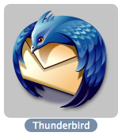

[Jon Hicks](http://www.hicksdesign.co.uk/journal/2004/04/thunderbird/), with input from the [Mozilla Visual Identity Team](http://www.mozillazine.org/talkback.html?article=4319), has designed a beautiful new logo and icon for [Mozilla Thunderbird](http://www.mozilla.org/projects/thunderbird/). Strong imagery. Great colors.

The new icon hasn’t made its way into the Mac OS X Thunderbird nightly builds yet, but when it is included it will be a great compliment to the new [Pinstripe theme](http://kmgerich.com/archive/images/thunderbird-progress.png).

## Comments

**Jinketsu** on 2004-04-20 14:28:36
> "Mozilla Thunderbird," "The application that gives email a big hug." :)

**Jonathan Hicks** on 2004-04-20 16:41:19
> Thats a shame, I was trying to go for more of a "P**s off! This is MY letter!" look...

**David** on 2004-04-20 18:36:17
> I love it! Any idea when it will show up in the nightlies?

**Neil** on 2004-04-21 01:52:44
> Oh, I /so/ wish that thunderbird would support either importing data from OS X's address book, or just used OS X's address book altogether...
> 
> Totally beautiful icon. I think it's very, very cool how the mix of development prowess from the Mozilla programmers is mixing with the aesthetics of the mozilla visual identity team. A great partnership, for sure!

**Chris** on 2004-04-27 02:40:28
> I downloaded the April 25 nightly, and it's got Jon's icon.  Thunderbirds looking real slick—makes me look forward to having all components of the mozilla suite in stand-alone form.

**Fire and Knowledge** on 2004-04-20 15:03:04
> <strong>New Thunderbird Icon Coming</strong>
> 
> Simply amazing, as usual.  John Hicks has an amazing eye for icons, as well as everything else design.  I also just found out about the newpinstripe theme  for the OSX version of Thunderbird, which looks incredible.  I&#8217;m so excited that I&#8217;m...
