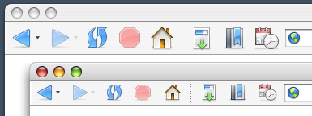

Firefox 0.9 has been [released](http://ftp.mozilla.org/pub/mozilla.org/firefox/releases/0.9/). This new version includes a lot of great [features](http://www.mozilla.org/press/mozilla-2004-06-15.html) and optimizations as well as a new [default theme](http://kmgerich.com/archive/000063.html).

Mac users will allso notice that the default theme also gets a set of Aqua icons to replace the previous “[button](http://kmgerich.com/pinstripe/screenshots/browser/tabbrowsing.png)” icons. The new icons are more consistent with the Aqua icon guidelines and are easier to hit with the mouse. They also work with the Windows default theme to create a unified look across platforms.

I will create a Graphite version soon. Oh, and before you ask me to put the old icons back, please turn on “small icons” and live with the new ones for a week. Then we’ll talk 🙂

## Comments

**Jinketsu** on 2004-06-15 10:29:30
> Well, I wasn't expecting Pinstripe to change. This one is like your old Pinstripe beta that wasn't released. At least it's less Safari-like.
> 
> Are you going to keep updating the 0.8 Pinstripe? please? :)

**Chris V** on 2004-06-15 10:30:08
> I just downloaded the new release earlier and was surprised by the inclusion of the new theme.  Although I wanted the old look back for a few moments, I do believe the “multi-platform”, unified look has started to grow on me.  Thanks for the great work.  I hope to see a common theme across the mozilla apps in the future.

**thenightfly42** on 2004-06-15 10:44:50
> I haven't installed it yet, but I'm glad to see color in the Mac theme.  Any reason why the front/back buttons are the same color as the refresh?

**Patrick Bennett** on 2004-06-15 11:12:24
> Well, I liked the previous buttons better, but I guess that's just me. I feel the new ones look "cheaper" in some way than the previous ones. Oh well... maybe you can make them as a seperate release at some time.

**James** on 2004-06-15 11:14:28
> Bring back the old pinstripe theme from .8!!!! Please!!!  I love that look.  The new look is fine, but makes me think of a windows icon port.  You do fantastic work, but let me have the option of at least using the old icons... Please!!! :)

**Kevin** on 2004-06-15 12:02:25
> Yeah Jinketsu, it is sort of like a beta of Pinstripe I had a while back :)
> 
> <a href="http://kmgerich.com/archive/images/pinstripeworking.png" rel="nofollow ugc">Here's a screen shot</a>

**Robert Curtis** on 2004-06-15 12:27:57
> Home icon = great
> Stop icon = great
> Back/forward = nice, but very blue
> Refresh = ok, but different colour and more rounded (as opposed to elliptical) shape would be better I think

**Robert Curtis** on 2004-06-15 12:35:08
> BTW, what happened to theming the Help browser?

**ts** on 2004-06-15 12:40:16
> I don't think the home button fits in Mac OS X. IMHO it should look exactly like the icon of the users home folder. "Stop" and "Reload" look great but "Back" and "Forward" seem to be too simple. Bookmarks icons are still looking awesome.
> 
> What about native looking form controls? I would really like to see Aqua-widgets.

**ives** on 2004-06-15 12:43:48
> At first I didn't like it, but it started to grow on me

**James** on 2004-06-15 12:53:13
> I don't know.  It may be growing on me, maybe not.  I love all the icons EXCEPT for the back, forward, refresh, stop, and home...
> 
> And I do have all the icons viewing in a small size; although, when I was using the .8 icons I used the full size icons.
> 
> Actually, the home icon is decent.  But I don't like the back, forward, refresh.  Stop is ok.  Just my .02
> 
> I do appreciate the fact that someone is taking their own time to create and work on an OS X theme for firefox, so thank you for that!

**Stephane** on 2004-06-15 13:34:16
> I love the work you've been doing for Firefox, it renders the browser actually watchable :-)
> 
> On another note, I think your stop button look better in the Win screenshot with the big X on it. I think the Reload, Back and Forward icons are a little to simplistic. A real arrow would have been better imho, also the reload could be inspired by the Reply icon from Thunderbird.
> 
> It is still the best theme around, the tabs are the must usable/beautiful I've seen in any theme.

**** on 2004-06-15 13:40:11
> Well, this is very discouraging. I thought one of the top selling points of .8 was the new mac-like theme. What happened? Firefox for Mac has lost it's mac-ness. It now looks like a Windows app ported for the Mac. The new icons are too simple, too bright and too cartoony. Its a shamefull day for Firefox on the Mac.

**bish** on 2004-06-15 13:42:32
> my vote is that the Back/Forward buttons get changed from the current green to some shade of Firefox orange found in the logo/icon.
> 
> eh? ...could look nice.

**Nx** on 2004-06-15 13:44:34
> >> Firefox for Mac has lost it's mac-ness. It now
> >> looks like a Windows app ported for the Mac.
> 
> excuse me... where exactly are you looking? the new theme looks great and fits OSX wonderfully!

**JB** on 2004-06-15 14:16:23
> It is to bad the old icons have gone. It was one of the main reasons to start using Firefox as my main Mac browser.
> 
> These new icons look cheap and would indeed better fit on the Windows platform.

**rgw** on 2004-06-15 14:49:58
> This 'unified look' thing is absurd. Everyone knows that XP and OSX are irrevocably different and taking an iconic middle ground will just lead to a half-rate UI on all platforms. Didn't the Mozilla Suite teach you guys that fact? I agree that the new Pinstripe icons are the best choice, but their windows counterparts are just plain yuck on that platform. The winstripe idea needs to be chunked and a return to the drawing board is needed with just XP UI correctness in mind, not this unification crap. Yeah, Winstripe is still early in development, but the concept behind the theme will just plain not work. So sitting around and waiting for the theme to mature is near idiotic because it is going to mature into a bastardized child of OSX and XP unless the whole concept changes.
> 
> Of course, no one will listen to the hardcore Mozilla community...and 99.9% of the time Ben and Co. would be wise to do that, but this time they are 100% wrong - no doubt about it. All of you guys are _excellent_ artist that far exceed my ability, but most of the Fx community seem to have a better idea of what an XP apps should look like in comparsion to the current rendition of winstripe. Personally, I think the Phoenity artist should be given a chance at the default theme...he seems to grasp the XP UI concept very well.

**Stephen Horlander** on 2004-06-15 15:35:55
> Right... Taking icon concepts from one platform to another is doomed to failure, no matter what. It is unsalvageable. We should probably just trash everything we have done so far because we are never going to get these icons shoehorned into XP. I finally see the light, thank you.
> 
> Look a dead horse! Quick, beat it! I am amazed at the continual bitching about this subject.
> 
> Constructive criticism has been taken. Reoccurring concerns are being addressed, but not everything will change, nor should everything change. People keep saying that it doesn't fit in well with XP, I would like to know what applications that they are using that fit in perfectly with XP? Applications that fit in even a little? Applications that fit in with Luna and Classic? Aside from the applications that come with Windows, there are maybe a handful of third-party applications that even make an attempt to conform to the XP look. Most of the bundled applications are inconsistent within themselves.
> 
> Firefox needs its own look, something that has a common theme among platforms and something that looks nice in a variety of different scenarios. "Winstripe" needs some extra XP attention and tweaking, but to say that icon subject matter can't survive the trip from one OS to another is nonsense.

**** on 2004-06-15 15:48:41
> But its not just XP. It doesn't work for OS X either. Why fix something that wasn't broken?

**Stephen Horlander** on 2004-06-15 16:00:51
> Why not?
> 
> Who says it wasn't broken? Qute had licensing issues, so it was in fact broken in regards to continued use in Firefox. Which of course is how this all came about in the first place.
> 
> Those icons that "don't work well for OS X", were in fact designed for OS X first, a long time ago before settling on the "button" look.

**Jon** on 2004-06-15 16:01:31
> Ah, Mozilla has and always will largely ignore user opinion. And thats whats going to happen in this case. But, it should tell you something when Mac users and Windows users actually agree on something. They agree this theme is not the answer. (IMO, looks like a flat, rainbow-colored version of Mac IE 5) And with the small number of themes for Firefox Mac, its even worse. Well, at least Mac users have Camino.

**Kevin** on 2004-06-15 16:02:15
> Providing a cross-platform identity is secondary to the goal of providing the best experience on each platform. But we will do both to the extent that we can.

**Stephen Horlander** on 2004-06-15 16:27:42
> I think in the future I will run all theme decisions by the "community". That way we could have the best possible theme ever! I am sure we could get everyone to agree on something. It would probably be done in record time too.
> 
> As a fall back method I will take a random sampling of internet posts because they represent all possible user opinion. With anonymous cowards and first posters having the most weight.

**Anonymous Coward** on 2004-06-15 16:38:01
> Your sarcasm is f***ing hilarious. Someone doesn't like your half-baked theme and you resort to insults. Have you read the opinions on mozillazine yet. Most are downloading Qute immediately to 'make the browser usable.' So don't be an ass. Take criticism and ignore it like Ben and the rest of the team.

**Stephen Horlander** on 2004-06-15 16:45:57
> As Anonymous Coward your "criticism" get first priority. ;) Man some people are sensitive.

**Kevin** on 2004-06-15 16:59:43
> Guys, don't make me come back there.

**Jack** on 2004-06-15 17:14:52
> First of all I'd just like to say how much I think we all appreciate your work on the Mac OS X Pinstripe theme for both Firefox and Thunderbird. All your icon work is of a very high quality IMO.
> 
> Your new theme is pretty good and will presumably get better with polishing. However, the reason some people are upset about the change is that frankly, they were almost head over heels in love with the old one from first sight.
> 
> I realise there is a lot of politics involved in giving Firefox a unified look and feel, however, you must at least see some people's point of view on the simple fact that no OS is quite alike and making a theme that will blend flawlessly with all of them is incredibly difficult.
> 
> On a side note, the new Windows Firefox theme is simply not as good (yet) as the old Qute theme, which did have flaws itself, admittedly (never got on with the refresh button). However, I think it will actually be better in the long run than Qute so I'm willing to give it the benefit of the doubt.
> 
> Here comes the big crunch though. Qute is still available, old pinstripe is not. Is it technically feasible to release a different icon pack for the hardcore pinstripe lovers? Opensource is about choice and I think people should be able to use either icon set as they see fit.
> 
> I will tentatively support the continual usage of the new pinstripe, I hope you take into account the constructive criticisms already made.

**eff** on 2004-06-15 17:15:48
> Count me in with the folks who were a bit disappointed after seeing the inclusion of Winstripe in FF 0.9. Now don't get me wrong - this theme is not ugly. It's quite well done and (imho) more consistent than many of the previous themes.
> 
> <b>But</b> and this is my primary complaint - they are not OS X icons. For example, if you compare the icons from Winstripe with the Finder's toolbar icons you'll see that Winstripe seems rather flat and weak in comparison.
> 
> Branding and software interfaces is quite a tricky topic - Personally, I as a user do not want the Firefox brand forced upon me every time I look at or interact with the browsers' toolbar. I (as I'm sure many people did) love the Mac OS because of the consistency of its user interface - regardless of what app I'm using things (usually) look and work in familiar ways.
> 
> KDE, Windows XP and OS X all have their own distinctive look and feel (= branding) - imagine if every piece of software introduced its own (different) look and feel, forcing the user to adapt to a slightly different standard whenever he/she switches between apps - I'm not sure how desirable that would be.
> 
> From my POV Firefox (or any software brand, for that matter) should attempt to create their branding through the use of distinct symbols and then adapt their style according to the guidelines of each major Desktop environment.
> 
> Communicating a consistent branding message doesn't equal and/or require forced uniformity :-)

**Jack** on 2004-06-15 17:25:31
> Indeed I agree with what eff has said, I think its also important to note the incredible branding of the Firefox and Thunderbird icons - they simply rule IMHO. Very recognisable and very nicely drawn indeed.
> 
> Is this not branding enough?

**Bruce** on 2004-06-15 17:31:50
> I am a professional designer / art director, and while I do appreciate all the hard work put into the new theme (and I have tried it in "small icon" mode) I tend to agree with those that prefer the theme in version 0.8. Maybe it is just the fact that the graphite mono-tone 0.8 version gives the feel of a unified interface and does not compete (and cause clutter) with the content displayed in the web page.  Maybe it is the fact that the "buttonized" 0.8 version icons create a clean horizontal line aligned with the URL/address field. Whatever the reason, I do prefer the 0.8 version...not that the 0.9 is neccessarily bad, I just think 0.8 is better. Then again, design is always subjective. I do hope you choose to release the 0.8 version as a packaged, downloadable theme for 0.9 browser users and grant us the option to choose.

**Tony Arnold** on 2004-06-15 18:15:10
> I think you've done a fantastic job Kevin - I love the new theme!

**Jay** on 2004-06-15 18:27:04
> I own both a mac and a pc and I appreciate the work going into making the program uniform across platforms while still blending in with the environment it is running in. I don't think its an impossible task and from the work done thus far, it seems very achievable.
> 
> It just seems to me that much of the outbursts from parts of the community concerning some recent decisions happened merely because they caught everyone by surprise. People have a tendency to become attached to something they use daily and like so when it changes suddenly people seem to panic.
> 
> For example "Winstripe" just came out of the blue when people downloading were probably expecting qute. Their reacting seems to be like OMG What did they do?
> 
> The same thing happened with the Pinstripe changes. People did not see it coming and had a similar reaction.
> 
> So what I am thinking might avoid all the unnecessary noise is not really getting approval from the community for every change but sort of like a warning shot or some kind of preview so people know something is coming and don’t have the OMG reaction. Maybe like a screen shot of the changes you are going to make and people can sort of have in mind what’s coming. It’s just a suggestion.
> 
> Anyway I hope all of this uproar isn’t getting you discouraged because what you are doing is important to the success of Firefox and I really dig the new theme, it has lots of potential.
> 
> That's all I have to say. Don't know if it makes any sense to anyone else but it's what I think.

**Peter da Silva** on 2004-06-15 19:48:17
> Another voice calling for the return of the original Pinstripe design. I'm actually surprised that there's even a question but the the "button" icons are a better fit for the Mac desktop, and I came here expecting (yes, honestly expecting) to hear that the original Mac-style pinstripe would be coming back... at least as a downloadable theme if not a "standard option" the way Mozilla comes with "Modern" and "Classic". How about that, as a compromise?
> 
> I had been considering switching to Firefox as my main browser, after 0.8+/0.9RC fixed the problems I was having with the extensions, even if it's a little more sluggish than Safari on my G4/466... but I can't stand leaving it open now, so that's obviously not an option. *sigh*

**Joe** on 2004-06-15 20:38:56
> It's amazing that Safari has only been available for  about fifteen months, but so many of the Firebird 0.9 complainers are convinced that its little square buttons are the only proper controls for a Mac webbrowser.  How did we ever manage to surf the web back then?

**James** on 2004-06-15 21:14:32
> Anonymous?  I haven't been posting anonymously.  I find the sarcasm by Stephen disturbing.  I understand that a lot of work had been put into the new theme, but I think the biggest outcry isn't that the theme sucks, but that you guys took away a theme that people loved.  Loved.  All you have to do is say, sure, that's not going to be the default theme, but at somepoint we'll package it up as an additional theme.  To not mention the .8 theme and deride people for there shock that the .8 theme isn't and may no longer be is a sad state of affairs.  Isn't that the point?  It's a theme?  I'm sure it would have been taken better and there would have been less bitching by people if the old .8 theme was still available.  But at this point in time you guys are stating, nope, we don't care if you don't like it, you'll have to eat the theme that we feed you and you'll have to like it.  Very microsoftian.  You'll take what we give you and like it, or else.
> 
> As I said before, I love the fact that you guys are working hard on themes, and good ones.  But don't discard the old ones that people love.  And don't deride people who are in shock that you may be throwing away and no longer making available the theme that they loved, and that made them set firefox as their default browser.
> 
> Personally, I may go back to safari.  Sad to say, but the .8 theme actually caused me to use Firefox as my primary browser.  I've tried helping out with bugs when I could, but if the very fact that someone doesn't agree with your icon set that you have determined is the end all be all icon set and must deride said person then what's the point of having the community involved with this.  Wait, maybe that's your point, you feel like it's not a community product, that it's not something that everyone else should be involved in.  You must have some sort of knowledge that this is the best thing for the direction, and that there isn't any other option or glimmer of hope that you can throw out to the end users.
> 
> Since that appears to be the case, you can count me out as a potential firefox 1.x user.  The technology is great, the interface used to be superb, (not saying the current set is bad, cuz it's good, just not as good as the .8 set for the mac) but if the development community is so snooty then you can count me out of using firefox and mozilla since voicing an opinion is only deserving of derisiveness.
> 
> Back to safari.  You can count me out of the mozilla community since the mozilla project apparently can't handle the constructive criticism being put out there by users that love the product.

**Daniel J. Wilson** on 2004-06-15 21:17:39
> I like the new version.  The previous version made the same UI mistakes seen in Safari's toolbar icons, which fail to use shape and color to effectively differentiate icons.
> 
> Kevin and Stephen: Keep up the great work!

**Peter da Silva** on 2004-06-15 21:21:29
> The problem I have isn't the shape, it's the color.  The native Mac theme is relatively monochrome to begin with, and I've pared down the palette of my Mac further using themes like  Milk and replacing common icons so that where there *is* color it's information, not just decor.
> 
> A "Winstripe Graphite" would probably do as well, but the old Pinstripe already exists and works well, so why discard it?
> 
> Ideally, of course, Firefox wouldn't use themes, it'd use native widgets everywhere and would automatically match the native look and feel. But since I don't have JWZ's audio-cock technology at hand, I have to make do with themes that are minimally jarring.

**Jinketsu** on 2004-06-15 22:15:01
> I remember people complaining when the .8 Pinstripe theme was introduced, they liked the Pinstripe beta better, because it was more "Mac-like."

**rgw** on 2004-06-15 22:21:00
> Mr. Horlander personally verbally raped my reply...yay, I'm special. You know, I may be overreacting but only time will tell. You guys do get paid to do this stuff, so you might know a little bit about the subject...but if I'm right I expect restitution for emotional damages. :)
> 
> BTW: Longhorn seems to be changing the UI so much that all this fighting and work will be of no-use in a few years. Damn you Microsoft, decide on a UI style already!

**** on 2004-06-16 04:50:23
> These icons are very ugly and un-Mac like.

**** on 2004-06-16 07:01:43
> I think Winstripe looks like it is going to be a great theme, even if it isn't quite there yet.
> 
> However, leave Pinstripe alone! The old icons were perfect, very Aqua. These new ones aren't quite as slick and Aqua-like. Can you at the very least continue to make the old version available?

**dave** on 2004-06-16 08:03:41
> What a bunch of whiny children.
> 
> For those threatening to switch to Camino (or any other browser) because of the design of an easily changeable default theme, an appropriate quote from their lead developer's website:
> 
> "Another thing that really pisses me off is that there are tons of things in Camino's UI that need improving (the download manager comes to mind among a long list of other things) but I just don't have the time. Oh, I'm sorry, I have a life and a job. However, that doesn't seem to be enough for some people, who repeatedly insist (or dare I say, threaten) these shortcomings be fixed or they'll go use a different browser. See this? This is me giving you the finger. Get over yourself. I have."

**Peter da Silva** on 2004-06-16 08:19:14
> Dave: the problem isn't "the design of an easily changable default theme", it's the abandonment of a great theme. It doesn't matter whether it's the default or not, it matters that it's now gone. The Pinstripe theme doesn't exist any more.
> 
> And characterising "the Pinstripe theme was so good that it made me consider switching to Firefox even though it's slower than Safari" as some kind of threat... um...

**** on 2004-06-16 09:21:33
> U . G . L . Y

**brian** on 2004-06-16 10:02:03
> the new icons are nice and professional looking, but  all of the different colors are an unecessary distraction on osx. the point of viewing a web page is to view the content of the web page -- these new icons compete with that content. yes, even at the small size. i would definitely welcome an all graphite version of the icons (including home and stop). in the meantime, could you please bundle up the 0.8 pinstripe theme so i can install it in 0.9?

**tobbe** on 2004-06-16 10:38:02
> I love your work, and i really think people here are flaming you for the wrong reasons.
> 
> However, i'd love to be able to run the firefox0.8 theme in 0.9 again too, i think i saw you post something about it being available in a week or so so i guess this post is unneccesary - but anyway, keep up the good work. I like the new theme but i loved the old one, congrats for making the best damn browser-UI i've seen, ever.
> 
> Rock on

**VandalL** on 2004-06-16 11:22:47
> Please bring back the old Buttons. Txs. Dont let the  win&lin unifiers bully you. You know whats goot for the Mac folks :)
> 
> V

**Darkside** on 2004-06-16 11:29:28
> I think iconic consistency across platforms is ridiculous; the Winstripe versions on Windows and Mac OS X aren't even the same!  OS X has a supposedly "Aquafied" version, but the Back and Forward buttons are different colors (blue on OS X, green on Windows), and they bow to the operating systems conventions of how do display inactive controls (faded vs. gray scale).
> 
> Let the consistent workflow of the application be the unifying factor between Windows, OS X, and Linux.
> 
> From a graphical standpoint, those three environments look nothing alike.  They have their own widgets, their own style; Mozilla shouldn't be imposing some watered-down icon mash on everyone.  The Winstripe theme even incorporates some of these variations, but still thrusts the same icons onto every platform.
> 
> I like the look of Winstripe... but the name is a dead-giveaway that it doesn't belong on my PowerBook or any OS X machine.  Unfortunately, there it is in the new 0.9 official release.
> 
> When will I be able to install Pinstripe for Firefox on my Mac?  I'll give the "Graphite" version of this Winstripe theme a chance, but I'd prefer the glossy, rounded-rectangles of the original Pinstripe.
> 
> And when will the Mozilla Visual Identity Team realize that they're job is NOT to dictate what widgets look good in my toolbar?  Focus on the application icons (which are beautiful, seriously), make a splash screen if you have to, but understand that an application's "look and feel" shouldn't override the graphical style of the operating system.

**eff** on 2004-06-16 12:01:15
> (Kevin, feel free to delete my post if you think this is not the appropriate place to mention this)
> 
> No blogwh*ring intended - but as long as you're using Mac OS X and would like the old Pinstripe back in FF 0.9, feel free to head on over to my site - I've put together a quick illustrated <a href="http://www.efflog.org" rel="nofollow ugc">"guide"</a> on how to put the good old Pinstripe back into Firefox. I've been running this mod all day long without even the slightest problem. :-) As always, though - ymmv.

**James** on 2004-06-16 15:41:52
> Ok, fine.  I'm still using firefox today even though I ranted yesterday.  I followed eff's quick illustrated "guide" and restored the icon set to .8 using his classic.jar replacement suggestion.
> 
> Thanks eff.  Again, the new theme is nice, but I just don't love it like I do the .8 theme; notwithstanding, I've not been trying to bash the work that's been done, but the attitude for which any comments that were negative about the work have been taken.
> 
> Again, you guys do great work and it is appreciated.

**dredoz** on 2004-06-16 21:28:07
> I love the new WinXP Firefox default look and
> I hope Thunderbird will get the same look for its next release!
> 
> keep up the great work!
> thanks!

**Ryan** on 2004-06-17 08:27:14
> I think the new UI is great. White on White with some grey never really seemed right- and if you think that is more visually appealing chances are you have no idea what you are talking about.
> 
> The new theme is great, it is simple, consistent and visually appealing.
> 
> If all you bitchers and moaners in here don't like the new theme so much... why don't you write your own? Chances are most of you have no talent, no eye for the asthetically appealing, and couldn't put together two complementary colours if your life depended on it.
> 
> ...Kevin, keep up the good work.

**bonaldi** on 2004-06-17 10:53:27
> Count me in as a disliker. I actually dislike it enough to seek out this website in an effort to change it back. Since it seems I can't, I'm going back to 0.8, and I think I'll be staying there.
> 
> Mono. Please. This crazed crayon colour clash is ridiculous. As is trying to make the application look the same across platforms.
> 
> Care to compare IE for windows with IE for Mac?
> 
> What's that? Oh: (from screenshots it seems like) IE for Windows has garish colour calamity, while IE on Mac has a soothing all-colours-the-same icon set. And you can even make them all gray.
> 
> I don't own any Windows PCs, I don't use them at work. Why should my browser suffer just for the sake of some esoteric cross-platform dream?
> 
> And yet: why should my page controls clash with the page. Jesus: Blue, red, the home and a host of other options for up there. It's nonsense. Nice try, but please go back to improving pinstripe.

**eff** on 2004-06-17 11:26:21
> <i>"Since it seems I can't, ..."</i>
> 
> bonaldi, scroll up 4 posts above yours on this page. :-)

**Greg K Nicholson** on 2004-06-17 21:02:30
> "Firefox for Mac has lost it's mac-ness. It now looks like a Windows app ported for the Mac."
> 
> ...and here's Winstripe being accused of looking too Mac-y and not at all Windows-y. Can't win :)

**Greg K Nicholson** on 2004-06-17 21:17:17
> By the way, through using the theme you've won me over - especially when compared to the Mac theme. I like the consistency and I'm looking forward to tweaks tailored to each specific OS.
> 
> My suggestion is that the basic devices of the icons be kept identical across platforms, but the use of colour and texture be tailored to each OS.
> 
> The screenshot of 0.9 Mac shows Aqua-like textures on (for example) the Bookmarks icon. It'd be excellent to see Luna-like (Qute-like) gradients and bright colours for Windows. Gnome could use their more subdued colours for the same icons.

**Ben Goodger** on 2004-06-17 22:32:59
> I love the new icons. I also like the old icons. The new icons give us a browser that is identifiably Firefox on all of the platforms that we run. (Apple took this a step further by making iTunes even appear Aqua-like on Windows - and guess what - I don't care, because the app works as advertised - desecration of "sacred Windows GUI principles" (which change with every major Windows release or release of MS Office) aside...)
> 
> I don't see anything stopping anyone from taking the old toolbar set from an old build and creating and maintaining a "Pinstripe Retro" of sorts.

**Philip** on 2004-06-17 22:48:25
> Another vote in favor of the new theme... I like it.

**george** on 2004-06-17 22:55:21
> Kevin--
> Thanks much for this new theme. As a long-time Mac user I feel that Firefox "looks and feels" like a application built for use on a Mac!
> 
> While I also liked the previous Pinstripe theme, this new theme blends in more with the colors and textures of OS X. Your efforts have greatly improved the usability of Firefox for everyday use.
> 
> Firefox is now my primary browser.
> 
> I also agree completely with Ben and the team--when I use XP or Linux in other environments it is so great to use a browser with the same features, structure, and design.
> 
> Firefox has fast become perhaps the premier example of open source success--Great work!

**Dat** on 2004-06-18 02:36:20
> Thanks <a href="http://www.efflog.org/" rel="nofollow ugc">eff</a> for the guide to bring the old pinstripe back. I don't have the right to complain about a heavily work-in-progress theme, but I'm glad the more polished theme is "available" as an option.

**arkayn** on 2004-06-18 18:08:14
> Downloading the last build from 5-31-04 so I can get my pinstripe theme back, I have always liked it since I downloaded the original.

**Fred Goff** on 2004-06-19 10:35:04
> The elitist snobbery on display here by some in the winstripe dev. team is quite revealing, but not terribly surprising.
> 
> The problem with elitists is that they think that they're the only ones smart enough to understand what people really need.
> 
> Unfortunately, it just feeds their supeiority complexes when people say things like UGLY when listing their complaints.
> 
> The problem is, an elitist snot can't bring himself to admit that just because a person can't communicate the reason WHY they dislike something does not INVALIDATE their dislike.
> 
> If a bunch of people say your art looks like crap, then it does. These people aren't whiners, they just can't quite explain WHY your art is crap.
> 
> Let me help you understand why Winstripe is crap and everyone hates it.
> 
> It breaks usability. It really is that simple. Winstripe makes Firefox LESS usable than it was before.
> 
> How? Simple. Garish color. The human eye is very sensitive to color. It will be the first thing the eye is drawn to in any environment.
> 
> This can be used to positive effect in good UI. You want to make PRIMIARY UI elements that you want quickly locatable have color. You also want to make them smaller, because the eye will spot the color, and the size doesn't need to be so pronounced.
> 
> OS X uses this trait of the human eye effectively with scroll bars, window controls and dialog buttons. They are colored to allow for quick location because they are the most important elements on the window.
> 
> This is precisely the same reason why the winstripe icons suck. They declare themselves through their bright colors to be primary window elements, yet that IS NOT THEIR FUNCTION. They are secondary elements, therefore they should be more muted. Instead of drawing primary attention to themselves, they should be easily locatable ONLY WHEN DELIBERATELY SOUGHT OUT BY THE USER.
> 
> The old pinstripe theme did this perfectly. The monochromatic icons were locatable without being distracting. The subtle button look advertised the icon function without overwhelming the user. The SHAPES, which is the PRIMARY way humans identify objects (it is NOT color) were well-thought out to effectively communicate each widget's function.
> 
> The new theme throws all this good UI out the window and instead uses the crappy Windows interface convention of: Let's see how much crap I can put in a window to distract the user.
> 
> This is a common problem among interface designers, especially in the Linux crowd, where they incorrectly equate "oooh pretty" with good usability.
> 
> The very fact that the first recommendation the author of Winstripe makes is to REDCUCE THE SIZE OF THE ICONS points out the primary flaw: Overwhelming the user. He's trying to overcome this fundamental flaw with a kludge workaround: make them smaller (the "you idiot user" is implied).
> 
> Now, the interesting thing about usability is that most people will not be able to explain this to you. Instead, they'll just look at your product and say: Man, this sucks.
> 
> So, get off your snotty elitist horse and realize that when people say a UI sucks, THEY are right, and YOU made a mistake.

**Kevin** on 2004-06-19 12:32:49
> People may not be able to articulate themselves in terms of design or usability, but I EXPECT readers of this blog to comment in a way that is not insulting. That's it. Those are my terms. Basic decency. Basic communication skills.
> 
> When someone says that things like "your theme SUCKS" or "your art is crap", it makes me less likely to take them seriously - even though a good point might be buried in there somewhere.
> 
> I read every word of feedback here, on other blogs and on the MozillaZine forums. I have posted here and in the forums to engage the community, but have chosen not to do a point-by-point response to every post because of the large volume. If you want to insult, please do not waste my time or bandwidth.

**rgw** on 2004-06-19 14:55:30
> I think Fred Goff has touched on a really good point: the sheer amount of dislike from average users, UI amateurs, and mozilla freaks should tell you something. Despite what I've been hearing from pundits lately, a good UI expert listens to his users. You might not do what they say...but you do take their criticisms to heart. So when you hear a lot of the "hey, this sucks" type statements, don't cry me a handful of tears or spit out a witty repartee...do something about it.

**allen** on 2004-06-19 15:25:52
> Kevin,
> 
> Let me first say your approach to the over-the-top criticism of both the new Pinstripe and Winstripe has been admirable. Don't let the flamers get to you. Constructive criticism is one thing (and very useful it is too), but some of the comments I've read here and at Mozillazine are inexcusable. This should not ever get personal.
> 
> Any major change involving Mozilla creates uproar, it's an inevitability. You only need recall what happened with the last name change - not to mention the turbulence caused by the initial plan to drop the suite and switch development solely to the separate apps.
> 
> I'm sure you have already taken heart from the fact that you could have come up with the best theme humanly possible and there would still be people would still bitch, whinge, moan and whine.
> 
> It seems Mozilla enthusiasts, more than most, resist change of this type. Why this should be, I don't know.  It may be because name and theme changes have a direct affect on the brand. Although I must say that I’m surprised so many are interested in branding – I thought I was in the minority in that respect.
> 
> What the enthusiasts need to recognise is that this theme isn't being created for them. It's being created for the masses that don't yet use Firebird, or the minority of current users who aren't savvy enough to know how to change their theme. I'd guess that amounts to no more than 10% of existing users. For the remaining 90% (including everyone that has posted here and at Mozillazine) the actual choice of default theme should be a moot point.
> 
> It's that last point which leads me to question the need to get so uptight about changing the default theme - particularly when the standard of the new theme is so high (an opinion, I know - but it is at least an educated one from a fellow designer). It is likely because people generally think they have good taste - and that what they like the majority like (or at least should like: "if they don't, they're wrong"). This usually doesn't follow - especially in the computer world. I'd rather have someone skilled and trained developing the theme than someone who merely carries an opinion they assume is shared by the majority.
> 
> I appreciate the quality of work you are producing. I know I'm not the only one - it's just that those who dislike it are louder at present.
> 
> Having said all that, I'd like to add a note of constructive criticism if I may...
> 
> One thing that has bugged me about Pinstripe since the beginning is the size of the toolbar 'Space'. Why does it need to be so wide? Could it not be half the width? That way you could still have gaps on the toolbar of the current size (by using two), but also smaller gaps for those (like me!) that prefer them?
> 
> Also, do you have any plans to release the previous version of Pinstripe as a standalone? Although I do like the current theme, I'd like the option of using the old one too - mainly because there are so very few themes that actually work in OS X.
> 
> Once again, keep up the good work!

**Ben Goodger** on 2004-06-20 00:35:03
> It never ceases to amaze me at how rude people are to those that pour hundreds and thousands of hours into providing a /free/ service to the world. I'm percolating a blog about this subject, probably not to be published this quarter, but it's coming.
> 
> How about the rude, obnoxious whiners get off *their* high horses and realize that Mozilla is an open source project, if you don't like it, feel free to do better! Mozilla has never been based on random commenter X having absolute power over those that have write access - it has been based on those who put their money where their mouth is.
> 
> If you don't like my attitude, feel free to see the Complaints Dept. (tm). [If you need an explanation of what this is, please read the archive on my personal blog]

**rgw** on 2004-06-20 11:59:38
> Ben, where did you get 'the complaint department'? I need one of those for my dorm.

**Dan** on 2004-06-20 13:39:38
> Just a quick point - I run ShapeShifter on OS X because I find the <a href="http://www.maxthemes.com/maxthemes/themes/bbxmercuryx.htm" rel="nofollow ugc">BBXMercury</a> theme much more soothing than Aqua to stare at all day. This theme makes toolbars a light grey instead of white. Winstripe's colors look kind of strange over that, while Pinstripe looks even better than on Aqua as the grey background gives the white buttons more contrast.
> 
> eff's suggestion above worked fine for me. I think Winstripe is a good start and will improve, but I'd like to see a complete Pinstripe for OS X as well. Perhaps both OSX and Win versions could come with Winstripe as a default, but packaged with Pinstripe or Qute respectively (like Mozilla's old Classic/Modern).
> 
> Overall very pleased with Firefox 0.9. Only major complaint is that I still don't understand why the cookie manager is hidden two menus deep in preferences. I'm constantly deleting cookies while testing sites and it seems to me it would make more sense next to Themes and Extensions in the tools menu.

**Ben Goodger** on 2004-06-21 02:38:25
> rgw: IKEA, $9.95

**Marc Poirier** on 2004-06-21 13:02:51
> I have been a big fan of Pinstripe and Kevin's work for a long time.  Without it, I might not be using Mozilla, cuz yes I am that shallow.  But really, I do think that the look of software effects your experience with it enormously, and even a wonderfully featured thing gets grating when you hate to look at it.  That said, I think that Mozilla is about as wonderfully featured and just plain wonderful as software gets, I mean it's up there with like my top 3 apps out there, I love it to death, and so this is all a preface to saying:  I adore Mozilla, and it's important to me how it looks, and I have admired Kevin's theme work.
> 
> Having said all of that, I was pretty taken aback when I installed Firefox 0.9.  I thought that something had gone wrong, that some other theme accidentally got mixed into the release build, because the toolbar icons were hideous.  I tried to live with it, but finally I decided to search the web to see if this was a bug that others had encountered, then found this page indicating that the icon change was intentional.  Now learning more about it, I see that really only 5 icons have changed:  the forward, back, reload, stop, and home icons.  But given that the only icons I have in my toolbar setup are those first 4, that's all I see.  I love the other icons.  I like the home icon, too, obviously very Mac OS X looking.  I love everything else about the theme.  But it's those 4 icons that I just can't stand.  And that's what I see all the time when I use Mozilla.  So I really hope that they are reconsidered.
> 
> I liked the old icons for those 4 things.  But I also see that they don't really match the rest of the icons, which have color.  So I'm not against them being redesigned, I just think it could be way better than the latest.  For one thing, the shades of blue and red that were chosen I think are very ugly.  More-over, I think that having primary blue and primary red as the main icon colors is a really ugly scheme.  I can understand the stop being red, but I would recommend something other than blue for the forward, back, and reload buttons.  I'm not good with graphics stuff, so I am better at saying what I don't like than what I like.  I know it's not as useful to say "not blue" than it is to say what I would like it to be, but that's the best I can do with attempting to provide constructive criticism.  Also, I think that those icons could have more colors, they don't just need to be mono-color.  The other problem with them is that, as others have said, they're very flat.  They're very geometrically uninteresting, too.  I think that the shapes could be more stylized in interesting ways.  And I totally think that Kevin is more than capable to make these changes and make an amazing theme again.  I hope that these criticisms and suggestions help.
> 
> In the meantime, I dipped into the 0.8 chrome, took out the toolbar icons, and integrated them into the 0.9 chrome.  You can <a href="http://marc.smartelectronix.com/firefox-0.9-pinstripe-mod.png" rel="nofollow ugc">see it</a> if you like.  For anyone interested, I have put up my <a href="http://marc.smartelectronix.com/classic.jar" rel="nofollow ugc">0.9/0.8 hybrid classic.jar</a> for download.  To install it, go into the Firefox.app package and put it in Firefox.app/Contents/MacOS/chrome/ (replacing the original one, or maybe you want to back up the original one first).

**D.Gall** on 2004-06-22 00:24:28
> Thanks Marc. That makes 0.9 much more usuable and pleasant on the eyes.

**Jedy** on 2004-06-22 08:12:50
> Just wondering, is the idea of creating one theme for all platforms set in stone or could you go back to seperate themes? Reason I'm asking is that there are a lot of posts giving negative feedback on this and I'm wondering if it's a waste of time complaining.

**Francis** on 2004-06-22 10:14:40
> Ben, Kevin, Stephen: I can understand your frustration with some of the flames and insults, but I can't understand why you only seem to be responding to those same flames and insults. Why don't you guys just ignore the trolls and start providing some response to all the constructive feedback, and the fundamental questions about the decision to pursue a uniform look across different platforms? Now it seems you are not only ignoring insensible whiners, but also the people who are genuinely trying to help you.

**Kevin** on 2004-06-22 10:25:35
> These are the things we are trying to balance: cross-platform identity, unique personality, OS-specific look and feel. OS-specific look and feel is most important, followed by the others.
> 
> Pinstripe and Winstripe don't necessarily have to share all the same icons and shapes. They are that way in the first version because of the time constraint that we were under. We'll see what happens in the next iteration :)
> 
> Feedback is welcome here if you have something to add to the discussion. If you want to give us negative feedback, that's fine, but please be constructive.

**Nikita U** on 2004-06-22 12:31:31
> Will the Mozilla Suite theme be updated as well, with these new buttons?
> 
> I'm not quite happy with the direction that the theme is taking, visually, but I'm really into the idea of having themes that are essentially similar but that fit into their respective graphical OS environment, so I'm anxious to see where this is going.

**Iain** on 2004-06-22 19:49:45
> I do think that the Winstripe theme is better than Qute when it first started, but that clearly has some way to go to really mesh with Windows XP's default look and feel. (And it is Luna that the users Firefox is hoping to attract will probably be using.) It's clearly possible to use the same basic symbols (triangles for navigation, similar reload shapes, etc.) yet tailor them to the look of the OS.
> 
> On the new Pinstripe, I was quite surprised to see the new forward/back, reload and stop buttons. They're not particularly bad, but I'm not really sure about them fitting into OS X themselves. They seem to me to lack the detail that an icon button usually has (more like the home, which is great - very close to the home directory one). I did like the use of symbol shapes on bevel buttons in the last Pinstripe - that way there was less need for the visually inviting look of Apple's own toolbar icons. I think that those four buttons (the rest look amazing) might need some more Aqua-fying, just as the beta mentioned above became more Apple HIG-oriented (to my eyes).
> 
> Of course, the theme could eventually move more to the brushed metal look, but then it wouldn't really be Pinstripe :o) Thanks for all the hard work on the themes.

**Gizmo** on 2004-06-23 08:45:19
> Good work (of course, it's the beginning of Windstripe).
> 
> Can you do some icon for Sunbird, and/or give your adsice in this mozillazine thread ? http://forums.mozillazine.org/viewtopic.php?p=602424#602424

**Graham** on 2004-06-24 06:12:21
> I must say, I really don't like this new theme. The colors just seem too garish, as if they're targeted at little kids. Or maybe Netscape 4: Now, with 20% more shiny!
> 
> I know you've put a lot of hard work into this, but I'm just glad that eff found a way to switch back to pinstripe.

**kai** on 2004-06-24 12:25:43
> i use the new default theme now about a week. and what should i say? It would not be better. Horrible colours. maybe a nice thing for Windows XP Users, but on a Mac? sorry its a grously view.
> i go to install smoke theme (or anything small, fine and decent theme else) now.

**Rae** on 2004-06-24 18:40:06
> How do you people even think that the colors are "garish"? Those colors are used in OS X. Look at the default icons scroll bars for example. You can see the reds and blues there. This style is similar to Omniweb, a browser that most Mac users say has the best and most OS X-like theme.
> 
> What do you all want an monotone and sterile look to the whole browser? Some of you act as if the icons were neon lights burning your eyes.
> 
> "So, get off your snotty elitist horse and realize that when people say a UI sucks, THEY are right, and YOU made a mistake." Elitist my ass, people always find a reason to bitch no matter what, especially Mozilla fans.
> 
> I'm glad that Firefox has a more unique look rather than something that was similar to Safari.

**** on 2004-06-25 18:00:38
> Round them out, please. Nice look, but too square.

**timeuser** on 2004-07-09 11:40:39
> Bring back the old icons! At least make a separate theme available so those of us that hate the new ones can be happy.

**Samual Icky** on 2004-07-20 22:53:49
> You stated "I will create a Graphite version soon. Oh, and before you ask me to put the old icons back, please turn on "small icons" and live with the new ones for a week."
> 
> Its now over a month, and I'm sure your busy working on Winstrip and Pinstrip for RC1... but... please... please.... I can't wait much longer... please... please....

**c. thomas** on 2004-09-09 23:22:29
> I hope you are still reading the comments after all this time.
> 
> The reason that the new icons do not work has to do with consistancy of the OSX GUI: the symbol of the isocoles triangle pointing right or left is reserved for an expansion widget: where one item expands a hierarchy of items under it...
> 
> Please refer to the use of the triangle in the OSX Mail.app sidebar for instance... or anywhere else in the GUI.  That symbol should not be used for another meaning; its meaning is diluted as a result.
> 
> Honestly, I liked the milky-white scheme of 0.8 much better...  It was very classy-looking.  I'm sorry to say that the current theme looks almost cheap in comparison.
> 
> Please provide the milky theme as a seperate download?  Please?

**SiChunLAM.com** on 2004-06-15 16:43:30
> <strong>Mozilla Firefox 0.9</strong>
> 
> Mozilla Firefox 0.9 is finally released. I am not sure whether I like some of the decisions made since 0.8 - the separate extensions and themes windows, for example - though on the other hand, the new ones work significantly...

**Steve Sizemore's Weblog** on 2004-06-15 18:00:27
> <strong>New Icons for Mac Version of Firefox 0.9</strong>
> 
> The Mac Version of Firefox has new version of Pinstripe. I didn't care for the last version on Pinstripe on the Mac, but this new one is beautiful. The new icons seem to flow much better with Mac OS...

**Maladjusted** on 2004-06-15 19:26:01
> <strong>Hooray!</strong>
> 
> Firefox 0.9 is now out!
> 
> The good, the bad and the ugly:
> 
> The good - is much faster on OS X. I dig the theme and extension handlers. Being able to auto-upgrade any extension or theme you have is truly a godsend. Also, it's good to know that we are...

**efflog** on 2004-06-16 11:48:19
> <strong>foxy lady 0.9</strong>
> 
> Boy has there been a stink going on about the UI of the latestFirefox release and its new default theme Winstripe. The Windows folks are cranky because Qute is gone, the Mac folks are grumpy because Pinstripe is no...

**Steve Sizemore's Weblog** on 2004-06-24 07:49:08
> <strong>Camino 0.8 Released:  Camino and Firefox Compared</strong>
> 
> Here's a comparison between Camino 0.8 and Firefox 0.9 for the mac....

**Funky M Dot Com** on 2004-07-03 18:10:46
> <strong>Firefox 0.8 "Pinstripe" theme for Firefox 0.9 (OS X)</strong>
> 
> If you've downloaded the latest version of Firefox for OS X, you've probably noticed some of the changes. Lots of small bugfixes, some interface improvements, and the new default theme. Personally, I really liked the default theme for 0.8, called "Pins...
