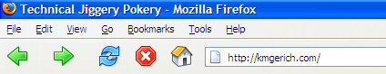

   

\[ This post is by Stephen Horlander, the designer behind the majority of the Firefox icons. – Kevin \]

After the release of “Winstripe” into the wild there was a large and varied response. Ranging from mindless petulant rants and demands, to well thought out critiques. Lets just say there were more of the former than the latter. Even before it’s inclusion in Firefox I was personally less than thrilled about how it turned out. The idea, as you may have read, was to take the icons from Pinstripe and make them fit into a Windows environment. The theory was sound as the icon concepts used in Pinstripe were, I feel, fairly strong. Due to time constraints and my own admittedly limited familiarity with more recent incarnations of Windows I think they failed on this count. They do however work well enough and are a good deal better than most of the icons used by many Windows applications, in my biased opinion anyway : )

Even without the harsh criticism, most of which I disregarded anyway do to the immature way in which it was conveyed, I still felt that the icons missed the mark. They needed work, but we needed them now, so what we had we went with. Seeing as how Firefox is a product in heavy development I don’t see the problem with developing the visual identity as well as the code in tandem. It is a mystery to me why people expect something to stay the same throughout it’s entire development, that is the risk of early adoption. If you can’t take drastic changes in a prerelease product, I would recommend you stay away until it is “finished”. Unless of course you just don’t have a life and you like to bitch about things, then prerelease products are for you.

#### A new direction

After I had time to digest the more intelligent criticism I sat down with my recently obtained Windows machine and thought seriously about what needed to be done. I decided that “Winstripe” needs to be attractive, be consistent within itself first, still fit in with Windows and have it’s own distinct look. Being attractive may be the easy part as well as consistent. The hard part is getting it to fit into Windows and be attractive at the same time, while still maintaining it’s own look. I personally don’t like the too cartoony looks of XP, that is something I would like to avoid. I started with the five main navigation buttons since they were the most noticeable and by default the only icons shown. Several things needed to change:

-   They needed to be larger. They now fill almost the whole 24×24 space including shadow. This is inline with Microsoft’s toolbar icons and it makes them much nicer to look at. The small icons also make more efficient use of space.
-   Moved development to Illustrator for a smoother (I think fuzzier) XP look. Initially I did them strictly in Photoshop because Illustrator tends to give exported bitmaps a fuzzy look. I was using Paths in Photoshop, but it is still sharper. A lot of people tend to use vector artworks smooth resizing abilities as kind of a crutch I think, ending up with vague smeary icons, especially at smaller sizes. I settled for a compromise between a lot of tweaking to get a more crisp look, and the ability to resize later. There are other problems with getting cartoony designed icons to scale well, but its a trade off to get a more XP consistent look.

-   Made them bolder and have more depth. More severe gradients, darker and softer outlines, and drop shadows. They are slightly more bold than anything found in Windows by default, but this is where “distinct style” comes into play. I even have subtle highlights on some of the icons. Not traditionally Windows, but I have seen it done and nothing forbids it. It also gives them a more solid look I think.
-   “Fixed” the **Reload** icon to be much more dynamic, and rounder 😉 Since very few people like that icon apparently.
-   Added 3D perspective to the home icon that really makes it feel more XPish. Also changed the color to be more inviting and less fake(not purple).
-   Made the disabled states transparent. Looks 200% better in Classic mode. Especially Classic mode with darker or colored backgrounds.
-   Also made new and consistent buttons for the Extension manager

#### The end destination

I feel much better about these icons than the ones initially included with Winstripe. This is the direction the rest of the icons will be going over the next few weeks when I can find the time. There is a lot of misinformation floating around about the goals of this theme change, a lot of people seem to think that we are focusing purely on a cross platform look. That is not the case. A lot of the concepts used in the Mac version of the theme can be used in the Windows or Linux versions, and vice-versa. The style will have to be applied to fit in with each platform, and some concepts just won’t make the transition. Giving a better user experience for each platform is a more important goal than anything else, and it always has been. Cross-platform consistency is secondary goal that can and will be sacrificed for that.

If people don’t like the new icons, that is fine, feel free to hate them. I know that you can’t please everyone, and if you try you will not please anyone. The real goal here is to make something that is distinctly Firefox. The functions of the icons should be clear even to the new user, which is why I am going to try and avoid too many elements in one icon wherever possible. A lot of things are going to change, so if you are one of the above mentioned users, prepare to whine 😉

#### Common problems

I have seen several comments regarding the icon spacing being too large. I have to assume most, if not all, of these users are using a pre-XP version of Windows, or Windows XP with the Classic style. The problem is that the spacing in Luna is much larger than Classic. Windows adjusts this on the fly for native toolbars, our toolbar spacing is defined in the CSS. That is something that does not change wether you are using Luna or Classic. So we can leave it large or make it smaller, but I can’t make it so that it is dynamic in regards to Windows theme changes. Sorry.

If there are any more theme related bugs let us know. I don’t mean stylistic problems, I mean usability problems directly related to the theme CSS. Thanks

## Comments

**Peter Hewitt** on 2004-06-28 03:32:23
> Although I'm still sticking with Qute I have to say the new version of Pinstripe is much nicer than the first one. I still have my reservations about the refresh icon mind you, it's just looks odd to me.
> 
> With regards to the icon spacing, although it now fits with XP Explorer it's smaller compared to Qute which everyone was used to so that's why it looks too big.
> 
> The bits I still "hate" with passion are the General and Privicy icons in prefs. General is just too plain and I think the padlock is just ugly, especially the thing around it. I much prefer the key from qute.

**Jonathan Dobres** on 2004-06-28 03:42:50
> A wonderful improvement over 0.1.  Of course, I won't really be able to fully examine the new Winstripe until the official 0.9.1 release comes out (I'm not a big nightly fan), but it looks much better.  The back, forward, and reload buttons in particular look much more at home in the Windows world.
> 
> As long as I'm here, I'd like to mention that I've always hated that yellow stripe that appears in an active tab.  It feels ugly, like it was just smeared on.  There's got to be a more subtle way to give emphasis to an active tab.

**Jed** on 2004-06-28 03:44:12
> Excelent work, I was one of the many dissapointed with the 0.9 theme. Your improvments for 0.9.1 have been incredible and it has been great to see you digest all the harsh comments so well and take out the good advice.
> 
> Excelent work, and I can't wait to see the other icons in the future as well.
> 
> Will you be offering Extra Large pnp's of the finished icons at a later date (like the home one above)?
> 
> I would love to use them on my Linux desktop :)
> Thanks
> -Jed

**Anonymous** on 2004-06-28 04:57:13
> The handling of the icons seems rather inconsistent. If you press the down the Go or Mail Button, a Toolbar Bookmark or the Throbber, it moves slightly to the lower right (as any other button does on Win98) but for the other buttons the border is just inverted. The Firefox Help still uses the old icons and the are handled like standard buttons.

**Mook** on 2004-06-28 05:09:56
> The newer icons are definately better, and now I use the default theme again :)  Thanks for the hard work!
> 
> Re: icon spacing: it looks like, in Luna, IE's toolbar buttons are not square; they're a bit more vertically rectangular.  This is more noticible in large icons view, around the home button.  The extra space in Winstripe is more noticible in small icons view.  Of course, you can always put it down as an artistic decision, that's fine too. ;)
> 
> Jonathan Dobres: that's coming from XP's theme, I think - it's trying to draw the tab bar natively.  Other tabs - such as those in IE's Tools -> Options - should exhibit the same behaviour.

**John Schneider Thomsen** on 2004-06-28 07:27:20
> The Reload icon
> 
> - What's good?
> 
> Round, Colour, Double arrows, Clockwise rotation and Shape of arrows.
> 
> - Hopes?
> 
> The arrows will be oriented NS and not EW. This would correspond to upload/send request and download/receive response.
> All shadows outside the contour lines are removed. This would be optimal for the human eye to quickly identify an icon.

**Francis** on 2004-06-28 07:47:48
> I actually prefer the EW orientation of the current reload button. Much better than the old orientation in Winstripe 0.1, imho!
> 
> I think the Stop button looks too much like the critical error symbol in Windows (at least in Windows classic). I know that this is also true for many other applications, including IE, but still. I actually prefer the solution from the latest Pinstripe theme (a shiny octagonal shape without the cross), as that icon looks more like a button than a warning flag.
> 
> The new Home button is definitely an improvement; I hope the Printer icon will change to a similar 3D orientation too, to make it better recognizable (note: Qute got that one right).

**syrek** on 2004-06-28 07:52:38
> The first look of pinstripe was just plain ugly, but it's getting better at some points and worse and others.
> 
> My ideas:
> 
> 1. The home icon is kinda weird in small icon view, I think it get's plain ugly, but that's an opinion. I would prefer here a 2d home button. (p.s. the house has great amount of detail, where the other icons don't)
> 
> 2. The bookmark icon, I never understood this one until I saw the camino version, that one is 100 times clearer. adding 3D for this icon really made sense.
> 
> 3. The bookmark folders are to bright, I would prefer them a little darker.
> 
> Keep up the good work, personally I think with this upgrade it is becomming a worthy qute replacement :)

**Hoc** on 2004-06-28 10:29:51
> http://www20.brinkster.com/rochette/moztoolbar/
> Those icons are a bit ugly in their pixelation and bad coloring, but they have the right designs.
> 
> Please do not go for an XP look. While it's modern, it's just too kiddy and fisher-price for me, plus Microsoft wants to do a new all blue theme for Longhorn. And you have programs like Adaware, Real, Quicktime, Flash, Windows Media Player, Kazaa, AIM, etc. that are on Windows, either with a proprietary skin or just plain ugly.
> 
> New Back/Forward=Almost Perfect.
> 
> I personally think the new Reload is ugly. The arrows seem to blend in. It'd be a good idea if you lose the shadows and used a shade of blue similar to the titlebar rather than this Aqua-reminiscent color. Like http://cheeaun.phoenity.com/weblog/images/artwork/icons/winstripe_reload_icon_modified.png
> 
> 
> The ghost outline for Stop is ingenious. Now it looks like an octagon rather than a blocky circle.
> 
> The new Home is even more hideous than before. While when zoomed in it's not so ugly, at regular size it really is. That's strange how the blue changes to green for my eyes when the icons are in real size. One of the oddities of IE is that Home is 3D. Why not 2D? 2D=More recognizeable. If Macs use it, why not windows? http://cheeaun.phoenity.com/weblog/images/artwork/icons/winstripe_home_icon_modified.png
> That's a good version.

**Nanac** on 2004-06-28 10:37:08
> <i>"Fixed" the Reload icon to be much more dynamic, and rounder ;) Since very few people like that icon apparently.</i>
> 
> I like it!  Sorry for complaining about the last one.  ;p
> 
> <i>The arrows will be oriented NS and not EW.  This would correspond to upload/send request and download/receive response.</i>
> 
> Honestly, I don't think the average user is going to care about, let alone notice that detail.

**michaell** on 2004-06-28 12:58:07
> You say people mistakenly think you're focusing on cross-platform. I would guess that's from Ben's original messages, when he said that the reasons for changing the theme were the licensing issue and to provide a consistent look and feel for the browser across the different platforms. He later clarified it, but lots of people had obviously got the wrong impression by then.
> 
> On the early adoption point, and this isn't just about the theme, I think a lot of people were confused by the big changes. 0.8 was quite stable, and was marketed hard. Then 0.9 was said to be "the best browser available", with an "excellent" new theme. If it's something for early adopters, then it shouldn't be marketed like that to the world in general. Or, the other way around, if something is marketed hard to the world in general, then you shouldn't release something when you're "less than thrilled about how it turned out".
> 
> Although the harsh words and ranting were directed at the theme, I'm sure a lot of it was because of timing and communication stuff which was nothing to do with what it looked like, and certainly not taking into account that it was a first version which the designers weren't entirely happy with themselves.
> 
> Anyway – Winstripe is looking pretty good now, and hopefully things can move forward without any further theme-related drama (although the number of foolish rants will only continue to increase with the number of users...)

**mgl** on 2004-06-28 15:41:39
> Great work!  I hated the Winstripe theme when I first saw screenshots, but quickly grew to like it in practice--clean, bright, and straightforward.  This new version is better in some ways, worse in others.
> 
> The new 3D Home icon seems out of place among the others, which are generally flat-looking (in a nice way).  I vote to keep the flat look, but more along the lines of Lim Chee Aun's Modified Winstripe version.
> 
> The new back and forward arrows are better than the original triangles, but are still (IMO) the weakest elements of the theme.  They look like navigation buttons I used on a website in 1996, and trust me, I have no graphic design skills.
> 
> Reload?  Enh--it's OK, but as someone else said, it seems to be lacking some clarity.
> 
> Stop is nice, and I nevet confuse it with the Windows error icon.
> 
> Looking forward to see the next iteration.   Thanks!

**rgw** on 2004-06-28 19:23:18
> I retract all of my malice...it looks like Winstripe is heading in the right direction now!

**Stephen Horlander** on 2004-06-28 20:26:00
> Thanks, rgw ;)

**marcoos** on 2004-06-29 08:05:04
> See bug 246035 (http://bugzilla.mozilla.org/show_bug.cgi?id=246035) for a nasty Winstripe bug in the Linux version of Firefox.

**M** on 2004-06-29 09:10:54
> Excellent progress. The new buttons have a much better look and feel than the ones for 0.9.

**** on 2004-06-29 11:14:15
> First, I'd like to say thanks for the improvements. The changes definitely are improvements. The new default theme is looking better.
> 
> However, there are still a few issues that I am concerned about that keep me with Qute.
> 
> 1. First, some of the button graphics seem off-center. An example of this is the reload button, which seems shifted to the left on the button.
> 
> 2. I think the small icons are too small relative to the toolbar space. They should take up more space on the bar, or even better, the empty space should be shaved off. They just look disproportionate. I know you commented on this in your entry, but it's noticable, and looks really odd. It seems that other themes, like Qute and Charamel, do a much better job of decreasing empty space and look much better in this regard.
> 
> At this point, I think the button graphics themselves look great, and I'm not sure I prefer them less than any other theme. It's just sizing and centering issues that seem problematic to me. Center the graphics on the buttons, and decrease the amount of empty toolbar space, and you'd have me completely sold.
> 
> Keep up the good work.

**Darkside** on 2004-06-29 11:40:47
> Marvelous improvement!  They feel much more at home in Windows now.  Eagerly awaiting the Graphite version of Pinstripe/Winstripe for Mac... ;-)
> 
> As michaell said, the "mistake" about imposing the same icons cross-platform came largely from Ben's original messages... but I wouldn't minimize the fact that in the 0.9 release, the icons WERE THE SAME ACROSS PLATFORMS.  ;-)
> 
> Actions speak louder, and all that; regardless of whatever back-peddling (um, "clarification") Ben did later, you can't get around the fact that the initial Winstripe was virtually identical on Win and Mac.  As I commented before, slight (and baffling, since they were so slight) differences, but still essentially the same.
> 
> I like the direction these new icons are moving.  The basic icon forms are the same, but have enough difference now on Windows to make it (1) consistent across platforms AND (2) at home with the particular OS theme.  Best of both worlds.
> 
> Congratulations!

**Stephen Horlander** on 2004-06-29 12:27:34
> I think one of the things you are seeing with the small icons in Winstripe in contrast to other themes is that our small icons are smaller than their small icons :) They are using 32x32 as the large size and 24x24 as the small size. We are using 24x24 as the large size and 16x16 as the small size.
> 
> Those are the normal Windows sizes, and the spacing is the same as Explorer with the Luna theme enabled. As I said in my post if you are Classic the sizes are much smaller, but we can't change that dynamically.

**mark** on 2004-06-29 15:42:39
> I have hard time with the add tab button. It reminds me more of a printer then a tab.

**Greg Wayne** on 2004-06-29 15:43:05
> I liked the first pinstripe theme and I like this one too.  Good work!!
> 
> Greg

**johnfive** on 2004-06-29 16:07:44
> The "refresh" icon looks off center when one hovers over it in Windows XP using the "classic" Windows widgets, otherwise looking good. Keep up the good work.

**Stu Fox** on 2004-06-29 17:33:13
> Definitely an improvement on the previous version, although I'm sticking with Qute.  The print button is still as ugly as sin, and the icons really only look decent when viewed at normal size.  If you view them as small icons (like I do) they still look a bit strange, although better than they used to.

**variance** on 2004-06-29 18:56:32
> this restyling is *really* good!
> 
> some more to do IMHO is:
> 
> - using small icons are *too* small
> 
> - download, history, print, new tab and new window could be done a little better (looking a bit flat)
> 
> - back and forward a little rounder and they are perfect
> 
> after all really a good job, i'm liking this theme a lot

**leon breedt** on 2004-06-29 18:58:19
> a vast improvement over the original Winstripe!
> 
> very, very, nice. can't wait for 1.0 :)

**sbszine** on 2004-06-29 20:29:13
> A huge improvement... my faith is restored. I can see myself switching from Qute when Firefox hits 1.0. Nice one.

**Øivind** on 2004-06-29 21:02:12
> Congratulations. You made default on my windows xp box (colors seem more subtle and less geared towards that _horrible_ default xp theme now, great!)
> 
> I didn't actually think you had it in you after seeing the last winstripe, but rest assured, I have been proven wrong :)
> 
> Great work!

**Michel** on 2004-06-29 21:09:22
> Somehow the first release of Winstripe felt more.. integrated, as in, more subtle. If I have to judge the two themes side by side I would say the new version is better, but if the next release could have a more toned-down colour scheme (just a bit, actually) .. slightly calmer colours and a bit less gradient between shadowed and unshadowed parts, I would feel more at home.
> 
> I do not pretend to be artistically competent - even if my taste were good my suggestions might not be - but there you have my 2 cents.
> 
> Thanks,
> 
> - Michel

**Joe Schmoe** on 2004-06-29 23:52:55
> You know WinStripe(0.2) is not bad. I actually like it now. It did take a bit of time for the look to sink in after having become so familiar and comfortable with Qute (just like the Firebird -> firefox change).
> 
> One thing i might perhaps change is to make the tabs just a tad bit shorter. when viewing in Windows classic mode, the tabs look like they could be a bit shorter. In WinXP Blue theme, it looks all right.
> 
> I think the change is a good thing. Unifying the look (at least icons anyway) across platforms sounds like a good idea. I liked the pinstripe theme for Firefox Mac.
> 
> Keep up the great work you and others are doing with Firefox. It is one of the best open source projects around!

**Daniel** on 2004-06-30 01:33:26
> I don't know about others, but I have a problem where there appears to be a 2 or 3 pixel line to the left of the window coloured as buttonface.
> 
> Other than that the theme looks much better now. Can't wait for the rest of the set to follow through.

**anon** on 2004-06-30 02:09:23
> Nice! I'm looking forward to trying it out when Debian SID finally gets the 0.9 series.

**Wayne Woods** on 2004-06-30 02:46:27
> Let me add my name to the list of initial doubters who have turned around. The latest incarnation of the theme is really, very nice! Nice shading, colourful and attractive, yet simple enough in style to be used as a default theme. I'm also glad to see this theme is becoming default on Mac as well, as it was the old greyish Pinstripe for Mac that gave me my doubts in the first place. Although it was still the original version of Winstripe that was in yesterday's Mac nightly, I assume we'll see the new version there soon? :)

**Michael** on 2004-06-30 05:31:17
> I like the new theme (I hope other icons (e.g. the one of the download manager) will be updated in the next months).
> 
> Just one thing : there is no icon for Messages (and Warnings too) in the JavaScript Console... There is an icon only for errors.

**Mathieu Pellerin** on 2004-06-30 06:36:12
> Nice improvement..
> 
>  I like your new toolbar "download manager" icon. You removed the luna xp blue window border ... for a reason which would be surely related to time, you forgot to change it in the preference window ...
> 
>  which brings me to my second point: what you did with this icon is the good way to go with the rest. I mean by that to simply remove all those luna borders on all the icons to break the association with an xp theme that will be obsolete in one year and that most ppl dont use anyway. Its quite easy, theres only two icons to change
> 
>  - new window icon
>  - new separator icon in the b.manager
> 
>  voila, thanks for your effort

**Zeron** on 2004-06-30 11:27:01
> Nice work!
> 
> Regarding toolbar spacing, why not make a substyle that uses "classic" spacing, like Chris Cook's Luna theme?

**Jugalator** on 2004-06-30 12:22:35
> Great improvement, it really came unexpected (but welcome) to me as part of a minor 0.9.1 update! :-)
> 
> Back/Forward/Stop/Home, heck even Reload, looks great to me now, although I can't comment on the small versions since I don't use those. They look cleaner and "crisper" than Qute. Yeah, I find those icons looking better than in Qute now actually.
> 
> I still don't quite like the icons particularly for Bookmarks and New Tab, and think others still belong to the pre-0.9.1 Winstripe style, but maybe these weren't changed as much...
> 
> Dramatic improvements in the main ones though.

**Umko** on 2004-06-30 12:47:54
> good to see improvements to winstripe! keep up the good work!
> 
> i have some remarks though,
> 
> -the samall icons are still too small and have too much padding around them in windows luna imho. they look somehow too small and lost on the wide bar.
> 
> -the reload symbol looks as thow both arrows are ointing towards the user and not towards the other arrow's end. it's not circular somehow
> 
> -and last. the stop loading icon looks critical. this has been addressed by others already.
> my idea about it:
> couldn't it be changed so that a curved arrow (like one of the reload symbol) points (bumps in)to this "stop" sign in the background. i haven't seen such an icon in any theme, but i think it's quite straightforward and matches the reload symbol perfectly

**nick** on 2004-06-30 17:49:43
> As the McDonald's commercials say, "I'm lovin' it"
> 
> Great job and by far this is one of the best themes for Firefox. And I am definitely glad that it is the  default them.  I am now finding it hard to find another theme to takes it's place, it's that good.  Usually defaults suck, this one, however, just kicks ass.

**Francis** on 2004-06-30 22:46:05
> Quote: "2. I think the small icons are too small relative to the toolbar space. They should take up more space on the bar, or even better, the empty space should be shaved off. They just look disproportionate. I know you commented on this in your entry, but it's noticable, and looks really odd. It seems that other themes, like Qute and Charamel, do a much better job of decreasing empty space and look much better in this regard."
> 
> Yes, I totally agree with this observation. The navigation bar in Qute, using small buttons, was just as big as the navigation bar in this new Winstripe, but its small icons made much better use of the button space. Right now, the small buttons are too small, and there is too much spacing between them.
> 
> And I can confirm that the reload icon seems to be left-of-center. I don't know whether this is actually true, or just an optical effect, but it sure looks odd.

**Philip Ashlock** on 2004-06-30 23:20:19
> I am very impressed by how significant of an improvement you have made after the majority of the feedback said no more than "it's ugly"
> 
> My only suggestion at this point is that all of the colors be toned down just a bit, to help alleviate the exessively cartoonish feel. I know that you are trying to go with the default Win XP luna feel which you described as "cartoonish" (I certainly agree and always switch to the classic windows theme), but I think you've done gone overboard with the brightness of your colors. If you darkened or toned down the blue of the refresh button to more closely match the color of the blue luna window header and then darkened all other colors to the same degree, I think there would be more harmony. I think just a slight adjustment would make a huge difference.
> 
> Additionaly, I think that the window in the house is unnecessary, it is indestinguishable in smaller pixel sizes and only makes the front of the house look less refined. Simplicity is key. Another issue, that always irritates me when people use the stop sign octogon for the stop icon is that at smaller pixel sizes the icon looks like it's supposed to be a circle, but has some imperfections (much like the window on the house) that are slightly distracting. Maybe try the same icon as a perfect circle and see how you like it, you might surprise yourself.
> 
> Thanks for you efforts, and keep up the exellent work!

**José Jeria** on 2004-07-01 06:11:08
> I dont know if you guys follow bugzilla, but this bug (http://bugzilla.mozilla.org/show_bug.cgi?id=246186) would be nice to have fixed. Also a background image in the download manager would make it look less naked.
> 
> Otherwise than that, great work, getting better!
> 
> :-)

**André** on 2004-07-01 12:00:44
> While I like the new version of the default theme, the thick black borders around text boxes (like the dropdown menu under the URL bar) remind me of those black lines around obituaries

**love-lee!** on 2004-07-01 14:58:44
> The following is no rant, cuz I hope to get a reply from it ;)
> 
> I downloaded 0.9.1 a few days ago, and tried using Winstripe for a while.  However, I ended up downloading Qute which made web surfing better.
> 
> To people who say, yeah "just change your them!  Whiner!" I as an end user want FF to succeed.  I can't write programs, draw graphics.  I'm not even good at filing bugs (or jsut too lazy).  But I do know what I like.  Compare Mac OSX to OS9.  The actual interface isn't really that different (system Preferences is the same, menu bar at the top, close at the left).  BUT they made the look desirable.  I remember working on a friend's Mac from '99 and thinking how primitve everything looks.  That has definitely changed, and now there's a dime a dozen of Win styles emulating Aqua.  Apple knows how damn _desirable_ Aqua is (esp. Panther, it truly polished everything), and it is a part of their marketing.  "You could do everything you want on a PC that you could on a Mac, but who wants to use something that absolutely loves the colour grey?"
> 
> Anyway, as of right now I'm running Qute.  In the last few versions it had some major changes & I'm disappointed they weren't showcased in FF 0.9, because it seems like Qute is now in its prime.  Eg., look at the new window icon.  It's no longer dreary and dark, it has a nice blue shade.  And a lot of the icons have a shean to them that.  Plus hovering changes which I've noticed WS lacks, I know mostly cause it's just 0.2 ;)
> 
> My thoughts on 0.2 WS revolve around the new icons (home, stop, navigation, refresh) and I don't think improved, they're just different, some would say more cartoonish (I agree here too).  They look too much like Opera's toolbar, and THOSE icons actually look a bit better than WS's, but who wants to use a copy when you could use the real thing?  See Apple vs. yz Dock (when it got too good. ;) Most of the other docks aren't very good)
> 
> Specific problems: [Home icon] The "window" actually detracts from the icon.  It looked like an error in the gfx to me until I heard someone say that the dot was window!  Also, it has the same  problem that the old version had- the washed out colours.  It feels like a copy, albeit a washed out one, of XP's home button.  And a lot of people said that the problem was that it was 2d, but to me, the problem was it's colour.  And I think the problem with colours happens throughout Winstripe.
> 
> For another example, the popup icon.  It's a nice, simple, pleasing icon.  But it just needs better colours and less jaggeds, like that new window icon I mentioned in Qute.
> 
> Qute 0.1 versus Winstripe today is another thing people have mentioned.  Qute0.1 Look at feels very disparate, and the colours really aren't so good, not unlike Winstripe, but all in all most of the icons are the same, because they were good concepts, like Winstripe's!  I don't mean any disrespect in the next sentence, but because of Firefox 1.0 coming in a few months, perhaps Chee Aun, or Arvid (or someone else :)) could be brought in to help with the colours aspect, as they look like they have the experiece with them (and look how long it took to perfect colours...FF 1.0 will be here soon and Qute didn't go from 0.1 to 0.9 in a few months).
> 
> Lim Chee Aun had some good ideas on this.  http://weblogs.mozillazine.org/djst/archives/005707.html   I'm wondering if you've seen them yet?  He also brought a good specific point that you could use the Go button (which I think is fabulous, perfect, etc. It's the one icon I loved out of the box ;)) as the back & forward icons.  It gives the theme some unity too, and a lot of other themes do it...Qute, Luna.
> 
> (BTW I hope you keep the stop icon, anyone remember IE5?  Yup, there's a stop icon there, did people get confused?  Not from what I've heard)
> 
> Just some thoughts, & I want to thank you for your work on FF.

**** on 2004-07-02 11:54:49
> i like the new winstripe changes keep them coming

**laketrout** on 2004-07-05 00:20:57
> Well I'm in the camp of decreasing the padding around the icons but *only* for the small icons. The large icon can remain with the padding just the way it is.  Also please keep the small icons at 16x16, others have asked that they be increased in size some but that's only because they look so out of place with all the extra padding.
> 
> I like to place icons on the bookmarks toolbar and with padding the way it is it increases the height of the toolbar and just doesn't look good.
> 
> Here's what the theme looks like with a 3px padding (the large icon padding is unchanged).
> 
> http://www3.sympatico.ca/d.longe/pub/ffpadding.jpg
> 
> Even though this is no Win2k with the clasic look, I've made these changes on XP Luna machines and it looks just as good.
> 
> So keep up the good work, I look forward to seeing the changes to the other icons that didn't get redone in your updated version.

**infinitera** on 2004-07-05 13:39:21
> Kind of minor thing, but the home button isn't orange enough.
> 
> http://cheeaun.phoenity.com/weblog/2004/06/homesick-winstripe.html

**David Tenser** on 2004-07-05 19:43:48
> Beautiful! I feel that you are going in the right direction with this theme. It looks really promising and I look forward to see the other icons in the set getting a uniform design.
> 
> As for theme related bugs, bug 245806 should be fixed to make it easier to hit the tab close button.
> 
> As I said in my blog: Very good work guys!

**** on 2004-07-08 23:33:38
> i like the home button like ot is

**** on 2004-07-09 14:20:04
> I have no specific problem with the Winstripe theme, but I do not understand the sentiment that Firefox should have the same theme across all platforms.  I find it to be disorienting when one program has an interface that doesn't quite fit.  Windows, Linux and Macintosh have very different interfaces.  The default theme in the Windows, Macintosh, and Linux binaries should reflect that difference, not ignore it.  The goal of Firefox should be to make it fit with the OS so well that the average user won't see it as standing out as different.  The default theme in Firefox .8 on the Mac did just that.  Until the .8 Pinstripe is made available, or until I or someone else has the time to make an original Mac Pinstripe inspired theme, I'm sticking with Firefox .8.

**** on 2004-07-09 14:36:26
> One small annoyance (always bugged me about qute too) for me has always been the height of the tabs
> I think you should open up a windows control panel and copy the height of the tabs (and the font size, since it would be necessary)
> 
> If it's not too small for a control panel it shouldn't be too small for the page tabs
> 
> also, if people think the spacing is too much, than it should just be cut perfectly in half (as a compromise between less and more)
> as mentioned, the padding on the large icons is good, but too much on the small ones

**alik** on 2004-07-09 17:14:29
> Excellent work, thanks. Keep improving.

**qwr** on 2004-07-11 14:20:38
> I am using Qute now for just one reason: the "new tab" button does not look like a printer...

**hen** on 2004-07-11 21:22:11
> Please consolidate the reload with the stop button (so only one is displayed at any given time).
> 
> This will save screen real estate

**Brian Mertens** on 2004-07-13 14:02:02
> Wish: I'd love a "Print Preview" button!

**m** on 2004-07-14 14:27:24
> much, much better than the first winstripe - well done!  it's probably just me, but the reload icon's colour reminds me of Internet Explorer's icon for some reason.  Perhaps, change the shade a little?  If I was looking at the webpage, sometimes i wonder why there's an internet explorer icon on my toolbar!

**Harry** on 2004-07-14 14:47:17
> I think 0.9.2 is almost perfect in regards to the winstripe theme.  All of the icons are intuitive and very stylish.  It has a decidedly modern look while keeping with tradition.  Great work and keep the improvements comming.  I do think the current theme is a great improvement over the last though, especially in regards to the the reload, back, and forward buttons.

**Pierre** on 2004-07-15 04:31:58
> This new version is certainly better but I prefered the previous design of the Back/Forward arrows. I think that a simple triangle with its little shadow looks very modern. The new buttons are good but I find the shape too classical.
> (The new house is nicer)

**Glenn** on 2004-07-16 23:25:42
> Looks a little like IE... Maybe a little too much.

**Steve Sizemore's Weblog** on 2004-06-28 07:18:02
> <strong>Firefox 0.9.1 Candidates</strong>
> 
> Ben Goodger writes, "Candidates Here - version number still reads "0.9" but these are the 0.9 builds. Please test EM for stopping bugs. This will probably go out Monday. I'd announce this on mz's forums but they're down." Firefox 0.9.1...

**Steve Sizemore's Weblog** on 2005-02-16 15:44:25
> <strong>Firefox 0.9.1 Candidates</strong>
> 
> Ben Goodger writes, "Candidates Here - version number still reads "0.9" but these are the 0.9 builds. Please test EM for stopping bugs. This will probably go out Monday. I'd announce this on mz's forums but they're down." Firefox 0.9.1...
