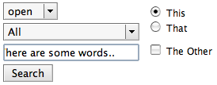

Here’s a followup on [my attempt to make the HTML widgets on Mac Firefox presentable](http://kmgerich.com/archive/000069.html). I’ve had to make some compromises here to get the widgets to look nice, for instance I force the background-color and -image on buttons. And text box borders usually use my colors rather than the ones specified by the web page CSS. For these reasons these styles would probably not be acceptable for inclusion in Firefox, but in most cases I’ve found these to be more comfortable than the primitive default widgets.

Instructions: Close Firefox. Right-click on your Firefox application, choose “Show Package Contents”, and then open the Contents > MacOS > res folder. Make a backup copy of your platform-forms.css file. Then copy these files into the res folder:

-   [radio.png](http://kmgerich.com/archive/temp/radio.png)
-   [radio\_checked.png](http://kmgerich.com/archive/temp/radio_checked.png)
-   [checkbox.png](http://kmgerich.com/archive/temp/checkbox.png)
-   [platform-forms.css](http://kmgerich.com/archive/temp/platform-forms.css)

Important: If you followed [my instructions in the previous blog post](http://kmgerich.com/archive/000069.html) to modify your userContent.css file, either delete it or remove my additional code before trying out the new and improved widgets.

A little bug: I’m not sure how I can get rid of the black border around the inside of the selected select box. Please let me know if you have any comments or suggestions for improvements!

## Comments

**Philip** on 2004-09-16 16:59:45
> Very nice... These mods make for a much nicer FF/OSX experience!

**Philip** on 2004-09-16 17:02:34
> EDIT:
> 
> FYI: I get no radio or checkbox in cnn.com's "Quick vote" area, about half-way down the page on the right.

**Daniel** on 2004-09-16 18:16:21
> Very nice!  I noticed a problem with selected radio buttons though.  If you check a radio button with the mouse and the focus stays there, you don't see the radio_check.png image, but some weird place holder image.  It looks fine after the focus leaves the radio button though.  Check out my screen shot in the link below to see what I'm talking about.
> 
> http://glazed.org/images/radio.pdf

**Steven Garrity** on 2004-09-16 18:28:28
> I'm not on a mac full-time, this is just a peripheral opinion, but I find when you can't use native widgets, it's best not to try to fake them either.
> 
> That's what I liked about the flydown, text input, and submit buttons here - they look good, but aren't odd fakes of real OS X controls. That said, I think the radio and checkboxes do suffer a bit from this - they look a lot like the real OS X controls, but a bit different. I'd rather see them take a more unique style until we can get the real native widgets in there.

**Cody** on 2004-09-16 18:56:24
> wow, i'm liking it, I've been without a Mac for a whole month now, and every day just keeps making me miss the mac more and more, I can't wait to try this out when I get my mac back!  Finally Firefox gets a more macish feel on webpages

**starwed** on 2004-09-16 21:16:37
> It was just today I was reading through a bugzilla bug about select box borders.  Weird coincidence.
> 
> Anyway, it was Bug 244370, and is now marked as fixed. :)
> http://bugzilla.mozilla.org/show_bug.cgi?id=244370

**Aaron K** on 2004-09-16 23:26:50
> I like it a lot, but is there any way to get rid of the blue border when you click on a link?

**Ryan Rafferty** on 2004-09-16 23:56:57
> These buttons are excellent! Thank-You! Maybe they can be added to Firefox if someone can program the old buttons to orrivide the nice ones when displaying a CSS that specifies special button attributes. Keep up the good work.

**Philippe** on 2004-09-17 02:55:53
> One little bug I noticed: when a radio button has focus, it does display some additional border, hiding most of the background-image.
> 
> I added to platform_forms.css:
> html|input[type="radio"]:focus {
> 	border:none !important;
> }

**amake** on 2004-09-17 09:16:35
> It wasn't clear to me that these widgets replace your previous ones specified in userChrome.css.  Maybe you should mention that.

**amake** on 2004-09-17 09:18:43
> Oops, I mean userContent.css.

**Nooon** on 2004-09-17 10:01:49
> Is there no way to still do this in usercontent.css?

**~bc** on 2004-09-17 10:19:40
> Hey, I took a look at that CNN radio button issue, it seems that you get the weird button only when the radio button is depressed, and still highlighted, eg, if you click on the radio button, then click elsewhere on the page (unhighlighting) the button then looks correct. So it's something to do with the focus.

**Kevin** on 2004-09-17 19:42:39
> Quite right amake. Sorry about that. I'll put up a correction.

**kaz** on 2004-09-18 05:04:44
> Thanks Kevin, for your great work. I'm impressed.
> 
> Here's my customized version of your CSS, replacement PNGs, and my "userChrome.css" which improves buttons and fonts of  Firefox.app. I've archived all of the files as "FirefoxSet.tar.gz" so please check it out.
> 
> http://pbx.homeunix.org/tpj/jam_log/files/article.php?id=38
> 
> My page is written in Japanese but I think you can figure it out.

**Philippe** on 2004-09-18 12:20:59
> I've also been working a bit more on this, based on what I had done a month ago. I think I've made some more improvements to the stylesheet (fixing the aforementioned problems with radio buttons, adding a real focussing ring on input fields and textarea, set foreground/background colours on all widgets, ... ).
> 
> http://emps.l-c-n.com/articles/63/form-widgets-2
> 
> One slight problem I have atm is the lack of focus ring around submit buttons. I have to investigate that further.

**kaz** on 2004-09-18 20:50:50
> Inspired by Phillippe's widgets, I've created  improved version:
> 
> http://pbx.homeunix.org/tpj/jam_log/files/article.php?id=39
> 
> I've replaced the backgraound image for the buttons and also added "Focused" background.
> 
> I think Select buttons look nicer without backgound-color, so I set it to "transparent" so it will displayed with Aqua background.

**Ernst Persson** on 2004-09-20 08:49:24
> Firefox for Linux DESPERATELY needs something like this. How about a Bluecurve one?

**Kevin** on 2004-09-20 10:48:44
> I thought Mozilla styled the HTML widgets using the GTK theme on Linux?

**Ernst Persson** on 2004-09-20 13:04:19
> No, only scrollbars and XUL, not HTML widgets.
> 
> This is the default look: (specially the buttons are ugly..)
> http://zapp.no-ip.com/images/ffold.png
> 
> And this is my first attempt to make your theme look like Bluecurve:
> http://zapp.no-ip.com/images/ffnew.png
> 
> It's avaliable here if someone wants to try it or improve it:
> http://zapp.no-ip.com/linux/BlueFox.tar
> 
> One should make a whole theme pack for Bluecurve like this, only with styled html widgets also:
> http://primates.ximian.com/~glesage/stuff/firefox/

**Ernst Persson** on 2004-09-20 13:07:23
> And the reason why they don't use GTK style is of cource the difference between the "Sök" buttons (in the lower right) on the two screenshots.

**Uri Bernstein** on 2004-09-30 11:48:07
> These sure look nice!
> 
> Kevin - I noticed that you decided to stick with the current font size for controls (13 px), which is larger than what Safari and Camino use.
> Can you please have a quick look at bug 262191 (and bug 261346, which spawned it), and give your opinion? The bug will probably end up being closed as WONTFIX - but since you're working in this area I'd like to know that you are aware of it.
> Thanks!

**Joel Nelson** on 2004-10-01 00:24:52
> Looks good!  I just wish this could be implemented in the actual Firefox builds so I wouldn't have to modify each nightly I download.

**Dan** on 2004-10-06 12:36:40
> I can't seem to get rid of the issue of when a radio button has focus, it displays an additional border.

**Jonathan Horak** on 2004-10-16 11:50:48
> Kevin, you've done a great job and a service to the Mac/Firefox community)!
> 
> Two minor issues that maybe someone can provide solutions so I can drop: 1) the extra border on focused radio buttons and 2) the blue borders that are created when clicking on links.

**thomnas** on 2004-10-18 17:37:20
> Good work... now what about loading images, broken images, things like that.  :)

**hank roberts** on 2004-10-28 11:38:58
> This was just mentioned at Burningedge -- first I've come across the info somehow, and delighted to find this page.  Thanks.

**amake** on 2004-11-06 05:17:29
> I created an app to apply these widgets via drag-and-drop.  Check out <a href="http://www.macupdate.com/info.php/id/16118" rel="nofollow ugc">Firefoxy</a>.

**Terence Tan** on 2004-11-14 19:22:21
> Just for the hell of it, I tried this mod on Firefox on my work PC (hey, my Mac is at home). It doesn't look bad under Windows! The only problem is, whilst a control has focus, its border disappears (probably due to -moz-mac-focusring).
> 
> I'm not suggesting that you should actually do one for Windows, of course, just that somebody here was crazy enough to see what would happen.

**Simon G** on 2004-11-20 08:58:01
> Nice work - but a small problem with ecommerce apps. Disabled buttons no longer are displayed as disabled - they look like regular enabled buttons. A small (and no doubt minor update), but without it, I can't use Pretty Widgets (especially in my corporate intranet).

**Philippe** on 2004-12-02 22:03:34
> Aaaaack... This doesn't work at all any more using the latest nightly builds (20041202), based on Trunk. platform-form.css isn't recognised at all. I managed to get it partly working by moving everything into userContent.css. Works, sort of. Only thing that doesn't work is the styling of the radio buttons and checkboxes.

**sk** on 2004-12-03 21:16:41
> Is there any work being done to have native widgets in firefox?  I cant seem to find a definitvie answer whether this work is something that's being done or going to be done.

**Hilda** on 2004-12-09 04:38:20
> <a href="http://shop.allago.de/zeichenschablone.asp" rel="nofollow ugc">Zeichenschablone</a> <a href="http://shop.allago.de/schneidemaschinen.asp" rel="nofollow ugc">Schneidemaschinen</a> <a href="http://shop.allago.de/buerobedarf.asp" rel="nofollow ugc">Bürobedarf</a> <a href="http://shop.allago.de/schreibmaschine.asp" rel="nofollow ugc">Schreibmaschine</a>

**atariboy blog: no such thing as no such thing** on 2004-09-17 02:34:38
> <strong>purdy widgets for firefox</strong>
> 
> I got sick of safari being slow on some sites (especially bloglines.com) and when I tried the firefox Preview Release...

**elblogg** on 2004-09-17 10:04:18
> <strong>More hot widgets</strong>
> 
> Kevin Gerich have released another set of nice widgets for Mozilla. It is a continued version of the last set, wich now also has radio-buttons and checkboxes in mac-style. If you have a mac, grab them at his blog I...

**Blogzilla - a weblog about Mozilla** on 2004-09-19 00:07:32
> <strong>Apple-icious Widgets for Mozilla Firefox</strong>
> 
> Kevin Gerich, who brought Pinstripe to Mozilla Firefox on Mac OSX, is busy with brilliance, again. He's forging form widgets for Mozilla Firefox which'll appear more "presentable" &#8212; i.e. Apple-icious. Ben Goodger has already offered to pull the e...

**Skyzyx.com - Sidebar** on 2004-09-19 09:26:02
> <strong><a href="http://kmgerich.com/archive/000072.html" rel="nofollow ugc">Pretty Firefox Form Widgets in OSX</a></strong>
> 
> Pretty Firefox Form Widgets in OSX...

**d-_-b hli.be** on 2004-09-19 12:43:08
> <strong>Firefox Pretty Widgets</strong>
> 
> Pour tous ceux qui ont un Mac et trouvent affreux les contrôles de formulaires utilisés par Firefox, Kevin Gerich nous offre une modification de ceux-ci qui donne vraiment pas mal. Le set a été modifié et packagé par Kaz pour un rendu encore meil...

**Linuxart** on 2004-09-22 10:49:37
> <strong>Firefox forms (work-in-progress)</strong>
> 
> Based on Kevin Gerich's forms work (and others), I have put together something that makes unstyled HTML forms look like Industrial widgets.
> 
> 
> Firefox forms, mostly like Industrial
> 
> At the moment, this doesn't work with everything, things aren't...

**A View From Home** on 2004-09-29 18:45:44
> <strong>Beautiful Firefox form widgets!</strong>
> 
> As much as I love using Firefox on the PC, I had been holding out making it the default browser on my Macs. The main reason? Form widgets. By default, the form widgets (check boxes, radio buttons, text fields,...

**VERSIONARY::BLOG** on 2004-10-29 23:03:56
> <strong>firefox os x tricks</strong>
> 
> These two tricks have made my os x firefox experience much better so I thought i'd pass them along. Use...

**BeatnikPad: Journal** on 2004-11-06 19:54:45
> <strong>Optimized Firefox build for G5</strong>
> 
> I built a Mac G5-optimized version of the Mozilla Firefox browser.

**CocoaBlog** on 2004-11-07 00:00:42
> <strong>Optimized Firefox for the Apple G5 processor</strong>
> 
> (I originally posted this elsewhere, but thought someone here might be interested...) For the past two weeks or so I have been running a totally kick-ass nightly build of the Mozilla Firefox web browser optimized for the Powerbook G4 processor....

**3332／ブログ式** on 2004-11-12 14:32:01
> <strong>Firefoxを改造する。</strong>
> 
> 先日、Firefoxの推奨バナーを作ってみたが、お使いいただいた、お気楽主婦のねっと生活さんのコメントに素敵な情報があったので、こちらにもリンクを貼らせていただきます。情報提供è€...

**Egon's Blog** on 2004-11-15 02:31:32
> <strong>Prettier Form Widgets in Firefox on Mac</strong>
> 
> Firefoxy 1.1 has just been released that allows you to easily change the widgets used on the mac firefox to the a much prettier set. The new widgets look like this: And are easily applied by dragging your firefox...

**All the Pages are My Days** on 2004-11-18 01:02:09
> <strong>G5 Optimized Firefox</strong>
> 
> First, if you aren't using Firefox as your primary browser, why not? It works better than Internet Explorer, it's free,...

**pics and titbits** on 2004-11-23 10:19:35
> <strong>Mac Firefox</strong>
> 
> Compared to the Safari browser, Firefox's default theme and widgets are pale in comparison. Replace the default theme with Aronnax's GrApple and get Kevin Gerich's polished widgets for a prettier interface. Remember to make a backup copy of Firefox bef...

**PD** on 2004-12-13 22:01:25
> <strong>Mac Tips</strong>
> 
> It finally happened. I stopped talking about it and bought a Powerbook. I won't get into how much better it is than my Windows laptop or desktop but rather here are a few tips/config settings/etc. that you may need to

**pixelgraphix // Firefox** on 2004-12-30 13:24:31
> <strong>Firefox im OSX Safari Look</strong>
> 
> Ran Aroussi hat ein Firefox Theme erstellt, das den Browser auf Mac OS X Systemen dem Aussehen von Safari anpasst. After reading two articles by Jon Hicks (1) &ldquo;Safari style tabs for Firefox OS X&rdquo; and (2) &ldquo;Native (looking)...
