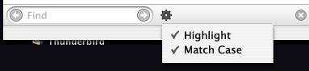

I have always thought the UI for [Firefox’s Find Toolbar](http://www.squarefree.com/burningedge/archives/000494.html) has room for improvement. Recently the Match Case checkbox was added to the bar, increasing the amount of horizontal space it requires. This becomes a problem when the find bar is used in the Help window, where a portion is clipped off unless you widen the window.

I made a Photoshop mockup of how an alternate find toolbar might look. This probably isn’t \*the answer\* – just starting point for a discussion. What do you like and dislike about the find toolbar, and what should we do about it?

## Comments

**Blake** on 2004-10-21 21:40:09
> I agree. I didn't really want to add the Match Case option like that, but I couldn't really do anything prettier since I didn't have an icon and it was late. (Actually, post-1.0 we may just remove the explicit option and automatically do a case-sensitive find when there's a capital letter in the search string.
> 
> I've considered a UI similar to the one you proposed, but I don't really like the idea of Highlight being a checkbox menuitem just like Match Case. It's not really an option; I think it's more like an action.

**Mark** on 2004-10-21 22:12:34
> hi Kevin, i've been here in your blog many times before, thru Planet Mozilla.
> 
> About your mockup, why does it looke like it's something accesible from the desktop, and not from Firefox itself?

**amano** on 2004-10-21 22:22:39
> Hmm. Why not just widen the standard Help width?
> 
> At least the Highlight button should be turned into a checkbox as well.

**amano** on 2004-10-21 22:32:09
> And please keep in mind that "Match case" isn't greyed out currently when no search term is entered.

**Kevin** on 2004-10-21 22:33:26
> Blake, I realized the menu items were not exactly appropriate but I posted the screenshot anyway :) Match Case could be a tricky concept to capture in an icon.
> 
> Mark, sorry, I know there's no context :) It's the bottom of a Firefox browser window.

**Mike Fedyk** on 2004-10-21 22:36:48
> Make sure you do the auto case sensitive if there is a mix of cases.  Many (I don't know why...) people prefer the look of all upper case -- or just have to use it in their environment most of the time.

**Darkside** on 2004-10-21 23:10:03
> First, three thumbs up for the automatic Match Case on mixed case search text.  Until then, why not put the Match Case on the little magnifying glass that's in the search field?  Visually, it applies directly to the search field string, and that would make the icon actually useful, instead of superfluous eye candy.  ;-)
> 
> I think the arrows should point up and down, as they currently do; closer connection to the previous (search up) and next (search down) functionality.
> 
> I don't know about putting the arrows IN the field... seems this relates the actions of the button too closely to the text field; i.e., "if i click this, it will give me previous searches".  If it's for some reason necessary to put the arrows in the field, put them at the same end, please.  ;-)
> 
> I'd like the "Find:" text at the beginning to be more prominent (maybe styled like the "Find Next" and "Find Previous" text), and then you could just drop the word "Find" on Next and Previous, since the whole bar is obviously for Find.  :-)

**Ran** on 2004-10-22 00:09:43
> Does the left/right presentation for previous/next make sense for RTL languages?

**Ran** on 2004-10-22 01:55:43
> Consider saving space by removing the highlight toggle and permanently using the feature (think of it as "find all"; it could be reasonably argued as a more intuitive behavior).
> 
> Use the other buttons to "select next occurance forward/backward". They really _are_ select buttons -- the bar finds all hits "as you type" ;-) as evidenced by the highlight feature. (And as it stands, the bar knows when a phrase is not found and so signals the user, but it does not disable the "select" buttons -- that should be fixed.)
> 
> Also, you could shorten "Match case" to "Exact".

**Will Price** on 2004-10-22 02:10:46
> The icon for case-sensitivity, while not overly pretty, could be as simple as the symbology:  A=a
> 
> I would suggest that and an icon of a highlighter marker tip (similar to those used in word processors' toolbars) for the highlight button.
> 
> Both should be stateful buttons, just as Highlight currently is; case-insensitive would be depressed by default and highlight would not.
> 
> Another note: using RC1 on Win32, the find toolbar (at least in the default theme) doesn't obey my "icons/text-only/icons-and-text" settings and shows the icons AND text, always.  There are tooltips for the buttons, so the extra text *shouldn't* be necessary if I've selected the icon-only option from the toolbar customization dialog.

**Alfred Kayser** on 2004-10-22 03:50:51
> https://bugzilla.mozilla.org/show_bug.cgi?id=265578:
> the find toolbar (at least in the default theme) doesn't obey my "icons/text-only/icons-and-text" settings and shows the icons AND text, always.

**Gerv** on 2004-10-22 05:09:43
> "(Actually, post-1.0 we may just remove the explicit option and automatically do a case-sensitive find when there's a capital letter in the search string.)"
> 
> I hope Firefox is able to tell what consititutes upper and lower case in all world languages :-)
> 
> Gerv

**Mike** on 2004-10-22 06:36:06
> Well, the mockup has a couple of things I don't like: it's completely nonintuitive (though perhaps the icon is just a placeholder for now), and it requires two clicks to change an option (or a click & drag).
> 
> Also, is there a way to put the next/previous match buttons next to each other instead of on opposite sides of the text box?

**Bill** on 2004-10-22 08:13:33
> Well, in the Firefox window, the find toolbar goes under both the main and sidebar windows.  The issue with the help window is caused by the fact that it does not.  Fixing the help window arrangement might be better than trying to redesign the findbar this late in the game, particularaly since we are limited in options by the l10n freeze.

**mortee** on 2004-10-22 13:50:03
> "Also, you could shorten "Match case" to "Exact"."
> 
> I don't really think this is a good idea - I, for example, wouldn't immediately think that "exact" refers to the case of letters. I'd rather guess that without that checked, FF will do a fuzzy search, or something like that.

**Frank Burleigh** on 2004-10-22 14:35:43
> I think I'd ask that you rethink intruding on the browser's content space--it could be argued this is what got you in this place to begin with. ;-)  I perceive it this way:
> 
> - I no longer know how to do find as you type (someone alludes that it's always doing fayt)
> - I no longer know how to find again using fayt *using the keyboard*
> - I'm not sure the relation of the find bar's buttons to the menu items since they're worded differently and don't show keyboard accelerators
> - "match case" I understand, but some might need something more like "match character case exactly" but space doesn't allow you to say that
> - "highlight" is a great feature, but my guess is that most people will need "show every hit on the page" but again space is a problem
> - I really like the result message feedback
> 
> I wonder if you couldn't think of this find bar as an abbreviated find tool, that gives some option to display a full-on find dialog more like the old control F that includes these additional options and commands.

**Ran** on 2004-10-22 15:30:53
> For clarity, let me address what Frank said:
> (someone alludes that it's always doing fayt)
> 
> Good point. I have that turned on and had forgotten it could be otherwise. (Tools>Options>Advanced>Accessibility) Regardless, once the find tool is activated, it indeed finds as you type into the textbox. That is the point -- pushing "find forward" ("find again", Ctrl-G on Windows) or "find backward" doesn't seem to do any (or more) finding, it merely selects the next occurrence.

**Frank Burleigh** on 2004-10-22 21:52:34
> See, that's what I mean, Ran: I don't think I knew that options were changing the behavior of Find.  I am a little troubled by not putting everything front and center.  It seems to me it makes it less likely most people will ever know of these good features.

**Mark (a different one)** on 2004-10-23 14:41:25
> What about instead of having "match case", you have a "regular expression" option? That would be awesome.

**Kevin** on 2004-10-24 10:42:09
> Regular expressions are not for normal humans :)

**Nikole Jolie** on 2004-11-29 13:42:29
> Thanks for the great idea! :)
> 
> Regards,
> <a href="http://poetrytherapy.port5.com/blog/" rel="nofollow ugc">Nikole</a>

**fantasai** on 2004-12-10 22:42:29
> I agree that the icons for case-sensitivity and highlighting should be stateful and off by default. For case-sensitivity, I'd use an icon that looks like [Aa] , and have the search be case-sensitive when it is depressed. You could reduce the entire Find bar to icons, too, by changing the Next and Previous buttons to use arrows. The toolbar would take up even less room then.
