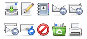
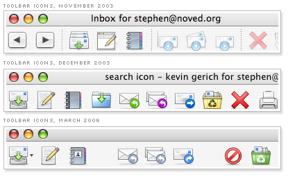
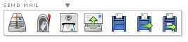
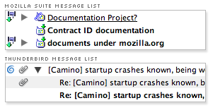
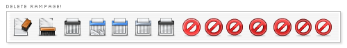
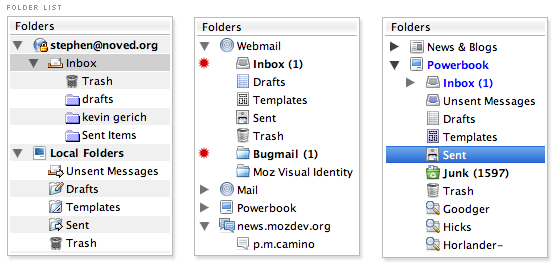
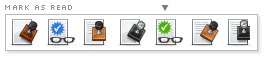
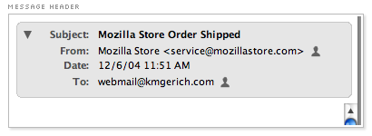

After the [Pinstripe theme landed in Firebird](http://kmgerich.com/archive/000045.html), icon designer Stephen Horlander and I dove in to a companion [Thunderbird](http://www.mozilla.org/products/thunderbird/) theme. We started in early November 2003 and [finally hit](http://kmgerich.com/archive/000056.html) the “let’s stop fiddling with it and get it out there” phase in March of 2004. I’ve gone through the messages that Stephen and I exchanged during that time and pulled out a few examples of design decisions.  
  
([Jump to comments](#comments))

Because there’s more UI in Thunderbird than Firefox, it’s doubly important to keep the icons simple and minimize the clutter. It’s a neat trick to make a UI get out of the way when there’s so much of it. Did we pull it off? I have a hard time being objective about it.

The colors started out a bit too clowny. Looking back, they seem more appropriate on Windows XP. Thankfully Stephen modified the Junk, Forward and Reply icons to use more subdued colors.

Apple’s Mail program features a paper airplane as a Send Mail icon. It’s very well done, but we wanted to avoid cliches and avoid copying Apple’s icons outright. I really liked all of the Send Mail icons that Stephen came up with, but none of the icons made us think “this is it”. The icons with the arrows on them are good, but ideally you want to use the primary elements of the icon to tell its story. We consciously tried not to overuse arrows in the theme. The last three icons were disqualified because the mailboxes might not be international enough. In the end we chose the mail slot and envelope icon and made a note to return to the icon later.

Messages in the Mozilla Suite have a 16px icon on the left side of the Subject column which indicates what type of message it is, if it has been read, if it has attachments and more. Since Thunderbird has a separate column to indicate that a message has an attachment, it seemed that all of the things indicated by the Subject bullet icon are redundant. We felt pretty confident that we could drop the Subject bullet icon entirely. Actually, not entirely – one piece of information provided by the Subject bullet wasn’t redundant. We retained the small arrows to indicate if a message was replied to or forwarded.

Stephen went on a rampage with this one to find just the right delete icon. I think he got it. There are some excellent ideas here but we went for the familiar circle with a slash.

Here are some variations on the icons in the folder sidebar. Some of the icons are just a touch complex, but we made an effort to use just one element or shape so you wouldn’t need a magnifying glass to understand the icon. Since we tried to minimize the badges that we put on the actual folder and message icons, I played around with using red dots in the background to indicate that you have new messages. In the end we just turned the folder label blue, which in retrospect, may be a bit too subtle.

Here are some variations on Mark Message as Read. I like the glasses 🙂

Strangely, when Thunderbird displays a message, the headers (From, Subject, etc) are fixed to the top of the pane and do not scroll with the message. [The Bugzilla report on the issue](https://bugzilla.mozilla.org/show_bug.cgi?id=9942) has been open for four years. Let me say that again: FOUR YEARS. Even if there is a good technical reason why this hasn’t been fixed by now, it does make Thunderbird’s UI seem cramped when reading mail in the default 3-pane view. We used a rounded rectangle style with margins that gives the appearance that the header box is inside the message pane. The only problem with this approach is that when a message is too long for the Message Pane, the top of the scrollbars appear to be floating.

At the end this four month process, Stephen and I were pretty sick of the Thunderbird theme. It all seemed to blur together. We’ve updated the theme recently to keep up with the new features that have been added to the program, like Shared Search Folders and RSS feeds. At some point we’ll return to it and try to improve on the design armed with a good dose of perspective and thoughtful feedback.

## Comments

**neilIo** on 2004-12-09 01:04:06
> I think you and Stephen had done an incredible job. I don't use Thunderbird, as I'm still waiting for OS X Address Book integration, but every once in a while I launch it and marvel and how fine looking it's become.

**JK** on 2004-12-09 01:06:46
> I just switched to Tbird on the Mac. I must say, the GUI is very impressive. I think it may be the most attractive app I have. I feel less pressure to close it when I'm not reading or writing mail (and because TOP often reports that Tbird is sleeping with 0%) -- that's saying a lot: the design makes it FEEL lighter, less stiff, less processor and RAM heavy. A real case of design making a big psychological difference. I can't thank you enough. Contributions like these make me feel good about ... it all.
> 
> JK

**carlos** on 2004-12-09 01:51:18
> Amazing job on the UI, I downloaded Thunderbird for the first time when the 1.0 release was announced and was immediately floored.

**Anthony** on 2004-12-09 02:23:03
> Yeah, guys, you did a beautiful job. I use TB for Mac everyday and the look and feel is amazing. I used XP previously.
> 
> I can't believe how much effort and time went in - you guys are brilliant at graphic design - I wish I had 1/4 of that talent so I wouldn't have to "borrow" most of the artwork on my web-pages :-)
> 
> Send me a rate card - I am very interested in getting 6 icons for a new site I am designing...
> 
> Thank You!

**Jon Hicks** on 2004-12-09 04:50:19
> Just superb work! The UI is more OS X than many cocoa apps out there. What you've done with an XUL app is incredible.
> 
> Like neilIo I'm waiting for Address Book integration (and maybe an easier way to import from Apple Mail than fiddling with mbox's) but I'll be there when it happens.
> 
> Really interesting reading on the progression of the icons too - glad you spent the time assembling them all. It can't have been a quick task!

**Jon Hicks** on 2004-12-09 04:53:11
> Actually, while I'm still lurking, I do have one request. The wee icon to show whether you're online just makes me think of the old Netscape days. Any chance Stephen could come up with a new icon for that?

**Kevin** on 2004-12-09 08:06:15
> Jon, you mean the bulb icon in the lower left corner of each window? I just recently put that in right before 1.0 was released.
> 
> <a href="http://kmgerich.com/archive/images/thunderbird/offline_status.png" rel="nofollow ugc">screenshot</a>

**J Cordes** on 2004-12-09 09:50:33
> This looks greta!  Excellent work!  Since it's inevitable that somebody will say this eventually here, I might as well go ahead and say it myself:  I can't wait for an official Winstripe theme for Thunderbird for Windows!

**** on 2004-12-09 11:05:43
> I would guess that
> 
> the "Do Not" (circle slash) icon is the junk mail icon (Do not open this), and
> 
> the recycle bin is the delete icon (trash).
> 
> Would I be right?
> 
> (It looks like I could be wrong, as the sequence of icons next to circle-slash starts with an eraser, which seems more like delete/trash).

**Kevin** on 2004-12-09 11:35:16
> The circle slash icon is for delete. I'm not sure it represents the "delete" action as clearly as possible, but Mac OS X users are familiar with the image from other Mac apps.
> 
> The recycle bin is for "Junk". You might think it means "trash" if you're coming from a Windows world. We use a trashcan icon for "trash". Trash and Junk are similar concepts, so I can see how it might be a bit confusing.

**Joshua Heyer** on 2004-12-09 15:08:33
> An amazing improvement! The old icon set and the new are like night and day! Great work!
> 
> I second Hicks and neilIO on that I'm waiting for integration with Address Book and transfering emails from Mail to TB isn't an easy or smooth process. Also the composing window doesn't seem as easy and flexible as Mails does for managing font use, colors, and quote management. And I get the feeling some things are harder to find in TB than in Mail. Anway, the big things are the Address Book and transfering the emails to TB.
> 
> I'm also waiting to see if Apple will "raise the bar" with Mail in OS X 10.4 Tiger.

**Jonathan Horak** on 2004-12-09 16:54:52
> I'm a recent Mac convert &#8212; made the "switch" just this Summer from Windows. Having been a Mozilla advocate before the move, it was inspiring to see the UI of Thunderbird for OS X progress from release to release (0.7, 0.8, 0.9 and now 1.0). Great work Kevin, Stephen; it's highly appreciated!

**jeff** on 2004-12-09 17:09:28
> Tremendous job on the icons, and the UI polish in general. Nice work!
> 
> ~jeff

**HC Andersson** on 2004-12-09 18:15:03
> Great icons! I wish that you guys could work out a Firefox as nice as this! As Mail seams to come nicely packed with MacOS X Tiger these 2 great looking applications will have a good fight. And it's better to have 2 good looking e-mail apps on Mac than none, right?
> 
> My bet is that Thunderbird wins in the end!
> PS: When is Mozilla Store going to launch Thunderbird polo shirts?

**Oscar** on 2004-12-09 23:34:01
> Very nice. Any chance you'd want to go to work on <a href="http://www.abiword.com/screenshots/abi-macosx.jpg" rel="nofollow ugc">AbiWord</a>? They could sure use the help.

**Stephen Horlander** on 2004-12-10 01:35:44
> I think Abiword is going to need more than icons, they are going to need a full Cocoa GUI programmer/designer.

**Chris Gervais** on 2004-12-10 09:50:22
> Excellent work documenting your thought and decision-making process. Understanding how you arrived at your final designs really connects the users to the care you put into the design. I don't user Thunderbird, but after reading this, you can bet I'm going to download it and try it out.

**Matt Carey** on 2004-12-10 13:59:55
> VERY nice work! :)
> 
> Again, bring me Address Book integration and I am there!

**Fabian** on 2004-12-11 06:32:51
> If only we had this kind of quality work for Windows Thunderbird right now...

**KAMiKAZOW** on 2004-12-11 07:28:15
> Firefox got some new icons in past Pinstripe releases. Eg. Back, Foreward, and Stop.
> Thunderbird still has the old icons for Previous, Next, and Stop.
> Are these icons going to be synced with Firefox?

**Jon Hicks** on 2004-12-11 08:03:56
> Kevin - yep thats the one! I hadn't tried the final 1.0 release until now. Hooray, I'm well chuffed!

**Kevin** on 2004-12-11 11:05:46
> KAMiKAZOW, yeah we didn't get around to syncing those icons up to the Firefox theme. I'll get it done for version 1.1 :)

**KAMiKAZOW** on 2004-12-11 20:40:47
> Good to read. :)

**Steve** on 2004-12-14 18:19:56
> The icons look great.  I would love to see a complimentary icon set for my desktop.  At the very least maybe a full size version of the folder used in the themes.  Great work!

**Kevin D** on 2004-12-18 03:46:22
> I agree with the "clown colors" being a bad thing, but right now thunderbird pinstripe strikes me as very "grey" - even firefox on the mac has more color than that.

**David** on 2004-12-28 06:34:52
> I've said it in previous posts but I'll say it again -- excellent work on the Thunderbird theme, guys!
> 
> I too would love to see support for Address Book. (I know that's not your job, Kevin. :)) It would make life easier on those of us who have (or plan to get) Bluetooth phones and want to sync them without maintaining two address books.

**Veerle's blog** on 2004-12-09 07:01:22
> <strong>Thunderbird's Extreme Mac-over</strong>
> 
> If you've ever tried to create good-looking icons then you probably know that some icons can be a real pain, especially  getting the message(purpose) across can be difficult. My
> 
