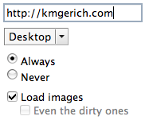

This is a third try at making Mac Firefox’s primitive-looking HTML widgets work with the design of Pinstripe. This time I took care to make the styles play well with others. For instance these styles won’t override CSS set by a web page in most cases.  
  
You’ll note that the styles have moved into forms.css from platform-forms.css. That’s because platform-forms.css doesn’t seem to exist in recent trunk builds of Firefox. If you’ve used a previous version of these widgets, you should remove them before you apply these files or start with a fresh new copy of Firefox.

There are bugs here, the most prominent is the inside of the URLbar that gets a focus ring when it’s not supposed to. Any ideas? I hope you’ll help me test these styles and let me know of any bugs.

Instructions: Download this file: [firefox-widgets3.zip (13k)](http://kmgerich.com/archive/firefox-widgets3.zip) and unzip it. Close Firefox. Right-click on your Firefox application, choose “Show Package Contents”, and open the Contents > MacOS > res folder. BACKUP YOUR FORMS.CSS file. Then copy the unzipped files in, overwriting the forms.css file as you do so.

Note: This was designed to work on the recent Firefox trunk builds. It may work on older versions of Firefox, but there may be additional bugs. If you want to use these widgets on Firefox 1.0, try out [Firefoxy](http://homepage.mac.com/amake/software/firefoxy.html).

Thanks to Amake for [Firefoxy, the fancy widget applicator](http://homepage.mac.com/amake/software/firefoxy.html), and [Garett LeSage](http://linuxart.com/log/archives/2004/09/22/firefox-forms-work-in-progress/), [Kaz](http://pbx.homeunix.org/tpj/jam_log/article.php?id=418), and [NAKAJIMA Hiroki](http://homepage.mac.com/travellers/software/Firefox/aquafirefox_en.html), who expanded on my earlier widget styles.

## Comments

**Fabian** on 2005-01-23 22:11:37
> Off topic, but just out of curiousity, is the general look of the Windows Winstripe theme for Firefox going to stay as it is for a long, long while or will we see changes to come soon? What version number would we consider Winstripe to be on, anyway?

**Kevin** on 2005-01-23 22:16:48
> I'd say that Winstripe is pretty solid. It isn't going to change radically at all, maybe get a little more polished. There are certainly some icons in Winstripe that need some lovin'. But as much as we like to tinker, the look will stay pretty much the same.

**Philippe** on 2005-01-23 22:17:12
> I had been working with Hiro to make those widgets nice on the latest nightlies. My package is <a href="http://emps.l-c-n.com/articles/77/firefox-widgets-yet-again" rel="nofollow ugc">here</a>, and is the base for Hiro's package. With my styling, I don't see any problems in the URL bar.
> 
> I'll check the difference with your latest one, see if I can come up with something.

**Kevin** on 2005-01-23 22:21:26
> Thanks Philippe!

**Philippe** on 2005-01-23 22:48:22
> After a quick test..
> That focus ring problem is not limited to the URL bar. Open the DOM inspector, and it is there as well, any fields in the right pane. All those are input elements as well, and the URL bar, according to the DOM inspector is a composite thing made of input elements.
> 
> With my widgets, I don't see the problem, because I load everything from the userContent.css. (Being a nightlies user, I don't want to be too dependent on possible changes in forms.css).
> 
> On HTML pages, your widgets look good, except that radio buttons are positioned above the base line. I set them lower, using text-align:text-bottom. Also, the select element appears a bit smaller than a submit button, when put side by side. See
> <a href="http://dev.l-c-n.com/forms/forms2.php" rel="nofollow ugc">my test file</a>. Some people complained about that. I'm about to change my own package for this.

**Neil** on 2005-01-23 22:54:32
> I just commented out the rule for input:focus from the section
> 
> button:focus,
> select:focus,
> textarea:focus,
> *:-moz-any-link:focus {
>   -moz-outline: 2px solid -moz-mac-focusring;
>   -moz-outline-radius: 1px;
>   -moz-outline-offset: -1px;
> }
> 
> which seems to have worked. As someone above posted, the URL bar is an input type, too, which is why it gets the border.
> 
> Seems to be working fine for me without all inputs being styled... thanks for this, Kevin!

**Philippe** on 2005-01-23 23:12:15
> I see Neil beats me to that URL bar problem :-/
> 
> The URL bar use an input without type attribute, then
> input[type="text"]:focus
> should avoid the problem, instead of input:focus
> (need some testing).

**Simon G** on 2005-01-23 23:16:06
> A small issue - disabled fields. The earlier pretty widgets I couldn't use on my intranet, as disabled fields are used on many of our web apps. Previously, disabled fields were not shown as such. I haven't tested with the latest - but has this been sorted?

**Kevin** on 2005-01-24 07:07:44
> OK, I've updated the <a href="/archive/firefox-widgets3.zip" rel="nofollow ugc">firefox-widgets3.zip</a> file with a a fix for the focus rings and disabled text boxes.

**Philippe** on 2005-01-24 08:52:55
> Kevin,
> Why do you use -moz-opacity instead of opacity (without the -moz prefix) ?
> opacity is perfectly supported by FF since I think 0.8.
> Just curious...:-)

**Kevin** on 2005-01-24 09:38:31
> Habit, Philippe. You're right, I should get in the habit of using opacity :)

**TwisterMc** on 2005-01-24 19:34:31
> What?  No blue selected radio boxes yet?  Or blue checked boxes?

**Kevin** on 2005-01-24 20:11:18
> Nope. No blue, sorry. :) I'm not trying to copy Aqua pixel for pixel, just do something that looks like it blends in. I can't swap in images with a color based on the OS theme you have selected. I'd rather leave the color out than be wrong 1/2 the time.

**amake** on 2005-01-24 21:46:30
> Note that I updated Firefoxy to use these widgets as well as the old ones, depending on the version of Firefox.

**Hiro** on 2005-01-26 09:09:49
> TwisterMc,
> If you want blue selected radio buttons and checked boxes, try my package.
> 
> http://homepage.mac.com/travellers/software/Firefox/aquafirefox_en.html

**BeatnikPad: Journal** on 2005-02-27 11:20:29
> <strong>G5-optimized Firefox 1.0.1 released</strong>
> 
> Alrighty then. I just built a Firefox 1.0.1 release version with optimizations for the G5...
> 
