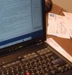

A few days ago I took delivery of a brand-spanking-new Thinkpad T42. It’s a beast of a machine with the sex appeal of a brick, but it’ll do.

Why a Thinkpad? I’d like to be able to build Firefox and Thunderbird on Windows and Linux. I’m very slow in getting to my Windows Firefox bugs because of the lack of a good development machine. Now I have no excuse 🙂 I’d also like to develop themes for GNOME at some point.  
  
I’m not willing to give up on Mac OS X yet though. The Titanium Powerbook snared me in the year 2000 with its good looks, wireless networking, and wide screen. It taught me to overcome a general dislike of laptops: Small screens, cramped unergonomic keyboards, expensive upgrades, etc. Mac OS X was a breath of fresh Unixy air after going through the pain that was Linux at that time.

The machine itself feels good, if a little heavy. The keyboard is nice and chunky, not mushy like some Apple laptop keyboards. It’s got a 15″ screen that’s not quite as bright as the Powerbook display. The native resolution is 1400×1050. To my surprise, text looks absolutely gorgeous in Linux and less so in Windows.

My distro of choice is [Ubuntu Linux](http://www.ubuntulinux.org/). The install went very smoothly and most of my hardware was detected right away. After finding some missing software (mplayer, thinkpad utils, Mozilla development tools, etc.), and FTPing my Firefox and Thunderbird profiles from the Powerbook, I’m off and running. My only problem is that my system seems to freak out when it wakes from sleep, but I consider that a minor annoyance. In my previous encounters with Linux, it seems that I’d have to compile a new kernel if I wanted to do \*anything\* slightly non-standard, like have scanner drivers that work.

I’ll have a report about the Ubuntu user experience shortly 🙂

## Comments

**Ben Goodger** on 2005-01-31 17:39:52
> Good lord. Let me know when you go screaming back to OS X :-P

**Neil T.** on 2005-01-31 18:25:48
> Ubuntu is pretty good, but I wish they'd get some newer stable builds of Firefox and Thunderbird out for it. Personally I still find I'm spending 99% of my time in Windows right now. But I am hoping to get a Mac Mini later this year :)

**Kevin** on 2005-01-31 22:17:07
> You can get Firefox 1.0 and Thunderbird 1.0 from <a href="http://ubuntu-bp.sourceforge.net/" rel="nofollow ugc">Warty Backports</a>

**Kevin** on 2005-01-31 22:20:27
> I dual boot as well. There are one or two things I use Windows for, including testing Winstripe. But I tried the latest beta version of VMware workstation yesterday and XP seems to perform better in the VM than on the separate partition.

**minghong** on 2005-02-01 02:01:34
> Hi! Just FYI, you <a href="http://kmgerich.com/archive/000085.html" rel="nofollow ugc">double posted</a>. And when did the anchor element gained a new attribute "hrref"? :-P

**Kevin** on 2005-02-01 08:05:48
> thanks minghong :) fixed

**Robert Accettura** on 2005-02-01 23:22:30
> Enjoy that.
> 
> I had to get a Thinkpad A31 for school.... and I soooo miss my mac :-(
> 
> I can't wait to make this my spare and have a nice shiny sexy Mac running OS X.
