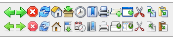

Designer Stephen Horlander and I are pleased to announce the availability of the toolbar and UI artwork seen in Firefox on Windows and Mac OS X.

[Winstripe](http://kmgerich.com/2004/06/28/the-browser-redesigned-take-two-or-02/) has been the default theme on the Windows version of Firefox for over two years. Man, how time flies. To explain the odd name, [the Pinstripe project](http://kmgerich.com/projects/pinstripe/) started in 2001 as an attempt to make the appearance of the Mozilla Suite fit in with the Mac OS X desktop. Icon designer Stephen Horlander joined the project and took the icon artwork to a new level of usability and polish. The Windows version of Pinstripe, dubbed “Winstripe”, [became the default look on the Windows version](http://kmgerich.com/2004/06/08/the-browser-redesigned/) of Firefox 0.9.

I’d like to see you take the artwork and remix it, mash it up with your own projects, use the artwork as the basis for your own Firefox themes. If you’re not familiar with Firefox themeing, start with the [documentation at the Mozilla Dev Center](http://developer.mozilla.org/en/docs/Themes). There’s an active community over at the [Mozillazine Themes forum](http://forums.mozillazine.org/viewforum.php?f=18) that’ll help you get up to speed. If creating a theme for Firefox looks daunting but you have a great idea, create a mockup of your idea and share it on the Themes forum. You might find people to help you turn your idea into a real theme. Enjoy!

### Download Details

The artwork source zips contain Illustrator and Photoshop files. The majority of the icons were created by Stephen Horlander with contributions by Kevin Gerich. You can use, modify and distribute them under the [Mozilla tri-license.](http://www.mozilla.org/MPL/)

[Pinstripe Browser Art](http://kmgerich.com/downloads/pinstripe-browser-art-1.0.zip) (3.6MB)

[Winstripe Browser Art](http://kmgerich.com/downloads/winstripe-browser-art-1.0.zip) (5.9MB)

## Comments

**Robert** on 2006-07-11 07:28:21
> Nice... but both links points to the same file, rename the pointed file to pinstripe* instead winstripe* to download the other until it is fixed.

**marcoos** on 2006-07-11 07:33:37
> Both links lead to Winstripe...

**Kevin** on 2006-07-11 07:58:55
> I fixed the links. Sorry about that. Thanks for letting me know.

**Lim Chee Aun** on 2006-07-11 09:28:04
> Wow, this is great news. Thanks!

**Sohil** on 2006-07-11 10:00:30
> Is this the right place to ask for a small peek into Bon Echo's Theme ? ;)

**Life As It Comes &raquo; Blog Archive &raquo; (Win|Pin)stripe Icons Released** on 2006-07-11 11:23:40
> [...] Kevin Gerich and Stephen Horlander announce the release of the Winstripe and Pinstripe artwork from their work for Mozilla. [...]

**David Naylor** on 2006-07-11 13:10:41
> Sohil: No real change for Bon Echo compared to 1.5.

**Will Rogers** on 2006-07-11 13:36:53
> I was also curious about this post, since there is still a "visual refresh" planned before the Firefox 2.0 release.  I guess this means the refresh won't take the form of theme changes?

**Dao** on 2006-07-11 14:08:09
> David Naylor, I guess you mean Bon Echo Beta 1. It's not final and the visual refresh is yet to come.

**Kevin** on 2006-07-12 11:17:51
> The visual refresh is off topic to this discussion, but the details are <a href="http://wiki.mozilla.org/FX2_Visual_Update/Default_Theme_Update" rel="nofollow ugc">here</a>

**lukem** on 2006-07-12 11:47:59
> Finally! Let's hope this heralds a policy of releasing this sort of thing earlier! It'll make it a lot easier to make browser extensions that fit in visually with the rest of the browser.

**Smokey Ardisson** on 2006-07-13 01:11:26
> Thanks for doing this (or making it happen, or whatever excatly...).  Getting some appropriately-licensed Aqua/Aqua-like iconography out there will be a big help for smaller open-source projects (without budgets or resident designers) trying to better fit in visually on Mac OS X.

**Firefox 1.x Classic themes available : pretty widgets** on 2006-08-05 13:10:49
> [...] and Photoshop files used to make these themes here. Bookmark article on:  digg  del.icio.us  Ma.gnolia  Filedunder: [...]

**Jens Meiert** on 2006-09-05 15:45:16
> Nice work. Firefox' (default) GUI will stay/get more appealing than IE's, while interestingly and at almost the same time, IE 7 becomes much more horrible to use (yeah, that clutter story...).
