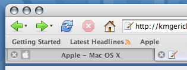

This update to the stand-alone Pinstripe theme turned out to be more of a redesign than [I originally intended](http://kmgerich.com/2006/08/05/firefox-1x-classic-themes-available/). Stephen Horlander sent in a cool concept for the browser tabs. Check out the etched text on the inactive tabs. You’ll see some of the other details in the screenshot below. The theme has some rough edges but should be usable. As always I appreciate your feedback.

Click on the thumbnail for a full screenshot.

[Install the Pinstripe Theme](javascript:void\(InstallTrigger.installChrome\(InstallTrigger.SKIN,'http://kmgerich.com/downloads/pinstripe_firefox.jar','Pinstripe v4.9'\)\)) (_requires [Firefox 2.0RC1](http://www.mozilla.com/products/download.html?product=firefox-2.0rc1&os=osx&lang=en-US) or later on Mac OS X_)

## Comments

**Dan V. P. Christiansen** on 2006-09-27 10:35:35
> *Very* nice upgrade. You should convince the Firefox developers to bundle this theme in Firefox 2.0. That would at least give people an option to have Firefox behave like a proper Mac application.

**Jacques** on 2006-09-27 10:48:55
> These are the best tabs I've ever seen on a Firefox critter.
> 
> I'll install it now.
> 
> Will the Mozilla folks open their eyes and bundle your theme for the Mac community?
> 
> Thanks!!!!!

**Jonathan Stanley** on 2006-09-27 11:11:04
> Personal dislikings of OSX aside, those tabs are probably more "native" looking that actual native OSX tabs. :D

**HÃ¥kan Waaara** on 2006-09-27 11:19:43
> Looks awesome, Kevin!

**jed** on 2006-09-27 11:21:49
> Awesome.
> 
> Any chance for a new winstripe for Linux/Windows.
> (I'm on Linux). I absolutely hate the new 2.0 theme.

**Mario** on 2006-09-27 11:22:51
> They look very nice... i think it would look better if you could get a unified toolbar like camino.

**Kevin** on 2006-09-27 12:00:55
> I think a true unified toolbar would be difficult to implement in XUL. Camino can do it because they use a Mac native UI. We tried to do a sort of pseudo-unified look with the gray gradient. That's probably the best a theme can do for now.

**José Jeria** on 2006-09-27 12:02:32
> Looks really nice. Though one minor thing, the close button next to the favicon makes it look a bit crowded.

**Josh Hughes** on 2006-09-27 12:08:44
> Looks very nice! Well done!
> 
> My one comment: The etching on inactive tabs looks a bit off when the text is longer than the tab (i.e. it finishes with an ellipsis).

**Josh Hughes** on 2006-09-27 12:43:10
> "My one comment: The etching on inactive tabs looks a bit off when the text is longer than the tab (i.e. it finishes with an ellipsis)."
> 
> Nevermind ;) I just realized I had some residual css in my userChrome that was throwing it off.

**Jon Hicks** on 2006-09-27 13:38:00
> Wow. I think you're underselling yourselves with 20%! More like 80%! Seriously, this has gorgeous attention to detail - it's everything the official mac theme for FF2 isn't.

**Stephen Horlander** on 2006-09-27 13:43:51
> He didn't even post a screenshot of the awesome sidebar ;)

**Hanspeter** on 2006-09-27 13:48:37
> ack! It hides my menu bar when I use it under OSX/X11.

**Kevin** on 2006-09-27 13:52:53
> You run Firefox under OSX/X11?! That's crazy talk.

**Hanspeter** on 2006-09-27 14:37:10
> I can ssh tunel to the Mac inside the school firewall to access internal web servers, which I can't connect to through the normal AppleTalk server connect to run the native Firefox.app.
> 
> ps.  the right side of the comment textbox hides  the last 4 characters (they do get typed in though).  This is on a normal OSX Firefox.  I'm guessing it's set at a width that's wider than the column it's contained in.  With Safari, the right half of the scrollbar is chopped off (supporting my idea).

**TomL** on 2006-09-27 15:51:41
> The tabs are great. Very nice. I have to say though, I have grown tired of the FF1.5 icon set and am enjoying the new icons in the default FF2.0 theme.
> 
> Thanks for the theme though! Nice work!

**Nick Fagerlund** on 2006-09-27 18:52:42
> Lordy, <em>yes.</em> THAT is what a 2.0 theme looks like.
> 
> The tab overflow controls need some more definition, including a greyed end-of-the-line state for the scrollboxes--file under "rough edges." But never mind that for now: you've done some very good work, so thank you.

**Philippe** on 2006-09-27 19:44:32
> icon size (large, small) check.
> close button on the left. check.
> background on tabbar, bookmarkbar, toolbar. check.
> 
> This looks quite good !
> 
> I'm not so enthusiast about the blueish glare on the active tab though. Greyish would be a lot smarter.
> The use of bold font-face on the tabs is problematic. This makes East-Asian characters very hard to read.
> 
> I think Arronax! has some serious competition here.
> 
> PS - you shouldn't scale this textarea's width in ems. Part of it disappears for those older visitors who need larger font sizes.

**Jim Barraud** on 2006-09-27 19:52:41
> Very nice. Vast improvement over what will be shipping with 2.0.
> 
> Why is it your not providing the default theme this time around?

**Jim Barraud &raquo; Blog Archive &raquo; Firefox 2 RC1: If you want something done right&#8230;** on 2006-09-27 20:02:03
> [...] But fear not, Kevin Gemerich, the man behind the default theme of Firefox 1.x has come to the rescue with an updated version of his Pinstripe classic. Should be considered a required install for anyone using FF2 on a Mac. [...]

**Eric** on 2006-09-27 21:44:13
> Looks great! One quibble though... when one uses 'small icons' in the toolbar, the gradient is not smooth into the tabs - there's a noticeable line at the top of each tab.
> 
> Other than that, is there an easy way to make the default buttons in FF2 not look like crap?

**Josh** on 2006-09-27 22:16:19
> This is indeed a huge improvement.  I love the gradient in the toolbar -- it's such a small thing but it really makes a difference.  And yes, those sidebars are snazzy.
> 
> Maybe a combination of this theme with the official 2.0 theme -- using the new icons (and fixing them) -- could be the official Mac theme?

**jed** on 2006-09-28 00:07:41
> Wow, just installed it, and it's even better than your screenshot :)
> 
> I too however am seeing that odd issue with text boxes, including this box here. I wonder if it's a theme or Firefox 2 bug?
> 
> Small nitpick, I don't like the 'blue' color of the tab text background gradient either.. would look alot more sexy grey.

**Philippe** on 2006-09-28 00:19:57
> A bug report...
> When navigating trees (like the left pane of the DomInspector, or in the bookmarks window), a click everywhere on a row highlights the whole row. I need to double-click on the little arrow to open up the tree. This doesn't happen with the default theme: click on the label in a row to highlight, click on the arrow to open.
> 
> Strangely, that works fine in the sidebar (tested with the bookmarks sidebar).
> 
> Using the latest nightly BonEcho build.

**MechR** on 2006-09-28 02:55:43
> Seconding the Win/Linux release request!  It looks beautiful :D

**Martin** on 2006-09-28 03:23:27
> I love this theme. Thanks!

**clem** on 2006-09-28 04:54:26
> Showing actual inactive tabs is just a waste of precious tab space IMO. I use middle-click to close tabs so have the close box disabled too. I use UNO along with the userchrome.css bit of Arranox's FF theme for UNO and a modified version of the old Safari Tabs userchrome hack and it works out pretty well for a unified toolbar look with more Mac-like tabs.
> 
> http://img136.imageshack.us/my.php?image=picture1an3.png

**ant** on 2006-09-28 07:16:11
> Very nice. I just wish someone would make the Linux theme this good, instead of this obsession with dumbing it down with an IE7-like UI for Gnome.

**Nick Fagerlund** on 2006-09-28 09:24:00
> I'm also getting some funny business with the bookmarks organizer, where I can't click the triangles to pop the folders open.

**Jay States** on 2006-09-28 10:57:37
> WOW.... I just installed this theme.  The best theme for the mac.  Keep it up!

**Jimmy** on 2006-09-28 11:04:28
> The official Firefox 2 theme makes me sad. A big step in the wrong direction as far as I'm concerned.
> 
> This though, is awesome. It looks fantastic! Thank you. Now I don't have to be sad. :)

**Glenn Watts** on 2006-09-28 11:09:29
> Drooling...
> 
> You've totally outdone yourself!  Been using Pinstripe exclusively since its earliest days.  This release blew me away!

**markpeak** on 2006-09-28 12:07:14
> Could the magnify-glass search icon change to left-rotate (the same as blue Spotlight icon or Safari search icon)?

**Firefox 2.0b2 (ick!) - MacNN Forums** on 2006-09-28 14:48:31
> [...] Originally Posted by Lateralus For starters, Firefox really sticks out like a fish out of water in OS X. It just looks and feels like a really klunky port of a Windows/Linux application.      The updated Pinstripe theme might help out here: Pinstripe for Firefox: Now with 20% more Macintosh : pretty widgets [...]

**The Journal of C.R.G. &raquo; Pinstripe for Firefox 2.0** on 2006-09-28 19:17:26
> [...] Check out this awesome update of the classic Firefox theme for OS X users. It really makes Firefox fit in with OS X. Although I do not understand why one of the main developers of Firefox want us to install it. If he likes it so much, why isn&#8217;t it in Firefox 2.0? [...]

**Mike M.** on 2006-09-29 01:44:19
> Very nice! Personally I'd make just one change (well, two really, but they're related). The Go and Search buttons appear greyed out, even though they're available for use. Green for Go seems obvious enough, but I'm not sure what colour would be most appropriate for Search. Blue maybe, a la Spotlight?
> 
> Other than that, it's magnificent and a LOT nicer to look at than the new 2.x default theme!

**Mislav** on 2006-09-29 08:52:28
> OK, I've installed this on Win (didn't read the fine print after "requires Firefox 2.0RC1"). It looks good (except for context menus, they're black), but it hides the menu bar. How to revert to default theme?

**Mislav** on 2006-09-29 09:29:26
> I found out. You can revert to default by removing a line from preferences.js file under "general.skins".
> 
> Firefox will forget the selected skin and start with default.
> 
> Default FF2 theme may be ugly for you OS X users, but is not so ugly in general. Apart from being in very cold appearence, I (for one) like it.

**FirefoxRawx &raquo; Archive &raquo; Pinstripe Theme for Firefox2 on OS X** on 2006-09-29 14:26:56
> [...] Mac users will appreciate this update of the classic Firefox Pinstripe theme for OS X, by Kevin Gerich. Very nice! [...]

**Chris McLeod** on 2006-09-29 17:18:25
> This is almost perfect, when used with <a href="http://gui.interacto.net/" rel="nofollow ugc">UNO</a>.
> 
> 
> 
> All it needs is a little tweaking of the active tab colours.
> 
> I tried to modify things myself, but I get errors when trying to install the modified theme.

**Sumeet Singh &raquo; Archives &raquo; Firefox 2 RC 1 experience** on 2006-09-30 00:38:14
> [...] I have been using Firefox 2.0 RC 1 ever since it was launched. Some of the in-built features such as spellcheck and session saver convinced me partially overlooking the pain of not being able to use del.icio.us plugin that I use the most. And then came the Pinstripe theme which convinced me completely to go for Firefox 2 RC 1, but the problem of the plugin not working was still bothering me somewhere. As I was looking for a tool similar to delicious plugin, I saw Nightly Tester Tool which enables you to install the extensions that are incompatible with the nightly builds of Firefox. So if you know your extension will work, or you are confident enough, go ahead and acquire Firefox 2 RC 1, Pinstripe theme and Nightly Tester Tool to get the best browsing experience. [...]

**Filter for 30/9 2006 - Felt** on 2006-09-30 03:46:51
> [...] pretty widgets: Pinstripe for Firefox: Now with 20% more Macintosh For when Firefox 2 is out. [...]

**Will** on 2006-09-30 21:09:23
> Contact me with your email address Kevin! I have a couple of screenshots you should look at.

**Kevin** on 2006-09-30 21:23:57
> Hi Will, you can send me an email through the <a href="http://kmgerich.com/about#contact" rel="nofollow ugc">contact page</a>.

**Chris** on 2006-09-30 22:51:04
> Great redesign. The only thing that has prevented my consistent use of firefox was the location of the close tab. Your version brings it much closer than 20% IMHO. I like that it gives me the safari feel/control without the brushed metal I detest. Your theme looks much cleaner, great work!

**Tim** on 2006-10-01 17:07:25
> Hey this tab-theme is really cool. Is this also available for 1.5 already or does one have to update to 2.0 ?

**Aronnax** on 2006-10-01 17:59:12
> Hi, Kevin
> I really like some big improvements, specially the the tab-text shadow and the changes in the download-manager
> And the focus state for the url and searchbars  are great work - the code looks very difficult and now really nice - many cool new features, love it ;-)
> 
> Most of the design changes are not my taste, but i think this is not important.
> Jon Hicks  has sad it already:  "this has gorgeous attention to detail - it’s everything the official mac theme for FF2 isn’t."
> 
> Your are still the most important guy for FF theme stuff ;-)
> and many, many thanks for all what you have done to support the Firefox community.
> 
> Regards

**David** on 2006-10-01 19:57:55
> Thank you! I really dislike the new Firefox 2.0 theme, and I appreciate your work on this new version of Pinstripe.

**Tom** on 2006-10-02 04:08:50
> I love the theme, but is there any way to reduce/remove the bluish tint on active tabs? This is the only remaining issue I have with the FF2.0 UI. Something seems very... off about the coloring.

**Jason** on 2006-10-02 12:45:39
> To change the color of the tabs, use your favorite extraction tool on the theme jar file (mine's "the unarchiver").  Navigate to the global folder, find the tab graphics (you'll know them when you see them), edit them, then highlight all the files under the folder automatically created by the unarchiver, right-click and choose to create an archive.  Rename the archive from .zip to .jar and install.
> 
> 
> It's a lot harder than it sounds. ;)
> 
> Great them, especially with UNO and a few userchrome mods.  Thanks.

**Jason** on 2006-10-02 12:46:42
> I meant it's a lot "easier" than it sounds.  Doh!

**onmac** on 2006-10-03 11:39:55
> Wonderful theme
> very macintosh!!!!

**T.R. Fullhart** on 2006-10-03 16:20:52
> Thank you very much. It seemed to me that the forward/back in the default theme were too small to hit and I didn't like that the home icon looked "rusty".

**Albert** on 2006-10-05 23:33:20
> This is fantastic. I enjoy it quite a lot over the standard FFX2 theme.
> 
> Any reason you weren't working on the new default theme refresh btw?

**Kevin** on 2006-10-06 06:16:14
> <blockquote>Any reason you weren’t working on the new default theme refresh btw?</blockquote>
> 
> Originally my day job was leaving me with little free time to contribute to Firefox. These days I'm not interested in participating in the closed theme design process driven by Mozilla Corp. and their contractors.

**Albert** on 2006-10-07 16:37:32
> Well, thanks for your effort all the same.  I hope you keep Pinstripe updated for 2.0 and beyond, this looks great :)

**joe** on 2006-10-09 15:12:42
> thank god. the new 2.0 theme icons are so dull and lame. this is the best mac theme i've ever used. like the sharp tabs.

**Geoffrey L. Wright** on 2006-10-11 00:31:57
> _beautiful_ work, and many thanks.  FF is a necessity for my job (web development), but sometimes it feels frustratingly alien on OS X.  Your theme makes a big dent in this issue.  (And oh my lord is the FF2 default Mac theme a big step back!)
> 
> I hope you reconsider working with the Mozilla folks on the default Mac theme -- if only so the majority of Mac FF users get the benefit of your excellent work.
> 
> And any case -- I wish you all the best.  I spend a lot of my life (too much, probably) looking at the world through a browser.  Your work makes it a prettier picture...  :)

**spk** on 2006-10-11 14:57:52
> Kevin,
> 
> You've just made Firefox on Mac useable again; now all we need is aqua/ cocoa widgets, and we're away...

**Sickr** on 2006-10-14 15:23:18
> I really like this theme and wish to use it as my default. Though for some reason once I install it on my PC any drop down menus such as the ones used for live RSS feed bookmarks show up in black, subsequently making them unreadable. Is this a commonly known problem with the theme? It's so annoying because it's a fantastic looking theme.

**Kevin** on 2006-10-14 15:33:20
> Sickr, Pinstripe was made for a Mac. It uses some Mac-specific Mozilla css extensions. I have no plans to do a Windows port but if someone wants to try to port it to Windows I'd be glad to help.

**Sickr** on 2006-10-14 18:20:40
> Aha thank you for clearing that up. It's a shame that it's only Mac-specific as I'm sure there are a number of PC owners out there who would love this theme. Hopefully someday it will make a welcome appearance.

**Jason** on 2006-10-16 07:20:11
> It's tempting to use this theme on Windows despite the loss of functionality.  It really is impressive.

**Firefox 2 RC3 is brilliant. - MacNN Forums** on 2006-10-17 08:31:48
> [...] I hate the new theme, but Kevin Gerich has an updated version of Pinstripe (the default FF1.0/1.5 theme) and some of Arronax's stuff is updated as well.  Incidentally all of my extensions are already 2.0-ready.  __________________  Backup your home folder to your iPod quickly and easily with iPodBackup [...]

**bob** on 2006-10-17 20:52:33
> Umm, Earth to Firefox developers... Earth to
> Firefox developers!  This should be the 2.0
> default theme.  Schmucks.

**MacManux** on 2006-10-18 13:42:36
> Great tab look! Any chance you bundle your efforts with the folks developing the GrApple themes to make the toolbar more Safari like? I'd think that their icons combined with your tabs would make the greatest look we ever had for a Mac browser!

**Kevin** on 2006-10-18 15:40:35
> bob, I wouldn't be so quick to insult the Firefox developers. They are doing excellent work and Firefox 2 is a fine browser.

**Tom** on 2006-10-21 03:40:41
> I managed to manually un-blue the tabs, but now I was wondering about one more user edit: would it be possible to move the close tab button to the right side of the tab?

**Will** on 2006-10-21 17:39:50
> I like the new theme, but agree with the other posts about the blue highlight on the tabs.  I also would like to see a variant without the blue/purple down state on the bookmark bar items.  To be 'savvy' the down state should be a dark gray like the default Firefox 2 theme.  The find interface however, is great. =)

**Shakespeare** on 2006-10-22 18:04:37
> I use this theme on Windows Xp...
> 
> Someone needs to port this, its just so goddamn nice, and anice FF theme is hard to come by.. Os X gets all the nice UI

**mpmchugh** on 2006-10-23 16:00:24
> Actually, I'd like the opposite. I like Pinestripes' less safari-like buttons and the awesome tabs, but I miss all the GrApple extras for the sidebar and extensions like Sage, Web Developer Toolbar, Scrapbook, etc.
> 
> Now that GrApple seems to have discontinued their "Pro" series, in favor of the safari-like Eos, I hope a combined theme is in the cards in the near future.

**Brian Kerr | Pinstripe on Firefox** on 2006-10-23 23:06:01
> [...] Oh my gosh, the updated Pinstripe theme for Firefox is gorgeous: [...]

**thread** on 2006-10-23 23:26:15
> Why do some themes show the icons for my bookmark bar while others don't? I'd like to be able to see the icons!

**Mahesh Asolkar : i think so&#8230; &raquo; Blog Archive &raquo; Firefox 2 is here!** on 2006-10-24 16:46:32
> [...] Mac users, try the new Pinstripe theme too! [...]

**me** on 2006-10-25 07:36:22
> I hate the half-blue tabs. It would have been much better if you had simply made the old pinstripe theme compatible with ff 2.0.

**CODE|源码 &raquo; Pinstripe for Firefox** on 2006-10-25 22:04:09
> [...] Mac version Win version Author:llqoli [...]

**chad** on 2006-10-26 05:55:17
> I have installed the Pinstripe theme on my wiondows machine but it has removed acess toall the windows for options etc.. now I can't uninstall the theme because don't know how to gewt to add-ons. Can anyone out there help me get back to a usable firefox?

**jmc** on 2006-10-26 07:55:12
> Hi,
> Just wanted to say I love this new theme.  The subtle glow on the tabs is simply very nice.  It's topped only by the beauty of the sidebar--which has led me to change my browsing habits, getting rid of the "bookmarks toolbar" entirely and adding the "bookmarks sidebar" button to my toolbar so that I can see it often.  Very nice.
> 
> I was just in Thunderbird, though, and couldn't help but think how nice the sidebar treatment would look on the "Folders" pane.  Any chances of seeing a Thunderbird Pinstripe update?  Might this be an update coming to Thunderbird 2.0, or are you no longer working on that theme, either?  (BTW, I've looked and not been able to find the answer anywhere: they're not making Qute the default Thunderbird theme for OSX, are they?)
> 
> Finally, for all the nay-sayers who say "nay," do you have any plans to open up the artwork changes from this update like you did back in July? http://kmgerich.com/2006/07/11/firefox-browser-ui-artwork-released/
> This move would allow people to repackage different color themes (blue, graphite, etc.) and take some of the (practically non-existent, I must admit) pressure off of you.
> 
> Anyway, to reiterate, thank you for such a lovely theme!

**Kevin** on 2006-10-26 08:05:32
> Thanks for the compliments jmc and everyone :)
> 
> jmc, I just got an email from Scott MacGregor and I will be helping out with polishing up the Thunderbird 2 theme and I'll see if I can sneak in some upgrades like the sidebar treatment you mentioned.
> 
> I'm also working on setting up a Wiki where people can contribute ideas, feedback and maybe even artwork and code as we develop the theme.

**jmc** on 2006-10-26 08:56:05
> Great news!  Thanks :-)

**Jason** on 2006-10-26 12:20:12
> Hey Chad,
> 
> You'll want to start Firefox in Safe Mode.  In the Start &gt; All Programs &gt; Mozilla Firefox folder there should be an icon named Mozilla Firefox (Safe Mode).
> 
> If you don't have such an icon, right-click on whatever Firefox icon you can find, choose properties, and change the text in the TARGET box to be this:
> 
> "C:\Program Files\Mozilla Firefox\firefox.exe" -safe-mode
> 
> Good luck!

**Ben** on 2006-10-27 05:50:25
> I love this theme. I would really love it if you could make a variant with tabs like those in Aronnax's GrApple (default) theme for FF1.5.
> 
> This was by far my favorite theme because it has the default icons which I prefer and great looking tabs. Since Aronnax is discontinuing this theme maybe you could build these tabs into your theme (please!!).

**Adam** on 2006-10-27 06:43:00
> I like it, but prefer the 'x' on the right, an option in the future perhaps...

**Les** on 2006-10-27 09:21:35
> I love it, but would like to have the option of using icons in the bookmarks toolbar.

**Patrick** on 2006-10-27 12:36:39
> I really like this, except for the blue tint on the active tab and lack of icons in the bookmarks toolbar. If those two issues were resolved I'd definitely use this theme.

**Succombing to Firefox : Pensieri di un lunatico minore** on 2006-10-28 11:01:38
> [...] Pinstripe theme : Prettier than the default [...]

**The Browser Den &raquo; Blog Archive &raquo; 9 reasons not to upgrade to Firefox 2?** on 2006-10-29 13:49:00
> [...] I agree that the theme looks totally out of place on the Mac, but I actually prefer it to the previous theme under Windows. To get a better Mac like theme get the new pinstripe. In my opinion the best theme for Firefox on Windows was Qute which disappeared after Firefox 0.8. A new version of Qute for Firefox 2 is QuBranch. [...]

**Nicky's blog** on 2006-10-30 00:35:27
> <strong>Pinstripe for Firefox2...</strong>
> 
> 
> 这几天Firefox2正式发布，看样子老用户们应该都更新过了，在它的RC阶段很多常用扩展都在跟进，所...

**Optimist Realist &raquo; Blog Archive &raquo;** on 2006-10-30 11:59:11
> [...] Kevin Grerich's Pinstripe theme Pinstripe with grey tabs     Posted by James K. Filed in Miscellanea [...]

**Bart** on 2006-10-30 13:06:52
> Thank you for making this theme. The only thing I'm not really a big fan of is the icon in the search bar with the dark border around it. It doesn't look Mac-like (the circle should just be a knocked-out solid gray color) and it doesn't match the icon in the Find toolbar (which is the magnifying glass without a circle around it). And is it just me or is there a purple shade over the active tab?

**tim_from_dc** on 2006-10-30 20:22:03
> When I try to download this I am getting an error,  It says that it is download error -228.  Is there something I can try?

**Panp** on 2006-10-30 22:23:01
> Dumb question: Why is this amazing theme not available through the official "Firefox add-ons" site? For most people that is their primary (or even unique) source for FF themes.

**Kevin** on 2006-10-30 22:30:25
> tim_from_dc: You can try downloading the jar directly to your computer then open up the Add-ons window, select themes and then drag and drop the jar file on the theme list. It should ask you to install.
> 
> http://kmgerich.com/downloads/pinstripe_firefox.jar
> 
> panp: the theme isn't done yet :) I'll put it on a.m.o when it's finished. That should be RSN :)

**Bart** on 2006-10-31 12:29:23
> My other suggestion for this theme is with the highlight color when the addressbar and search bar are in focus. All my other programs have the focus be a blue color that matches the blue of the scrollbar pill. I feel like the shade you're using is more of a purple? Reminds of of OS 9's folder icons. I think the blue would make it fit in with the overall OS better. And also, is there no standard for the blue background color that you use for the Find Bar and the History sidebar? I'm noticing that Mail has a different color from iTunes which has a different color than NetNewswire which has a different color from your theme (though your themes tilt more towards the purple side).
> 
> Other than that I want to thank you again for making this theme. The more I use it the more I notice the little details, like the Find bar, that you thought through very well.

**Bill** on 2006-11-02 12:56:55
> grid bless you

**macfox II at BOK** on 2006-11-02 14:17:52
> [...] Today the macfox II theme for Firefox 2.0 was released. To give an impression, it almost looks like this: it&#8217;s how the default Firefox 1.x looked when installed on an Apple computer. You can get the jar-ball overhere. Also, if you don&#8217;t like the new default theme (too) in FF2.0 for Mac OS X, go for the Pinstripe-theme, to get that good ol&#8217; feelin&#8217; back. Now all my foxes look the same    theme, Firefox [...]

**Empty** on 2006-11-03 00:36:56
> This theme is amazing, its simple yet it still catches the eye.  Could you maybe port it so it will work with Windows?  I tried messing around with the css file to get it to work and I couldn't figure it out.

**Chris** on 2006-11-03 06:39:34
> Kevin, are you still working on the theme? I would really like to see some updates :)

**Oskar L-B** on 2006-11-04 09:32:41
> Thanks for the excellent theme. Subtle update, but it just feels so much more integrated into OS X.
> 
> Currently testing the new builds of CocoaFox (i.e. Firefox 3.0.1a), but your theme unfortunately won't install on it... Is it possible for you to fix it without devoting too much time?
> 
> I also suggested to Mozilla that they add your theme as standard for the new 3.0 releases. (Hopefully for 2.0 as well, but that probably won't happen.)

**Sickr** on 2006-11-06 07:25:12
> Any news on a Windows compatible version of this beautiful theme?

**altes (schöneres) theme für den neuen Firefox 2.0 at blogadresse** on 2006-11-09 11:55:01
> [...] Wer den Firefox 2.0 benutzt dem ist bestimmt schon das neue Theme des Browsers aufgefallen, was auf dem Mac irgendwie nicht mehr so schön ist für vorher. Wer das alte (bessere), mehr mac-maßige Theme möchte, der sollte sich den Pinstripe theme einmal anschauen.  Share and Enjoy:These icons link to social bookmarking sites where readers can share and discover new web pages. [...]

**Better Tabbed Browsing In Firefox** on 2006-11-14 12:23:43
> [...] Although I occasionally use Camino and Safari, Firefox is my preferred browser and I use it even more of the time now that 2.0 has been released. If you use Firefox too, but don&#8217;t think the tabbed browsing feature is Mac enough, you have to install the Pinstripe add on developed by Kevin Gerich at Pretty Widgets. [...]

**Optimized Firefox 2.0 for Mac &laquo; Shoegazer** on 2006-11-15 06:12:05
> [...] 然后是主题，Firefox 2.0 默认的主题说实话还是挺难看的，GrApple 这里可以下载 3 款 Safari 类主题，蛮不错的。如果像我一样不喜欢 Firefox 用 Safari 类主题，那这款 Pinstripe 主题一定会让你满意的。 [...]

**BlogMyth|博客神话之设计类博客 &raquo; Archive &raquo; Pinstripe for Firefox2** on 2006-11-23 10:44:44
> [...] 到了2.0扩展是跟上了，主题却倒下了，有人说2.0的默认皮肤漂亮，我觉得还比不上1.x干净，如果你还怀念以前的界面，点击这里下载1.x经典皮肤，我喜欢的还是类Safari风格主题，有同样爱好的朋友可以到这里下载Pinstripe Theme，因为它是&#8221;equires Firefox 2.0RC1 or later on Mac OS X&#8221;，所以在windows版本上使用会发现菜单完全没有可读性，那么你点击这里就可以下载一个修改好的版本（支持Windows版本的Firefox2.0正式版）。 [...]

**Meredith** on 2006-11-26 21:38:30
> This theme is beautiful and the best "Macfox" theme I've found.  Thanks!

**Treviño** on 2006-11-29 22:14:15
> Really wonderful but I'd like to use it in my Linux box, but I can't becouse it hides my menus... :/
> 
> Could you make also a version for all OS?

**Daniel Andrews** on 2006-11-30 06:24:30
> Absolutely beautiful!  Now if there were only a graphite version...

**Andy** on 2006-11-30 20:29:26
> I hate the half-blue tabs. It would have been much better if you had simply made the old pinstripe theme compatible with ff 2.0.

**Jon** on 2006-12-21 12:10:04
> Only "rough edge" I noticed was the anti-phishing warning bubble doesn't work as expected.
> 
> http://img84.imageshack.us/img84/6397/picture1lg2.png

**Scott** on 2006-12-22 23:44:46
> Toolbar icons are still too PC-ish.
> Nice widgets though.

**Firefox 2 tidbits :: medicinalchemistry** on 2007-01-01 05:23:30
> [...] There&#8217;s a lot to like about Firefox 2 but there are a few changes that long-time users such as me are finding quite annoying. The new default theme looks consistently bad across platforms (and particularly so in Mac OS X). Fortunately, designers Kevin Gerich and Stephen Horlander have updated the venerable Firefox 1.x default themes Pinstripe (Mac OS X) and Winstripe (Windows) for use in Firefox 2. Secondly, the Find As You Type search bar has been pointlessly &#8220;simplified&#8221;. Once again the customisability of Firefox comes into its own here, and it&#8217;s simply a matter of inserting the following line into your local userchrome.css file. /* Use the old-style / and &#8216; QuickFind Bar behaviour */ #FindToolbar &gt; * {display:-moz-box} [...]

**Jon** on 2007-01-03 00:47:56
> Hmmm...any chance of releasing a version with the original 1.5 tabs?  Your new ones are quite clever,
> but honestly I find them to be really distracting--they call a lot of attention to themselves.  It would be nice to have the older version, as well, if it's not an insane amount of trouble...

**cgmania** on 2007-01-17 03:19:21
> Well, thanks for your effort all the same. I hope you keep Pinstripe updated for 2.0 and beyond, this looks great

**Josh** on 2007-01-17 19:47:30
> I'm checking out recent Thunderbird 2.0 nightlies and I think I see some of you handiwork in there :)  Looks great!  I'm hoping your changes will stick.

**Ray** on 2007-01-28 18:57:26
> I really like this theme. Is there any way to get the blue background the ScrapeBook extension sidebar?
> 
> TIA.

**Jonathan** on 2007-02-12 21:43:37
> Just wondering if there was any plans to finish this theme since it's been a while since Kevin has said anything.

**Nader** on 2007-02-13 18:12:13
> Im using windows xp pro and it hides my menu bar! how can i change the theme or change it back!?!?

**Jonathan** on 2007-02-13 20:20:53
> Nader,
> 
> Start Firefox in Safe Mode (It should be in the start menu) and then disable the theme, or even uninstall it if you can.

**Look What I Found &raquo; links for 2007-02-17** on 2007-02-16 23:18:06
> [...] Pinstripe for Firefox Now with 20% more Macintosh : pretty widgets (tags: firefox osx themes) [...]

**Echo Faith &raquo; Blog Archive &raquo; Little Quirks** on 2007-02-20 14:54:26
> [...] And in another note: if you are on mac and trying out the new Firefox release, make sure to check out either the excellent Pinstripe skin or the equally attractive GrApple skin - it makes Firefox not so ugly. [...]

**Gate Nine &raquo; Mon précieux Firefox** on 2007-03-08 09:39:10
> [...] Pinstripe (compatible uniquement sur Firefox 2+ sur Mac) [...]

**Ray** on 2007-03-08 19:53:32
> Kevin, have you stopped development on this theme?

**KAMiKAZOW** on 2007-03-09 11:58:11
> @Ray:
> 
> Until recently Kevin updated Pinstripe for Thunderbird 2. So he was busy with that.

**Ray** on 2007-03-09 18:09:43
> Ahh, I was just curious. It's been a while since he's posted.
> 
> I really love this theme and hope Kevin is going to continue to update it.The Bookmarks quirk noted earlier is very frustrating.
> 
> Thanks.

**christina** on 2007-03-10 21:38:47
> Personal dislikings of OSX aside, those tabs are probably more “native” looking that actual native OSX tabs.

**Daniel** on 2007-03-27 12:34:49
> PC Users!  To make this theme compatible for Windows, use Personal Menu (https://addons.mozilla.org/en-US/firefox/addon/3895).   You can use this add-on to move the toolbars to the navigation bar. Install Pinstripe and close Firefox.  Next, paste the following into your userchrome.css file:
> 
> 
> /* Classic Menus */
> .menu-accel,
> .menu-iconic-accel,
> .menu-text,
> .menu-iconic-text {
>  margin-top: 0px !important;
> }
> 
> .menu-iconic-left {
>  margin-top: 1px !important;
>  margin-bottom: 1px !important;
>  min-width: 12px;
>  -moz-margin-start: 2px;
>  -moz-margin-end: 2px;
> }
> 
> menubar &gt; menu {
>  border: 1px solid transparent !important;
>  padding-top: 0px !important;
>  padding-bottom: 1px !important;
>  margin-bottom: 1px !important;
>  -moz-padding-start: 2px;
>  -moz-padding-end: 3px;
> }
> 
> menubar &gt; menu[_moz-menuactive="true"] {
>  background-color: transparent !important;
>  color: MenuText !important;
>  border-top: 1px solid ThreeDHighlight !important;
>  border-right: 1px solid ThreeDShadow !important;
>  border-bottom: 1px solid ThreeDShadow !important;
>  border-left: 1px solid ThreeDHighlight !important;
> }
> 
> menubar &gt; menu[_moz-menuactive="true"][open="true"] {
>  background-color: transparent !important;
>  color: MenuText !important;
>  border-top: 1px solid ThreeDShadow !important;
>  border-right: 1px solid ThreeDHighlight !important;
>  border-bottom: 1px solid ThreeDHighlight !important;
>  border-left: 1px solid ThreeDShadow !important;
>  padding-top: 1px !important;
>  -moz-padding-end: 2px !important;
>  padding-bottom: 0px !important;
>  -moz-padding-start: 3px !important;
> }
> 
> /* Classic Popups */
> menupopup,
> popup {
>  border: 2px solid !important;
>  -moz-border-top-colors: ThreeDLightShadow ThreeDHighlight !important;
>  -moz-border-right-colors: ThreeDDarkShadow ThreeDShadow !important;
>  -moz-border-bottom-colors: ThreeDDarkShadow ThreeDShadow !important;
>  -moz-border-left-colors: ThreeDLightShadow ThreeDHighlight !important;
>  padding: 1px !important;
>  min-width: 1px !important;
>  background-color: Menu;
> }
> 
> popup[type="autocomplete"],
> .autocomplete-history-popup {
>  border-width: 1px !important;
>  -moz-border-top-colors: ThreeDDarkShadow !important;
>  -moz-border-right-colors: ThreeDDarkShadow !important;
>  -moz-border-bottom-colors: ThreeDDarkShadow !important;
>  -moz-border-left-colors: ThreeDDarkShadow !important;
>  padding: 0px !important;
>  background-color: -moz-Field !important;
> }
> 
> menulist &gt; menupopup,
> .menulist-menupopup {
>  border-width: 1px !important;
>  -moz-border-top-colors: -moz-FieldText !important;
>  -moz-border-right-colors: -moz-FieldText !important;
>  -moz-border-bottom-colors: -moz-FieldText !important;
>  -moz-border-left-colors: -moz-FieldText !important;
>  padding: 0px;
>  min-width: 0px;
>  background-color: -moz-Field;
> }

**&nbsp; Getting Firefox&nbsp;by&nbsp;MyAppleStuff** on 2007-04-04 02:22:48
> [...] My personal favorite, Pinstripe, is pictured to the right. Pinstripe can be found at this blog, and is free, like all of the other extensions and themes for firefox. [...]

**etharooni** on 2007-04-22 19:33:33
> To all of you who installed this theme on windows, to revert it, all you have to do is to go to the firefox website and install a theme.  This will open the theme menu, where you can change it back to the default.

**Daniel Chacko** on 2007-04-23 20:38:33
> Kevin, I've created an optimized version of your theme for Windows.  Do I have your permission to distribute it?

**James** on 2007-04-25 12:48:52
> Does anyone have a version without the blue on the tabs (and down state on the bookmarks bar items) that they'd be willing to share?  I love this theme, but those inconsistencies are really grating.

**Frantz** on 2007-04-29 04:30:56
> Hi, I found a bug using Pinstripe with Tab Mix Plus, the width of the tabs do not correspond to the minimum and maximum width specified in the prefs...

**Chat** on 2007-05-03 09:18:52
> […] Pinstripe for Firefox Now with 20% more Macintosh : pretty widgets (tags: firefox osx themes) […]

**TechPwn &raquo; Give Firefox an OS X Feel** on 2007-05-07 11:48:28
> [...] 1. Pinstripe for Firefox - This is my favorite theme integration for Firefox. It&#8217;s very sleek and just fits. Check out the pictures below. [...]

**Kevin** on 2007-05-25 10:58:35
> Daniel Chacko - were you able to release it for windows?

**Firefox extensions - Page 2 - The Apple Blog Community** on 2007-06-02 17:30:17
> [...] I've been poking around a bit, and I believe he is using the very first version of the Pinstripe theme. I have found the latest but it's not quite as nice as the first one, well icon wise. I prefer it over the GrApple themes though.    __________________ My Mac's: 20&quot; iMac Core Duo with 2gb RAM; 14&quot; iBook G4 My Blog [...]

**Komik** on 2007-06-09 09:38:44
> Thanks kevin nice job.

**Remixing Mac at Zarro Boogs found.** on 2007-06-23 21:22:15
> [...] This is combining Uno (to achieve the unified look) and Kevin and Steven Horlander&#8217;s tabs from Pinstripe.  There&#8217;s a lot of great work in Pinstripe (notably the tabs, sidebars and findbar) that we&#8217;d like to pull into Firefox 3, but I haven&#8217;t been able to get a hold of Kevin to find out if he&#8217;s cool with this, and what the licensing is like, since the jar lacks any licensing info. [...]

**Araba Oyunları** on 2007-06-28 04:33:39
> With Safari, the right half of the scrollbar is chopped off (supporting my idea).

**Araba Oyunları** on 2007-06-28 04:33:56
> With Safari, the right half of the scrollbar is chopped off (supporting my idea).

**Oyun** on 2007-06-28 04:36:07
> This is on a normal OSX Firefox. I’m guessing it’s set at a width that’s wider than the column it’s contained in.

**Daniel Chacko** on 2007-07-19 22:59:54
> I have been hesitant to release the "Pinstripe for Windows" theme because of a single bug I have been unable to eliminate.  However, since you have expressed interest, I will give you instructions to allow you to use the "Pinstripe" theme on Windows.
> 
> Let me explain the situation to you.  It is possible to install Kevin's Pinstripe theme on any Windows Firefox installation.  However three problems occurr:
> 
> 1) The menu bar is hidden.
> 2) The close buttons on inactive tabs are invisible.
> 3) The menus and popup menus are entirely black.
> 
> I will show you how to fix each of these step by step.
> 
> #1
> 
> Prior to applying the "Pinstripe" theme, install the "Personal Menu" extension through Firefox Addons.  Basically, this extension gives you buttons to access all the menus through the navigation bar instead of the menu bar.  Restart Firefox.
> 
> #2
> 
> Install the "tab mix plus" extension.  Restart Firefox.  Click Tools&gt;Tab Mix Plus Options.  Click "Display."  Click the "Tab" tab.  Uncheck the "Close Tab Button" checkbox.  Click the "Tab Bar" tab.  Check the "Close Tab Button" checkbox.  Click "Apply" then click "OK."
> 
> #3
> 
> Install the ChromEdit Plus Extensions from here (http://webdesigns.ms11.net/chromeditp.html).  Restart firefox.  Click Tools&gt;ChromEdit Plus&gt;ChromEdit.
> 
> Paste the following code at the end of the text field, afterwards restarting firefox:
> 
> /* Classic Menus */
> .menu-accel,
> .menu-iconic-accel,
> .menu-text,
> .menu-iconic-text {
> margin-top: 0px !important;
> }
> 
> .menu-iconic-left {
> margin-top: 1px !important;
> margin-bottom: 1px !important;
> min-width: 12px;
> -moz-margin-start: 2px;
> -moz-margin-end: 2px;
> }
> 
> menubar &gt; menu {
> border: 1px solid transparent !important;
> padding-top: 0px !important;
> padding-bottom: 1px !important;
> margin-bottom: 1px !important;
> -moz-padding-start: 2px;
> -moz-padding-end: 3px;
> }
> 
> menubar &gt; menu[_moz-menuactive="true"] {
> background-color: transparent !important;
> color: MenuText !important;
> border-top: 1px solid ThreeDHighlight !important;
> border-right: 1px solid ThreeDShadow !important;
> border-bottom: 1px solid ThreeDShadow !important;
> border-left: 1px solid ThreeDHighlight !important;
> }
> 
> menubar &gt; menu[_moz-menuactive="true"][open="true"] {
> background-color: transparent !important;
> color: MenuText !important;
> border-top: 1px solid ThreeDShadow !important;
> border-right: 1px solid ThreeDHighlight !important;
> border-bottom: 1px solid ThreeDHighlight !important;
> border-left: 1px solid ThreeDShadow !important;
> padding-top: 1px !important;
> -moz-padding-end: 2px !important;
> padding-bottom: 0px !important;
> -moz-padding-start: 3px !important;
> }
> 
> /* Classic Popups */
> menupopup,
> popup {
> border: 2px solid !important;
> -moz-border-top-colors: ThreeDLightShadow ThreeDHighlight !important;
> -moz-border-right-colors: ThreeDDarkShadow ThreeDShadow !important;
> -moz-border-bottom-colors: ThreeDDarkShadow ThreeDShadow !important;
> -moz-border-left-colors: ThreeDLightShadow ThreeDHighlight !important;
> padding: 1px !important;
> min-width: 1px !important;
> background-color: Menu;
> }
> 
> popup[type="autocomplete"],
> .autocomplete-history-popup {
> border-width: 1px !important;
> -moz-border-top-colors: ThreeDDarkShadow !important;
> -moz-border-right-colors: ThreeDDarkShadow !important;
> -moz-border-bottom-colors: ThreeDDarkShadow !important;
> -moz-border-left-colors: ThreeDDarkShadow !important;
> padding: 0px !important;
> background-color: -moz-Field !important;
> }
> 
> menulist &gt; menupopup,
> .menulist-menupopup {
> border-width: 1px !important;
> -moz-border-top-colors: -moz-FieldText !important;
> -moz-border-right-colors: -moz-FieldText !important;
> -moz-border-bottom-colors: -moz-FieldText !important;
> -moz-border-left-colors: -moz-FieldText !important;
> padding: 0px;
> min-width: 0px;
> background-color: -moz-Field;
> }

**Macintosh Tips &raquo; Make Firefox 2 look more Mac like.** on 2007-07-27 23:00:47
> [...] Get the Pinstripe Theme [...]

**Macintosh Tips &raquo; Make Firefox 2 look more Mac like.** on 2007-07-27 23:00:45
> [...] Get the Pinstripe Theme [...]

**Joel** on 2007-09-06 23:59:04
> Use of Pinstripe on the trunk (Minefield) is no longer possible due to "does not provide secure updates". Can this be fixed, I forgot how fugly the default theme (esp. tabs) is :-/

**forever** on 2007-09-08 06:00:05
> Toolbar icons are still too PC-ish.
> Nice widgets though. .

**forever** on 2007-09-08 06:00:45
> Daniel Chacko - were you able to release it for windows

**aytac** on 2007-09-09 06:56:56
> thanks. it s great job. I ll use it.

**Muskelaufbau** on 2007-09-09 23:43:45
> thanks for the stuff. use it ,too. greetz from germany

**portraiture** on 2007-09-10 04:20:23
> I’m waiting for the same theme for Windows.  By the way if you load this is this light enough just like the recent 2.0 version?

**Christian** on 2007-09-13 14:44:58
> Ahh thanks for the theme - I am a big MAC fan and I really like the style!

**音響器材** on 2007-09-14 02:41:57
> Wow, just installed it, and it’s even better than your screenshot

**Daniel** on 2007-09-17 10:49:22
> Pinstripe for Windows:
> 
> http://tanjihay.deviantart.com/art/Pinstripe-2-2-for-Firefox-62954657

**self storage** on 2007-10-11 08:50:34
> ssh tunel to the Mac inside the school firewall to access internal web servers, which I can’t connect to through the normal AppleTalk server connect to run the native Firefox.app.

**MAC LIKE Firefox theme | Firefox.hk** on 2007-10-12 00:53:09
> [...] The best one, if you are actually on a Mac, is probably GrApple by Aronnax. His attention to detail is amazing. Other good choices are Pinstripe (again Mac only), iSafari and iAqua, my own creation. [...]

**Firefox Themes|几款漂亮的火狐主题(皮肤) | 马季——Sharing My Blog！！！** on 2008-07-19 05:29:15
> [...] If you’ve ever wanted a good Firefox theme to match the look of your Mac a bit more, there are lots of developers out there trying to make this happen.The best one, if you are actually on a Mac, is probably GrApple by Aronnax. His attention to detail is amazing. Other good choices are Pinstripe (again Mac only), iSafari and iAqua, my own creation. [...]
